<div align="center">
  <br />

  <h1>LAPORAN PRAKTIKUM <br>
  APLIKASI BERBASIS PLATFORM
  </h1>

  <br />

  <h3>Tugas COTS <br>
  CihuyStore
  </h3>

  <br />

  

  <br />
  <br />
  <br />

  <h3>Disusun Oleh :</h3>

  <p>
    <strong>Fahreza Ilham Wicaksono</strong><br>
    <strong>2311102191</strong><br>
    <strong>S1 IF-11-REG01</strong>
  </p>

  <br />

  <h3>Dosen Pengampu :</h3>

  <p>
    <strong>Dimas Fanny Hebrasianto Permadi, S.ST., M.Kom</strong>
  </p>
  
  <br />
  <br />
    <h4>Asisten Praktikum :</h4>
    <strong> Apri Pandu Wicaksono </strong> <br>
    <strong>Rangga Pradarrell Fathi</strong>
  <br />

  <h3>LABORATORIUM HIGH PERFORMANCE
 <br>FAKULTAS INFORMATIKA <br>UNIVERSITAS TELKOM PURWOKERTO <br>2026</h3>
</div>

<hr>

## Deskripsi Tugas

Buatlah sebuah halaman web sederhana untuk menampilkan data produk. Pada halaman tersebut terdapat form input dan tabel data produk.
Ketentuan:

1. Gunakan Bootstrap untuk tampilan halaman.
2. Buat form input dengan data:
   * Nama Produk
   * Kategori
   * Harga
3. Data yang diinput dari form harus ditampilkan pada tabel.
4. Gunakan JQuery Datatable pada tabel.
5. Tambahkan tombol hapus pada setiap data di tabel.
6. Pastikan tabel memiliki fitur search dan pagination.
7. Bikin crud sederhana dengan sistem penyimpanan dengan mapping object
  
Output:

* Halaman memiliki form input produk
* Data yang dimasukkan muncul di tabel
* Tabel menggunakan Datatable
* Tampilan menggunakan Bootstrap

## Pengerjaan

### Penggunaan Bootstrap

Pada tugas ini, Bootstrap 5.3 digunakan sebagai framework CSS dan JavaScript untuk mempercepat proses pembuatan tampilan antarmuka (UI) yang responsif, konsisten, dan mudah dikembangkan. Pada website ini, Bootstrap diimpor menggunakan Content Delivery Network (`CDN`) sehingga proses pemuatan library menjadi lebih cepat tanpa perlu mengunduh dan menyimpan file Bootstrap secara lokal.

```html
<link href="https://cdn.jsdelivr.net/npm/bootstrap@5.3.8/dist/css/bootstrap.min.css" rel="stylesheet"
    integrity="sha384-sRIl4kxILFvY47J16cr9ZwB07vP4J8+LH7qKQnuqkuIAvNWLzeN8tE5YBujZqJLB" crossorigin="anonymous">

<script src="https://cdn.jsdelivr.net/npm/bootstrap@5.3.8/dist/js/bootstrap.bundle.min.js"
    integrity="sha384-FKyoEForCGlyvwx9Hj09JcYn3nv7wiPVlz7YYwJrWVcXK/BmnVDxM+D2scQbITxI"
    crossorigin="anonymous"></script>
```

#### Bootstrap Grid dan Column

Bootstrap grid dan column umumnya digunakan untuk mengatur tata letak struktur HTML pada sebuah website. Kelas-kelas yang disediakan oleh Bootstrap memungkinkan pengembang untuk membangun tampilan berbasis kolom yang bersifat responsif, sehingga elemen dapat menyesuaikan diri dengan berbagai ukuran layar.

Pada website ini, tata letak terutama menggunakan kombinasi kelas `.row` dan `.col-md-*` dengan `.container-fluid` sebagai elemen pembungkus (`parent`). `.container-fluid` digunakan agar konten dapat memanfaatkan lebar layar secara penuh, sedangkan `.row` berfungsi sebagai pembungkus baris dalam sistem grid Bootstrap. Sementara itu, kelas `.col-md-*` digunakan untuk menentukan lebar kolom pada breakpoint medium (`md`) ke atas, sehingga tampilan lebih optimal ketika website dibuka pada perangkat desktop.

```html
<div class="container-fluid">
    <div class="row justify-content-center my-5">
        ...
    </div>

    <div class="row justify-content-center mb-5">
        <div class="col-md-6" data-aos="fade-up" data-aos-delay="100">\
            ...
       </div>
    </div>

    <div class="row justify-content-center mb-5">
        <div class="col-md-10" data-aos="fade-up" data-aos-delay="150">
            ...
       </div>
    </div>
        
```

Kombinasi kelas tersebut digunakan untuk membagi halaman menjadi tiga segmen utama, yaitu: segmen `hero` sebagai bagian pengenalan website, segmen `form product` yang digunakan untuk menambahkan data produk, dan segmen `tabel` yang menampilkan daftar produk yang telah dimasukkan. Dengan memanfaatkan sistem grid Bootstrap, ketiga segmen tersebut dapat ditata secara rapi, konsisten, dan tetap responsif pada berbagai ukuran layar.

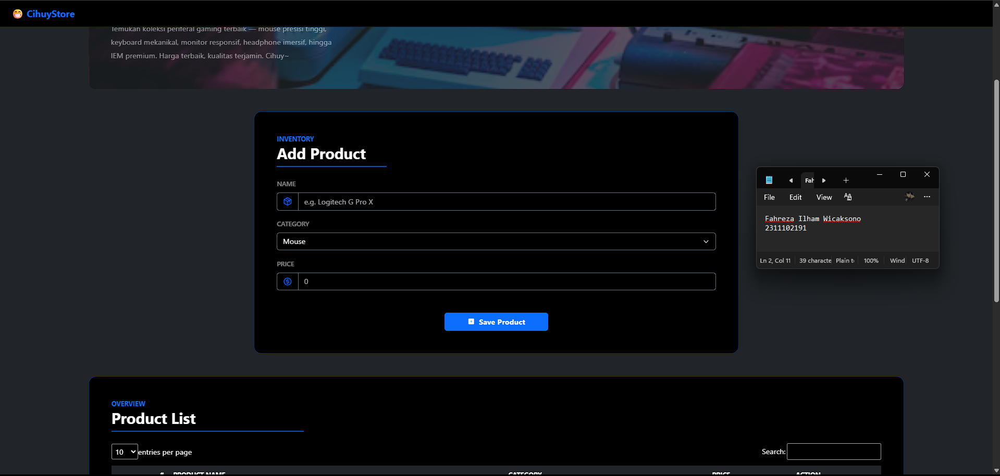

#### Styling

Pada website ini, sebagian besar styling dilakukan dengan memanfaatkan kelas-kelas bawaan dari Bootstrap tanpa menambahkan CSS kustom yang kompleks. Pendekatan ini membuat proses pengembangan menjadi lebih cepat sekaligus menjaga konsistensi tampilan antarkomponen.

Tampilan website menerapkan tema gelap (`dark theme`) dengan menggunakan beberapa kelas Bootstrap, seperti `.bg-dark`, `.bg-black`, dan `.text-white` untuk mengatur warna latar belakang serta teks. Selain itu, warna `primary` juga digunakan sebagai aksen visual melalui kelas seperti `.text-primary`, `.btn-primary`, `.border-primary`, dan kelas serupa lainnya. Kombinasi kelas-kelas tersebut membantu menciptakan tampilan yang kontras, modern, dan tetap konsisten di seluruh halaman. Contoh penerapan styling tersebut dapat dilihat pada potongan kode berikut.

```html
<h1 class="display-4 fw-bold text-white mb-3">
    Welcome to<br>
    <span class="text-primary">CihuyStore</span>
</h1>

<p class="text-white-50 fs-6 mb-0" style="max-width:500px; line-height:1.8;">Temukan koleksi periferal gaming terbaik — mouse presisi tinggi, keyboard mekanikal, monitor responsif, headphone imersif, hingga IEM premium. Harga terbaik, kualitas terjamin. Cihuy~
</p>
```

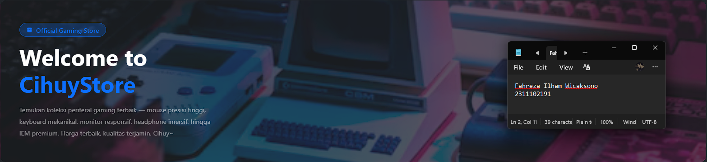

#### Utility Class

Utility class pada Bootstrap digunakan untuk memberikan styling tambahan atau penyesuaian detail tanpa perlu menulis CSS kustom. Dengan utility class, pengembang dapat dengan cepat mengatur posisi, jarak antar elemen, tipografi, serta tampilan visual lainnya secara langsung pada elemen HTML. Pada website ini, beberapa utility class Bootstrap digunakan untuk mempercantik sekaligus merapikan tampilan antarkomponen. Beberapa di antaranya adalah sebagai berikut:

* `.position-*`
Digunakan untuk mengatur posisi elemen, seperti relative, absolute, atau fixed, sehingga elemen dapat ditempatkan sesuai kebutuhan pada layout.
* `.border` dan variasinya
Digunakan untuk menambahkan garis tepi pada elemen, misalnya untuk memperjelas batas antar komponen.
* `.fw-*` (font weight)
Mengatur ketebalan teks, misalnya fw-bold untuk membuat teks menjadi tebal.
* `.fs-*` (font size)
Mengatur ukuran teks agar lebih menonjol atau menyesuaikan dengan hierarki informasi.
* `.m-*` (margin)
Digunakan untuk mengatur jarak luar antar elemen sehingga tata letak terlihat lebih rapi.
* `.p-*` (padding)
Mengatur jarak dalam suatu elemen agar konten tidak terlalu rapat dengan batas elemen.
* `.rounded` dan variasinya
Memberikan sudut yang membulat pada elemen, sehingga tampilan terlihat lebih modern dan halus.
* `.text-uppercase`
Mengubah teks menjadi huruf kapital untuk memberikan penekanan pada judul atau label.
* `.text-center`
Mengatur perataan teks agar berada di tengah.

Contoh penerapan utility class tersebut dapat dilihat pada potongan kode berikut.

```html
<!-- potongan segmen hero -->
<div class="position-relative p-5 d-flex flex-column justify-content-center" style="min-height:400px;">
    <span
        class="badge bg-primary bg-opacity-25 text-primary border border-primary border-opacity-50 rounded-pill px-3 py-2 mb-3 fs-6 fw-semibold align-self-start">
        <i class="ph-fill ph-storefront me-1"></i> Official Gaming Store
    </span>

    <h1 class="display-4 fw-bold text-white mb-3">
        Welcome to<br>
        <span class="text-primary">CihuyStore</span>
    </h1>

    <p class="text-white-50 fs-6 mb-0" style="max-width:500px; line-height:1.8;">
        Temukan koleksi periferal gaming terbaik — mouse presisi tinggi, keyboard mekanikal,
        monitor responsif, headphone imersif, hingga IEM premium. Harga terbaik, kualitas terjamin.
        Cihuy~
    </p>
</div>

<!-- potongan segmen form product -->
<p class="text-primary text-uppercase fw-bold small mb-0">Inventory</p>
<h2 class="fw-bold text-white mb-1">Add Product</h2>
<hr class="border border-primary border-2 opacity-75 mt-2 mb-4 w-25">
```

### Form

Pada website ini terdapat form input produk yang digunakan untuk menambahkan data produk ke dalam sistem. Tampilan form menggunakan komponen form dari Bootstrap yang dipadukan dengan `input group` serta ikon untuk memberikan tampilan yang lebih informatif dan menarik, ditambah dengan styling yang sebelumnya disebutkan.

Form tersebut memiliki beberapa field utama sebagai berikut:

* Nama Produk (`product_name`)
Menggunakan tipe input `text` yang berfungsi untuk memasukkan nama produk yang akan ditambahkan.
* Kategori (`category`)
Menggunakan elemen `select` agar pengguna dapat memilih kategori produk dari daftar yang tersedia, sehingga memudahkan proses klasifikasi produk.
* Harga (`price`)
Menggunakan tipe input `number` untuk memasukkan nilai harga produk secara numerik sehingga lebih terstruktur dan meminimalkan kesalahan input.

```html
<div class="row justify-content-center mb-5">
    <div class="col-md-6" data-aos="fade-up" data-aos-delay="100">
        <div class="bg-black border border-primary border-opacity-50 rounded-4 p-4 p-md-5">

            <p class="text-primary text-uppercase fw-bold small mb-0">Inventory</p>
            <h2 class="fw-bold text-white mb-1">Add Product</h2>
            <hr class="border border-primary border-2 opacity-75 mt-2 mb-4 w-25">

            <form id="addProductForm" action="#">
                <div class="mb-3">
                    <label for="product_name"
                        class="form-label text-white-50 text-uppercase fw-semibold small">Name</label>

                    <div class="input-group">
                        <span class="input-group-text bg-black border-secondary text-primary">
                            <i class="ph-duotone ph-package fs-5"></i>
                        </span>

                        <input type="text" class="form-control bg-black border-secondary text-white"
                            id="product_name" placeholder="e.g. Logitech G Pro X">
                    </div>
                </div>

                <div class="mb-3">
                    <label for="category"
                        class="form-label text-white-50 text-uppercase fw-semibold small">Category</label>

                    <select class="form-select bg-black border-secondary text-white" id="category"
                        aria-placeholder="Select Category">
                        <option value="mouse"> Mouse</option>
                        <option value="keyboard"> Keyboard</option>
                        <option value="monitor"> Monitor</option>
                        <option value="headphone"> Headphone</option>
                        <option value="iem"> IEM</option>
                    </select>
                </div>

                <div class="mb-3">
                    <label for="price"
                        class="form-label text-white-50 text-uppercase fw-semibold small">Price</label>

                    <div class="input-group">
                        <span class="input-group-text bg-black border-secondary text-primary">
                            <i class="ph-duotone ph-currency-circle-dollar fs-5"></i>
                        </span>

                        <input type="number" class="form-control bg-black border-secondary text-white"
                            id="price" placeholder="0">
                    </div>
                </div>

                <div class="d-flex justify-content-center mt-5">
                    <button type="submit" class="btn btn-primary fw-bold px-5">
                        <i class="ph-fill ph-plus-square me-1"></i> Save Product
                    </button>
                </div>
            </form>
        </div>
    </div>
</div>
```

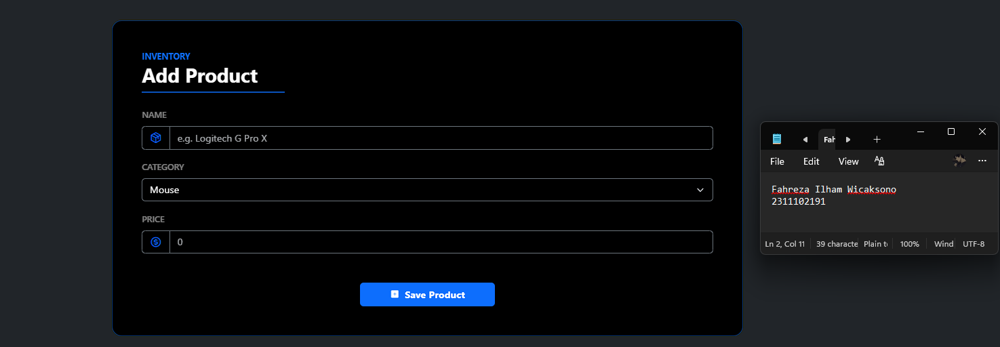

### Penggunaan Datatable dan JQuery

DataTables adalah plugin jQuery yang digunakan untuk meningkatkan fungsionalitas tabel HTML agar menjadi lebih interaktif dan mudah digunakan dan jQuery adalah library JavaScript yang digunakan untuk mempermudah manipulasi DOM, pengolahan event, serta pembuatan fitur interaktif pada halaman web dengan sintaks yang lebih sederhana dibandingkan JavaScript murni.

#### Datatable

Penggunaan DataTables pada website ini diimpor melalui CDN, kemudian dimanfaatkan untuk menampilkan seluruh data produk dalam bentuk tabel yang lebih interaktif. `DataTables` dipilih karena menyediakan berbagai fitur bawaan yang dapat membantu pengguna dalam mengelola dan menelusuri data produk dengan lebih mudah, seperti pencarian, pengurutan data, dan `pagination`.

```html
<link rel="stylesheet" href="https://cdn.datatables.net/2.3.7/css/dataTables.dataTables.css" />
<script src="https://cdn.datatables.net/2.3.7/js/dataTables.js"></script>
```

DataTables diimplementasikan pada segmen tabel produk, yaitu pada elemen tabel yang memiliki atribut `id="productTable"`. ID tersebut kemudian digunakan pada bagian JavaScript untuk melakukan inisialisasi `DataTables` terhadap tabel tersebut. Selain itu, tampilan tabel juga tetap menggunakan tema dan kelas Bootstrap yang telah disebutkan sebelumnya sehingga tampilannya tetap konsisten dengan keseluruhan desain website.

```html
<div class="row justify-content-center mb-5">
    <div class="col-md-10" data-aos="fade-up" data-aos-delay="150">
        <div class="bg-black border border-primary border-opacity-50 rounded-4 p-4 p-md-5">

            <p class="text-primary text-uppercase fw-bold small mb-0">Overview</p>
            <h2 class="fw-bold text-white mb-1">Product List</h2>
            <hr class="border border-primary border-2 opacity-75 mt-2 mb-4 w-25">

            <table id="productTable" class="table table-dark table-striped table-hover align-middle w-100">
                <thead class="border-bottom border-primary border-opacity-50">
                    <tr>
                        <th class="text-white text-uppercase small fw-bold">#</th>
                        <th class="text-white text-uppercase small fw-bold">Product Name</th>
                        <th class="text-white text-uppercase small fw-bold">Category</th>
                        <th class="text-white text-uppercase small fw-bold">Price</th>
                        <th class="text-white text-uppercase small fw-bold">Action</th>
                    </tr>
                </thead>
                <tbody></tbody>
            </table>
        </div>
    </div>
</div>
```

Pada proses inisialisasi di JavaScript, `DataTables` dapat dikonfigurasi dengan berbagai parameter tambahan. Pada website ini digunakan beberapa parameter, yaitu:

* `paging`
Mengaktifkan fitur pagination untuk membagi data ke dalam beberapa halaman.
* `searching`
Menyediakan fitur pencarian sehingga pengguna dapat menemukan data produk dengan lebih cepat.
* `stateSave`
Menyimpan kondisi tabel (seperti halaman, pencarian, dan `sorting`) sehingga tetap tersimpan ketika halaman dimuat ulang.
* `ordering`
Memungkinkan pengguna untuk mengurutkan data berdasarkan kolom tertentu.
* `columnDefs`
Digunakan untuk mengatur perilaku atau konfigurasi khusus pada kolom tertentu dalam tabel misalnya kelas atau atribut tambahan.

```js
let table = $("#productTable").DataTable({
    paging: true,
    searching: true,
    stateSave: true,
    ordering: false,
    columnDefs: [
        {
            targets: 1,
            className: "fw-bold"
        },
        {
            targets: 2,
            className: "align-middle text-center"
        },
        {
            targets: 3,
            className: "fw-bold text-end"
        },
        {
            targets: 4,
            className: "align-middle text-center"
        }
    ]~
});
```

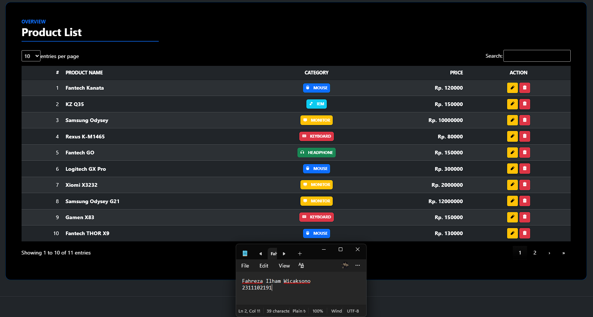

#### JQuery

Pada website ini, jQuery terutama digunakan untuk melakukan seleksi elemen HTML serta menyediakan berbagai utilitas yang mempermudah manipulasi dan interaksi pada halaman. Dengan jQuery, proses penanganan `event` dan pengambilan nilai dari elemen form dapat dilakukan dengan sintaks yang lebih sederhana.

Beberapa fungsi jQuery yang digunakan pada website ini antara lain:

* `$(document).ready()`
Digunakan untuk memastikan bahwa seluruh elemen HTML telah dimuat sebelum kode JavaScript dijalankan.
* Selector jQuery (`$()`)
Digunakan untuk memilih elemen HTML tertentu berdasarkan id, class, atau atribut sehingga elemen tersebut dapat dimanipulasi melalui JavaScript.
* `.val()`
Digunakan untuk mengambil atau mengatur nilai dari elemen input, seperti field nama produk, kategori, dan harga.
* `.on()`
Digunakan untuk menangani event pada elemen, misalnya event click atau submit.
* `submit` event handler
Digunakan untuk menangani proses pengiriman form, seperti saat pengguna menambahkan atau memperbarui data produk.

```js
$("#productTable")...

let name = $('#product_name').val();
let category = $('#category').val();
let price = $('#price').val();

$("#addProductForm").submit(function (event) {});
```

### Fitur pada Tabel

#### Searching

Searching merupakan salah satu fitur pada `DataTables` yang memungkinkan pengguna untuk mencari kata kunci tertentu di dalam data yang ditampilkan pada tabel. Dengan fitur ini, pengguna dapat dengan cepat menemukan data yang diinginkan tanpa harus menelusuri seluruh isi tabel secara manual. Jika menggunakan `DataTables`, fitur searching dapat diaktifkan saat proses inisialisasi `DataTables` melalui parameter konfigurasi. Namun pada umumnya, fitur pencarian ini sudah aktif secara default, sehingga kolom pencarian akan langsung tersedia ketika DataTables diterapkan pada sebuah tabel.

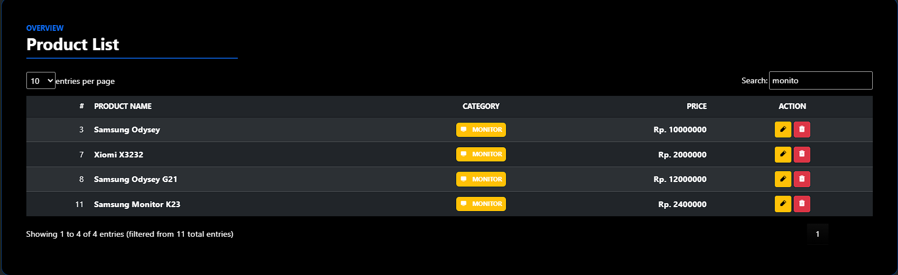

#### Pagination

Pagination merupakan fitur pada `DataTables` yang digunakan untuk membagi data tabel menjadi beberapa halaman (`pages`). Fitur ini bertujuan agar data yang ditampilkan tidak terlalu panjang dalam satu tampilan, sehingga lebih mudah dibaca dan dinavigasi oleh pengguna. Dengan adanya pagination, pengguna dapat berpindah dari satu halaman data ke halaman lainnya menggunakan kontrol navigasi yang tersedia di bagian bawah tabel. Pada `DataTables`, fitur ini dapat diaktifkan melalui parameter paging saat proses inisialisasi. Namun secara default, pagination biasanya sudah aktif secara otomatis ketika `DataTables` diterapkan pada sebuah tabel.

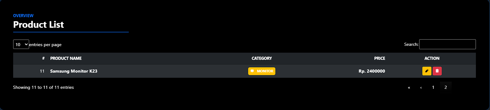

#### Action

Pada website ini diterapkan action `button`, yaitu tombol yang digunakan untuk melakukan pengolahan data seperti mengedit atau menghapus data produk. Tombol-tombol tersebut ditempatkan pada setiap baris data di dalam tabel, sehingga pengguna dapat langsung melakukan tindakan terhadap data produk yang dipilih.

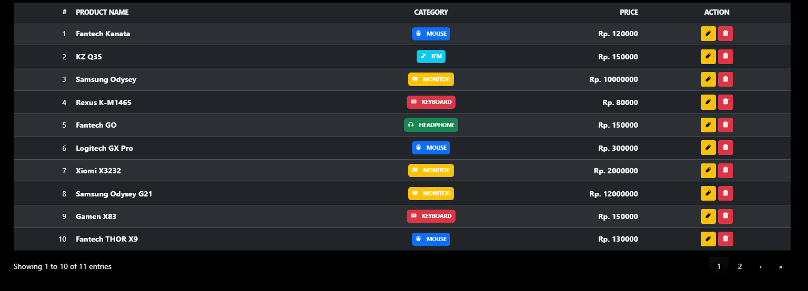

### CRUD

Karena tujuan utama pembuatan website ini adalah untuk mengimplementasikan `CRUD` sederhana menggunakan object mapping, maka logika utama atau backend logic dari website ditempatkan pada file `script.js`. File JavaScript tersebut berisi seluruh implementasi operasi CRUD (`Create`, `Read`, `Update`, dan `Delete`) yang digunakan untuk mengelola data produk pada aplikasi. Selain itu, file `script.js` juga memuat beberapa fungsi utilitas tambahan yang mendukung jalannya fitur pada website, seperti pengambilan nilai dari form, manipulasi data objek, pembaruan tampilan tabel, serta penanganan event dari interaksi pengguna. Dengan demikian, seluruh proses pengolahan data pada website dapat dikelola secara terpusat melalui file JavaScript tersebut.

#### Create

Fitur Create pada website ini digunakan untuk menambahkan data produk baru ke dalam sistem melalui form input. Proses ini dimulai ketika pengguna mengisi field nama produk, kategori, dan harga, kemudian menekan tombol `Save Product` pada form.

Saat form dikirim, event `submit` ditangkap oleh jQuery menggunakan selector `$("#addProductForm").submit()`. Pada tahap ini digunakan fungsi `event.preventDefault()` untuk mencegah halaman melakukan reload, sehingga proses penambahan data dapat dilakukan secara dinamis menggunakan JavaScript. Nilai dari setiap input kemudian diambil menggunakan fungsi `.val()`, yaitu untuk field `product_name`, `category`, dan `price`. Data tersebut selanjutnya dipetakan ke dalam sebuah object `product` dengan properti `name`, `category`, dan `price`. Teknik ini disebut object mapping, yaitu proses mengubah data input menjadi struktur objek yang lebih mudah dikelola. Selanjutnya, data produk yang baru ditambahkan akan langsung ditampilkan pada tabel menggunakan `DataTables` dengan metode `table.row.add()`. Pada baris tabel tersebut juga ditambahkan tombol aksi `edit` dan `delete` yang masing-masing memiliki atribut data-index untuk menandai posisi data dalam array.

```html
<form id="addProductForm" action="#">
    <div class="mb-3">
        <label for="product_name"
            class="form-label text-white-50 text-uppercase fw-semibold small">Name</label>

        <div class="input-group">
            <span class="input-group-text bg-black border-secondary text-primary">
                <i class="ph-duotone ph-package fs-5"></i>
            </span>

            <input type="text" class="form-control bg-black border-secondary text-white"
                id="product_name" placeholder="e.g. Logitech G Pro X">
        </div>
    </div>

    <div class="mb-3">
        <label for="category"
            class="form-label text-white-50 text-uppercase fw-semibold small">Category</label>

        <select class="form-select bg-black border-secondary text-white" id="category"
            aria-placeholder="Select Category">
            <option value="mouse"> Mouse</option>
            <option value="keyboard"> Keyboard</option>
            <option value="monitor"> Monitor</option>
            <option value="headphone"> Headphone</option>
            <option value="iem"> IEM</option>
        </select>
    </div>

    <div class="mb-3">
        <label for="price"
            class="form-label text-white-50 text-uppercase fw-semibold small">Price</label>

        <div class="input-group">
            <span class="input-group-text bg-black border-secondary text-primary">
                <i class="ph-duotone ph-currency-circle-dollar fs-5"></i>
            </span>

            <input type="number" class="form-control bg-black border-secondary text-white"
                id="price" placeholder="0">
        </div>
    </div>

    <div class="d-flex justify-content-center mt-5">
        <button type="submit" class="btn btn-primary fw-bold px-5">
            <i class="ph-fill ph-plus-square me-1"></i> Save Product
        </button>
    </div>
</form>
```

```js
$("#addProductForm").submit(function (event) {
    event.preventDefault();

    let name = $('#product_name').val();
    let category = $('#category').val();
    let price = $('#price').val();

    // mapping object
    let product = {
        name: name,
        category: category,
        price: price
    };

    // save ke array dan local storage
    products.push(product);
    saveToLocalStorage();

    let index = products.length - 1;

    table.row.add([
        index + 1,
        product.name,
        categoryBadge(product.category),
        "Rp. " + product.price,
        `
            <button class="btn btn-warning btn-sm editBtn" data-index="${index}"><i class="ph-fill ph-pencil-simple"></i></button>
            <button class="btn btn-danger btn-sm deleteBtn" data-index="${index}"><i class="ph-fill ph-trash"></i></button>
        `
    ]).draw(false);

    Swal.fire({
        position: "top",
        icon: "success",
        title: "Product has been successfuly saved",
        showConfirmButton: false,
        background: '#181818ff',
        color: '#fff',
        timer: 2000
    });

    this.reset();
});
```

Input form
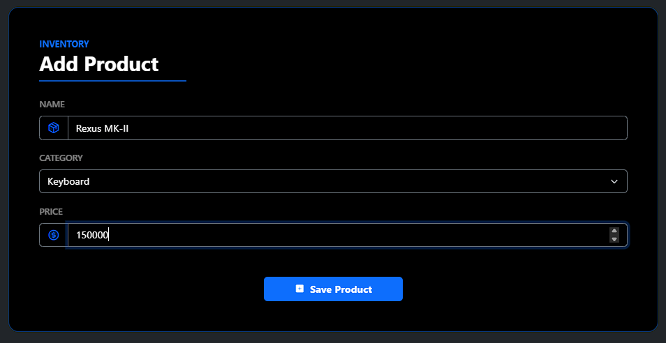

Contoh output
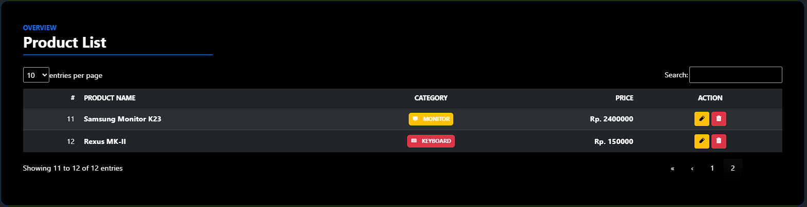

#### Read

Fitur Read pada website ini digunakan untuk menampilkan data produk yang tersedia ke dalam tabel produk. Tampilan tabel dibuat menggunakan elemen `<table>` yang memiliki `id="productTable"` dan kemudian diintegrasikan dengan `DataTables` agar data dapat ditampilkan secara lebih interaktif. Pada bagian JavaScript, data produk yang tersedia akan dilakukan iterasi menggunakan `forEach()`. Setiap data produk kemudian dimasukkan ke dalam tabel menggunakan fungsi `table.row.add()` dari `DataTables`. Data yang ditampilkan pada setiap baris tabel meliputi nomor urut, nama produk, kategori, harga, serta kolom action yang berisi tombol `edit` dan `delete`. Selain itu, kategori produk juga ditampilkan menggunakan fungsi `categoryBadge()` untuk memberikan tampilan label kategori yang lebih informatif. Setelah seluruh data dimasukkan ke dalam tabel, fungsi `table.draw(false)` dipanggil untuk merender atau menampilkan data tersebut pada `DataTables`.

```html
<table id="productTable" class="table table-dark table-striped table-hover align-middle w-100">
    <thead class="border-bottom border-primary border-opacity-50">
        <tr>
            <th class="text-white text-uppercase small fw-bold">#</th>
            <th class="text-white text-uppercase small fw-bold">Product Name</th>
            <th class="text-white text-uppercase small fw-bold">Category</th>
            <th class="text-white text-uppercase small fw-bold">Price</th>
            <th class="text-white text-uppercase small fw-bold">Action</th>
        </tr>
    </thead>
    <tbody></tbody>
</table>
```

```js
let products = JSON.parse(localStorage.getItem("products")) || [];

if (products.length > 0) {
    products.forEach(function (product, index) {
        table.row.add([
            index + 1,
            product.name,
            categoryBadge(product.category),
            "Rp. " + product.price,
            `
                <button class="btn btn-warning btn-sm editBtn" data-index="${index}"><i class="ph-fill ph-pencil-simple"></i></button>
                <button class="btn btn-danger btn-sm deleteBtn" data-index="${index}"><i class="ph-fill ph-trash"></i></button>
            `
        ]);
    });

    table.draw(false);
}
```

Contoh tabel


#### Update

Fitur Edit pada website ini digunakan untuk memperbarui data produk yang sudah ada pada tabel. Proses edit dimulai ketika pengguna menekan tombol `edit` pada salah satu baris data. Event klik tersebut ditangkap menggunakan jQuery pada selector `#productTable tbody .editBtn`. Ketika tombol ditekan, sistem akan mengambil `index` data produk yang tersimpan pada atribut `data-index`, kemudian mengambil data produk yang sesuai dari array `products`. Data tersebut selanjutnya dimasukkan ke dalam form edit yang berada di dalam modal Bootstrap, sehingga pengguna dapat melihat dan mengubah informasi produk. Setelah pengguna mengubah data dan menekan tombol `Save Product`, event `submit` pada form edit akan diproses oleh JavaScript. Data input yang baru kemudian digunakan untuk memperbarui objek produk pada array `products`, lalu baris tabel yang sedang diedit diperbarui menggunakan metode `currentRow.data()` dari `DataTables`.

```html
<div class="modal fade" id="editModal" tabindex="-1">
    <div class="modal-dialog modal-dialog-centered">
        <div class="modal-content bg-black border border-primary border-opacity-50 rounded-4 p-2 p-md-4">
            <h2 class="fw-bold text-white mb-1">Edit Product</h2>
            <hr class="border border-primary border-2 opacity-75 mt-2 mb-4 w-25">

            <form id="editProductForm" action="#">
                <div class="modal-body">
                    <input type="hidden" id="edit_index">

                    <div class="mb-3">
                        <label for="product_name_edit"
                            class="form-label text-white-50 text-uppercase fw-semibold small">Name</label>

                        <div class="input-group">
                            <span class="input-group-text bg-black border-secondary text-primary">
                                <i class="ph-duotone ph-package fs-5"></i>
                            </span>

                            <input type="text" class="form-control bg-black border-secondary text-white"
                                id="product_name_edit" placeholder="e.g. Logitech G Pro X">
                        </div>
                    </div>

                    <div class="mb-3">
                        <label for="category_edit"
                            class="form-label text-white-50 text-uppercase fw-semibold small">Category</label>

                        <select class="form-select bg-black border-secondary text-white" id="category_edit"
                            aria-placeholder="Select Category">
                            <option value="mouse"> Mouse</option>
                            <option value="keyboard"> Keyboard</option>
                            <option value="monitor"> Monitor</option>
                            <option value="headphone"> Headphone</option>
                            <option value="iem"> IEM</option>
                        </select>
                    </div>

                    <div class="mb-3">
                        <label for="price_edit"
                            class="form-label text-white-50 text-uppercase fw-semibold small">Price</label>

                        <div class="input-group">
                            <span class="input-group-text bg-black border-secondary text-primary">
                                <i class="ph-duotone ph-currency-circle-dollar fs-5"></i>
                            </span>

                            <input type="number" class="form-control bg-black border-secondary text-white"
                                id="price_edit" placeholder="0">
                        </div>
                    </div>
                </div>

                <div class="d-flex justify-content-center mt-5 gap-2">
                    <button type="button" class="btn btn-light" data-bs-dismiss="modal">Close</button>

                    <button type="submit" class="btn btn-primary fw-bold px-5">
                        <i class="ph-fill ph-plus-square me-1"></i> Save Product
                    </button>
                </div>
            </form>
        </div>
    </div>
</div>
```

```js
$("#productTable tbody").on('click', '.editBtn', function () {
    let index = $(this).data('index');
    let product = products[index];

    // mengambil data nomor baris saat ini
    currentRow = table.row($(this).closest("tr"));

    $("#edit_index").val(index);
    $("#product_name_edit").val(product.name);
    $("#category_edit").val(product.category);
    $("#price_edit").val(product.price);

    $("#editModal").modal("show");

});


$("#editProductForm").submit(function (e) {
    e.preventDefault();

    let index = $("#edit_index").val();
    let name = $("#product_name_edit").val();
    let category = $("#category_edit").val();
    let price = $("#price_edit").val();

    products[index] = {
        name: name,
        category: category,
        price: price
    };

    saveToLocalStorage();

    currentRow.data([
        parseInt(index) + 1,
        name,
        categoryBadge(category),
        "Rp. " + price,
        `
            <button class="btn btn-warning btn-sm editBtn" data-index="${index}"><i class="ph-fill ph-pencil-simple"></i></button>
            <button class="btn btn-danger btn-sm deleteBtn" data-index="${index}"><i class="ph-fill ph-trash"></i></button>
        `
    ]).draw(false);

    Swal.fire({
        position: "top",
        icon: "success",
        title: "Product has been successfuly edited",
        showConfirmButton: false,
        background: '#181818ff',
        color: '#fff',
        timer: 2000
    });

    $("#editModal").modal("hide");
});
```

Edit form
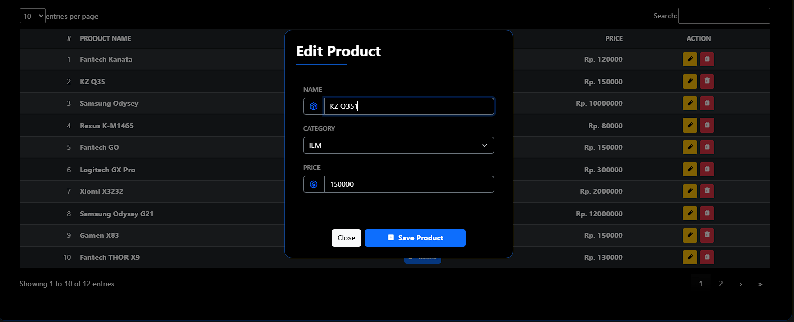

#### Delete

Fitur Delete pada website ini digunakan untuk menghapus data produk dari tabel. Proses dimulai ketika pengguna menekan tombol `delete` pada salah satu baris data di tabel. Event klik tersebut ditangkap menggunakan jQuery melalui selector `#productTable tbody .deleteBtn`. Ketika tombol ditekan, sistem akan menampilkan dialog konfirmasi menggunakan `SweetAlert` untuk memastikan bahwa pengguna benar-benar ingin menghapus data tersebut. Jika pengguna menekan tombol konfirmasi, data produk akan dihapus dari array `products` menggunakan metode `splice()`. Setelah itu, baris data yang sesuai akan dihapus dari tabel menggunakan fungsi `row.remove().draw(false)` dari `DataTables`, dan sistem menampilkan notifikasi sukses sebagai umpan balik bahwa produk berhasil dihapus.

```js
$("#productTable tbody").on('click', '.deleteBtn', function () {
    let button = $(this);
    let row = table.row(button.parents('tr'));
    let index = button.data('index');

    Swal.fire({
        title: "Are you sure?",
        text: "Delete this product?",
        icon: "warning",
        position: 'top',
        showCancelButton: true,
        background: '#181818ff',
        color: '#fff',
        confirmButtonColor: "#3085d6",
        cancelButtonColor: "#d33",
        confirmButtonText: "Yes, delete it",
        cancelButtonText: "Cancel"
    }).then((result) => {
        if (result.isConfirmed) {
            // delete data dan save ke local storage
            products.splice(index, 1);
            saveToLocalStorage();

            Swal.fire({
                position: "top",
                icon: "success",
                title: "Product has been successfuly deleted",
                showConfirmButton: false,
                background: '#181818ff',
                color: '#fff',
                timer: 2000
            });

            row.remove().draw(false);
        }
    });
});
```

Contoh output
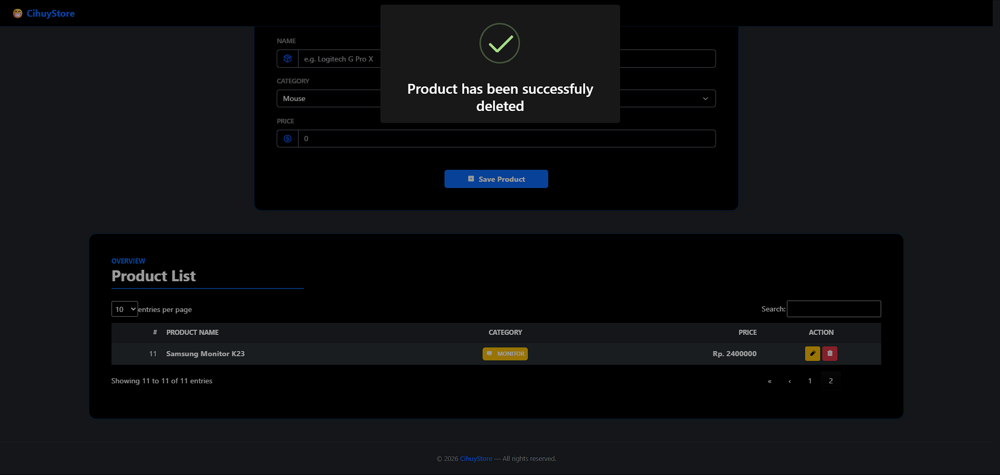

### Fitur Tambahan

#### Sweetalert

SweetAlert digunakan untuk menampilkan notifikasi atau dialog interaktif dengan tampilan yang lebih menarik dibandingkan `alert()` bawaan JavaScript. Pada website ini, SweetAlert digunakan sebagai feedback kepada pengguna, misalnya ketika data produk berhasil disimpan, diedit, atau dihapus. Notifikasi ditampilkan dalam bentuk popup dengan ikon, posisi tertentu, serta dapat diatur durasi tampilnya menggunakan parameter seperti `timer`, `icon`, dan `position`.

```js
Swal.fire({
    position: "top",
    icon: "success",
    title: "Product has been successfuly saved",
    showConfirmButton: false,
    background: '#181818ff',
    color: '#fff',
    timer: 2000
});
```

#### AOS (Animate On Scroll)

AOS adalah library JavaScript yang digunakan untuk menambahkan animasi ketika elemen muncul saat halaman di-scroll. Pada website ini, AOS digunakan untuk memberikan efek animasi pada beberapa bagian halaman seperti form dan tabel. Animasi diaktifkan dengan menambahkan atribut seperti `data-aos="fade-up"` dan `data-aos-delay` pada elemen HTML. Library ini kemudian diinisialisasi menggunakan `AOS.init()` untuk mengatur perilaku animasi seperti `durasi` dan `easing`.

```html
<link rel="stylesheet" href="https://cdn.jsdelivr.net/npm/aos@2.3.4/dist/aos.css" />

<script src="https://cdn.jsdelivr.net/npm/aos@2.3.4/dist/aos.js"></script>
<script>AOS.init({ once: true, duration: 600, easing: 'ease-out-cubic' });</script>
```

```html
<div class="col-md-6" data-aos="fade-up" data-aos-delay="100">
<div class="col-md-10" data-aos="fade-up" data-aos-delay="150">
```

#### Local Storage

Local Storage digunakan untuk menyimpan data produk langsung di browser pengguna sehingga data tetap tersimpan meskipun halaman direfresh. Pada kode tersebut, data produk diambil menggunakan `localStorage.getItem()` dan diubah kembali menjadi objek JavaScript dengan `JSON.parse()`. Ketika terjadi perubahan data seperti penambahan, pengeditan, atau penghapusan produk, fungsi `saveToLocalStorage()` akan menyimpan kembali data tersebut ke Local Storage menggunakan `JSON.stringify()`.

```js
let products = JSON.parse(localStorage.getItem("products")) || [];

function saveToLocalStorage() {
    localStorage.setItem("products", JSON.stringify(products));
}
```

### Source code

```html
<!DOCTYPE html>
<html lang="en" data-bs-theme="dark">

<!-- 2311102191 -->
<!-- FAHREZA ILHAM WICAKSONO -->
<!-- 👍🏿 -->

<head>
    <meta charset="UTF-8">
    <meta name="viewport" content="width=device-width, initial-scale=1.0">
    <title>CihuyStore</title>

    <link rel="icon"
        href="data:image/svg+xml,<svg xmlns='http://www.w3.org/2000/svg' viewBox='0 0 100 100'><text y='.9em' font-size='80'>😁</text></svg>">

    <!-- Bootstrap -->
    <link href="https://cdn.jsdelivr.net/npm/bootstrap@5.3.8/dist/css/bootstrap.min.css" rel="stylesheet"
        integrity="sha384-sRIl4kxILFvY47J16cr9ZwB07vP4J8+LH7qKQnuqkuIAvNWLzeN8tE5YBujZqJLB" crossorigin="anonymous">

    <!-- Phospor icon -->
    <link rel="stylesheet" type="text/css"
        href="https://cdn.jsdelivr.net/npm/@phosphor-icons/web@2.1.2/src/duotone/style.css" />
    <link rel="stylesheet" type="text/css"
        href="https://cdn.jsdelivr.net/npm/@phosphor-icons/web@2.1.2/src/fill/style.css" />

    <!-- Datatables -->
    <link rel="stylesheet" href="https://cdn.datatables.net/2.3.7/css/dataTables.dataTables.css" />

    <!-- AOS -->
    <link rel="stylesheet" href="https://cdn.jsdelivr.net/npm/aos@2.3.4/dist/aos.css" />
</head>

<body class="bg-dark text-white">
    <!-- Navbar -->
    <nav class="navbar navbar-dark bg-black border-bottom border-primary border-opacity-25 sticky-top">
        <div class="container-fluid px-4">
            <a class="navbar-brand text-primary fw-bold fs-5" href="#">
                😁 CihuyStore
            </a>
        </div>
    </nav>

    <div class="container-fluid">
        <!-- Hero -->
        <div class="row justify-content-center my-5">
            <div class="col-md-10" data-aos="fade-down">
                <div class="rounded-4 overflow-hidden position-relative"
                    style="min-height:400px; background-image:url('https://images.unsplash.com/photo-1550745165-9bc0b252726f?w=500&auto=format&fit=crop&q=60&ixlib=rb-4.1.0&ixid=M3wxMjA3fDB8MHxzZWFyY2h8MTB8fGdhbWluZ3xlbnwwfHwwfHx8MA%3D%3D'); background-size:cover; background-position:center;">

                    <div class="position-absolute top-0 start-0 w-100 h-100 bg-dark bg-opacity-75"></div>

                    <div class="position-relative p-5 d-flex flex-column justify-content-center"
                        style="min-height:400px;">
                        <span
                            class="badge bg-primary bg-opacity-25 text-primary border border-primary border-opacity-50 rounded-pill px-3 py-2 mb-3 fs-6 fw-semibold align-self-start">
                            <i class="ph-fill ph-storefront me-1"></i> Official Gaming Store
                        </span>

                        <h1 class="display-4 fw-bold text-white mb-3">
                            Welcome to<br>
                            <span class="text-primary">CihuyStore</span>
                        </h1>

                        <p class="text-white-50 fs-6 mb-0" style="max-width:500px; line-height:1.8;">
                            Temukan koleksi periferal gaming terbaik — mouse presisi tinggi, keyboard mekanikal,
                            monitor responsif, headphone imersif, hingga IEM premium. Harga terbaik, kualitas terjamin.
                            Cihuy~
                        </p>
                    </div>
                </div>
            </div>
        </div>

        <!-- Add Product Form -->
        <div class="row justify-content-center mb-5">
            <div class="col-md-6" data-aos="fade-up" data-aos-delay="100">
                <div class="bg-black border border-primary border-opacity-50 rounded-4 p-4 p-md-5">

                    <p class="text-primary text-uppercase fw-bold small mb-0">Inventory</p>
                    <h2 class="fw-bold text-white mb-1">Add Product</h2>
                    <hr class="border border-primary border-2 opacity-75 mt-2 mb-4 w-25">

                    <form id="addProductForm" action="#">
                        <div class="mb-3">
                            <label for="product_name"
                                class="form-label text-white-50 text-uppercase fw-semibold small">Name</label>

                            <div class="input-group">
                                <span class="input-group-text bg-black border-secondary text-primary">
                                    <i class="ph-duotone ph-package fs-5"></i>
                                </span>

                                <input type="text" class="form-control bg-black border-secondary text-white"
                                    id="product_name" placeholder="e.g. Logitech G Pro X">
                            </div>
                        </div>

                        <div class="mb-3">
                            <label for="category"
                                class="form-label text-white-50 text-uppercase fw-semibold small">Category</label>

                            <select class="form-select bg-black border-secondary text-white" id="category"
                                aria-placeholder="Select Category">
                                <option value="mouse"> Mouse</option>
                                <option value="keyboard"> Keyboard</option>
                                <option value="monitor"> Monitor</option>
                                <option value="headphone"> Headphone</option>
                                <option value="iem"> IEM</option>
                            </select>
                        </div>

                        <div class="mb-3">
                            <label for="price"
                                class="form-label text-white-50 text-uppercase fw-semibold small">Price</label>

                            <div class="input-group">
                                <span class="input-group-text bg-black border-secondary text-primary">
                                    <i class="ph-duotone ph-currency-circle-dollar fs-5"></i>
                                </span>

                                <input type="number" class="form-control bg-black border-secondary text-white"
                                    id="price" placeholder="0">
                            </div>
                        </div>

                        <div class="d-flex justify-content-center mt-5">
                            <button type="submit" class="btn btn-primary fw-bold px-5">
                                <i class="ph-fill ph-plus-square me-1"></i> Save Product
                            </button>
                        </div>
                    </form>
                </div>
            </div>
        </div>

        <!-- Product Table -->
        <div class="row justify-content-center mb-5">
            <div class="col-md-10" data-aos="fade-up" data-aos-delay="150">
                <div class="bg-black border border-primary border-opacity-50 rounded-4 p-4 p-md-5">

                    <p class="text-primary text-uppercase fw-bold small mb-0">Overview</p>
                    <h2 class="fw-bold text-white mb-1">Product List</h2>
                    <hr class="border border-primary border-2 opacity-75 mt-2 mb-4 w-25">

                    <table id="productTable" class="table table-dark table-striped table-hover align-middle w-100">
                        <thead class="border-bottom border-primary border-opacity-50">
                            <tr>
                                <th class="text-white text-uppercase small fw-bold">#</th>
                                <th class="text-white text-uppercase small fw-bold">Product Name</th>
                                <th class="text-white text-uppercase small fw-bold">Category</th>
                                <th class="text-white text-uppercase small fw-bold">Price</th>
                                <th class="text-white text-uppercase small fw-bold">Action</th>
                            </tr>
                        </thead>
                        <tbody></tbody>
                    </table>
                </div>
            </div>
        </div>
    </div>

    <!-- edit modal -->
    <div class="modal fade" id="editModal" tabindex="-1">
        <div class="modal-dialog modal-dialog-centered">
            <div class="modal-content bg-black border border-primary border-opacity-50 rounded-4 p-2 p-md-4">
                <h2 class="fw-bold text-white mb-1">Edit Product</h2>
                <hr class="border border-primary border-2 opacity-75 mt-2 mb-4 w-25">

                <form id="editProductForm" action="#">
                    <div class="modal-body">
                        <input type="hidden" id="edit_index">

                        <div class="mb-3">
                            <label for="product_name_edit"
                                class="form-label text-white-50 text-uppercase fw-semibold small">Name</label>

                            <div class="input-group">
                                <span class="input-group-text bg-black border-secondary text-primary">
                                    <i class="ph-duotone ph-package fs-5"></i>
                                </span>

                                <input type="text" class="form-control bg-black border-secondary text-white"
                                    id="product_name_edit" placeholder="e.g. Logitech G Pro X">
                            </div>
                        </div>

                        <div class="mb-3">
                            <label for="category_edit"
                                class="form-label text-white-50 text-uppercase fw-semibold small">Category</label>

                            <select class="form-select bg-black border-secondary text-white" id="category_edit"
                                aria-placeholder="Select Category">
                                <option value="mouse"> Mouse</option>
                                <option value="keyboard"> Keyboard</option>
                                <option value="monitor"> Monitor</option>
                                <option value="headphone"> Headphone</option>
                                <option value="iem"> IEM</option>
                            </select>
                        </div>

                        <div class="mb-3">
                            <label for="price_edit"
                                class="form-label text-white-50 text-uppercase fw-semibold small">Price</label>

                            <div class="input-group">
                                <span class="input-group-text bg-black border-secondary text-primary">
                                    <i class="ph-duotone ph-currency-circle-dollar fs-5"></i>
                                </span>

                                <input type="number" class="form-control bg-black border-secondary text-white"
                                    id="price_edit" placeholder="0">
                            </div>
                        </div>
                    </div>

                    <div class="d-flex justify-content-center mt-5 gap-2">
                        <button type="button" class="btn btn-light" data-bs-dismiss="modal">Close</button>

                        <button type="submit" class="btn btn-primary fw-bold px-5">
                            <i class="ph-fill ph-plus-square me-1"></i> Save Product
                        </button>
                    </div>
                </form>
            </div>
        </div>
    </div>

    <!-- Footer -->
    <footer class="border-top border-secondary border-opacity-25 text-center py-4 mt-2">
        <p class="mb-0 text-white-50 small">© 2026 <span class="text-primary fw-semibold">CihuyStore</span> — All rights
            reserved.</p>
    </footer>

    <!-- Bootstrap -->
    <script src="https://cdn.jsdelivr.net/npm/bootstrap@5.3.8/dist/js/bootstrap.bundle.min.js"
        integrity="sha384-FKyoEForCGlyvwx9Hj09JcYn3nv7wiPVlz7YYwJrWVcXK/BmnVDxM+D2scQbITxI"
        crossorigin="anonymous"></script>

    <!-- Jquery -->
    <script src="https://code.jquery.com/jquery-3.7.1.min.js"
        integrity="sha256-/JqT3SQfawRcv/BIHPThkBvs0OEvtFFmqPF/lYI/Cxo=" crossorigin="anonymous"></script>

    <!-- Datatables -->
    <script src="https://cdn.datatables.net/2.3.7/js/dataTables.js"></script>

    <!-- sweet alert -->
    <script src="https://cdn.jsdelivr.net/npm/sweetalert2@11"></script>

    <!-- AOS -->
    <script src="https://cdn.jsdelivr.net/npm/aos@2.3.4/dist/aos.js"></script>
    <script>AOS.init({ once: true, duration: 600, easing: 'ease-out-cubic' });</script>

    <!-- Custom JS -->
    <script src="script.js"></script>
</body>

</html>
```

```js
//  2311102191 
//  FAHREZA ILHAM WICAKSONO
//  👍🏿

$(document).ready(function () {
    let currentRow;

    // init datatable
    let table = $("#productTable").DataTable({
        paging: true,
        searching: true,
        stateSave: true,
        ordering: false,
        columnDefs: [
            {
                targets: 1,
                className: "fw-bold"
            },
            {
                targets: 2,
                className: "align-middle text-center"
            },
            {
                targets: 3,
                className: "fw-bold text-end"
            },
            {
                targets: 4,
                className: "align-middle text-center"
            }
        ]
    });

    // object mapping array, jika ada data pada local storage maka ambil
    let products = JSON.parse(localStorage.getItem("products")) || [];

    // render jika ada data
    if (products.length > 0) {
        products.forEach(function (product, index) {
            table.row.add([
                index + 1,
                product.name,
                categoryBadge(product.category),
                "Rp. " + product.price,
                `
                    <button class="btn btn-warning btn-sm editBtn" data-index="${index}"><i class="ph-fill ph-pencil-simple"></i></button>
                    <button class="btn btn-danger btn-sm deleteBtn" data-index="${index}"><i class="ph-fill ph-trash"></i></button>
                `
            ]);
        });

        table.draw(false);
    }

    // menyimpan ke local storage
    function saveToLocalStorage() {
        localStorage.setItem("products", JSON.stringify(products));
    }

    // untuk mengupdate data pada tabel
    function updateRow(index) {
        let product = products[index];
        let row = table.row(index);

        row.data([
            index + 1,
            product.name,
            categoryBadge(product.category),
            "Rp. " + product.price,
            `
                <button class="btn btn-warning btn-sm editBtn" data-index="${index}"><i class="ph-fill ph-pencil-simple"></i></button>
                <button class="btn btn-danger btn-sm deleteBtn" data-index="${index}"><i class="ph-fill ph-trash"></i></button>
            `
        ]).draw(false);
    }

    // untuk menentukan kelas category
    function categoryBadge(category) {
        let badges = {
            mouse: "primary",
            keyboard: "danger",
            monitor: "warning",
            headphone: "success",
            iem: "info"
        };

        let icons = {
            mouse: "ph-mouse",
            keyboard: "ph-keyboard",
            monitor: "ph-monitor",
            headphone: "ph-headphones",
            iem: "ph-music-note"
        };

        return `
        <span class="badge bg-${badges[category]} fw-bold p-2">
            <i class="ph-fill ${icons[category]} me-2"></i>
            ${category.toUpperCase()}
        </span>`;
    }

    // create
    $("#addProductForm").submit(function (event) {
        event.preventDefault();

        let name = $('#product_name').val();
        let category = $('#category').val();
        let price = $('#price').val();

        // mapping object
        let product = {
            name: name,
            category: category,
            price: price
        };

        // save ke array dan local storage
        products.push(product);
        saveToLocalStorage();

        let index = products.length - 1;

        table.row.add([
            index + 1,
            product.name,
            categoryBadge(product.category),
            "Rp. " + product.price,
            `
                <button class="btn btn-warning btn-sm editBtn" data-index="${index}"><i class="ph-fill ph-pencil-simple"></i></button>
                <button class="btn btn-danger btn-sm deleteBtn" data-index="${index}"><i class="ph-fill ph-trash"></i></button>
            `
        ]).draw(false);

        Swal.fire({
            position: "top",
            icon: "success",
            title: "Product has been successfuly saved",
            showConfirmButton: false,
            background: '#181818ff',
            color: '#fff',
            timer: 2000
        });

        this.reset();
    });

    // get data untuk edit modal
    $("#productTable tbody").on('click', '.editBtn', function () {
        let index = $(this).data('index');
        let product = products[index];

        // mengambil data nomor baris saat ini
        currentRow = table.row($(this).closest("tr"));

        $("#edit_index").val(index);
        $("#product_name_edit").val(product.name);
        $("#category_edit").val(product.category);
        $("#price_edit").val(product.price);

        $("#editModal").modal("show");

    });


    // edit
    $("#editProductForm").submit(function (e) {
        e.preventDefault();

        let index = $("#edit_index").val();
        let name = $("#product_name_edit").val();
        let category = $("#category_edit").val();
        let price = $("#price_edit").val();

        products[index] = {
            name: name,
            category: category,
            price: price
        };

        saveToLocalStorage();

        currentRow.data([
            parseInt(index) + 1,
            name,
            categoryBadge(category),
            "Rp. " + price,
            `
                <button class="btn btn-warning btn-sm editBtn" data-index="${index}"><i class="ph-fill ph-pencil-simple"></i></button>
                <button class="btn btn-danger btn-sm deleteBtn" data-index="${index}"><i class="ph-fill ph-trash"></i></button>
            `
        ]).draw(false);

        Swal.fire({
            position: "top",
            icon: "success",
            title: "Product has been successfuly edited",
            showConfirmButton: false,
            background: '#181818ff',
            color: '#fff',
            timer: 2000
        });

        $("#editModal").modal("hide");
    });

    // delete
    $("#productTable tbody").on('click', '.deleteBtn', function () {
        let button = $(this);
        let row = table.row(button.parents('tr'));
        let index = button.data('index');

        Swal.fire({
            title: "Are you sure?",
            text: "Delete this product?",
            icon: "warning",
            position: 'top',
            showCancelButton: true,
            background: '#181818ff',
            color: '#fff',
            confirmButtonColor: "#3085d6",
            cancelButtonColor: "#d33",
            confirmButtonText: "Yes, delete it",
            cancelButtonText: "Cancel"
        }).then((result) => {
            if (result.isConfirmed) {
                // delete data dan save ke local storage
                products.splice(index, 1);
                saveToLocalStorage();

                Swal.fire({
                    position: "top",
                    icon: "success",
                    title: "Product has been successfuly deleted",
                    showConfirmButton: false,
                    background: '#181818ff',
                    color: '#fff',
                    timer: 2000
                });

                row.remove().draw(false);
            }
        });
    });
});
```

### Output

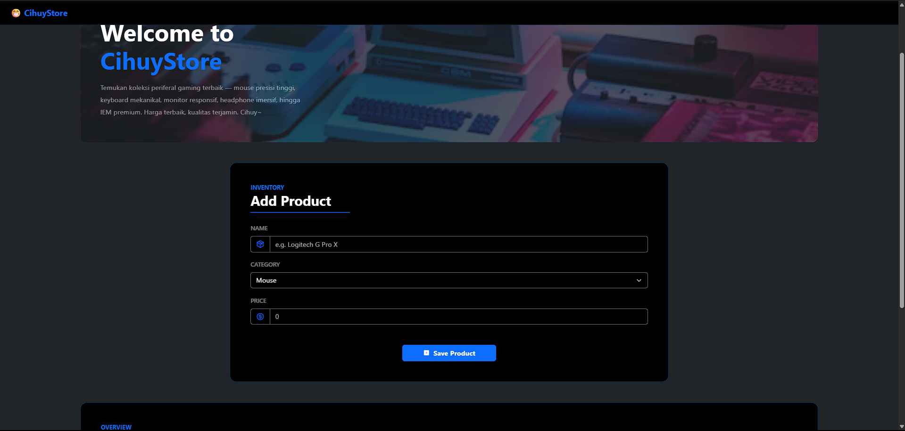
