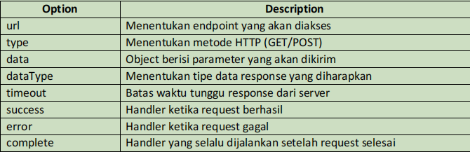
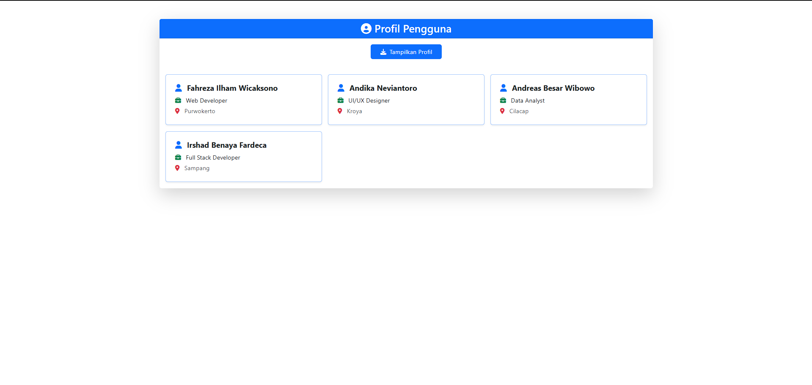

<div align="center">
  <br />

  <h1>LAPORAN PRAKTIKUM <br>
  APLIKASI BERBASIS PLATFORM
  </h1>

  <br />

  <h3>MODUL 10 <br>
  AJAX
  </h3>

  <br />

  

  <br />
  <br />
  <br />

  <h3>Disusun Oleh :</h3>

  <p>
    <strong>Fahreza Ilham Wicaksono</strong><br>
    <strong>2311102191</strong><br>
    <strong>S1 IF-11-REG01</strong>
  </p>

  <br />

  <h3>Dosen Pengampu :</h3>

  <p>
    <strong>Dimas Fanny Hebrasianto Permadi, S.ST., M.Kom</strong>
  </p>
  
  <br />
  <br />
    <h4>Asisten Praktikum :</h4>
    <strong> Apri Pandu Wicaksono </strong> <br>
    <strong>Rangga Pradarrell Fathi</strong>
  <br />

  <h3>LABORATORIUM HIGH PERFORMANCE
 <br>FAKULTAS INFORMATIKA <br>UNIVERSITAS TELKOM PURWOKERTO <br>2026</h3>
</div>

<hr>

## Dasar Teori

### AJAX

AJAX (Asynchronous JavaScript and XML) suatu teknik pemrograman berbasis web untuk menciptakan aplikasi web interaktif. Tujuannya adalah untuk memindahkan sebagian besar interaksi pada komputer user, melakukan pertukaran data dengan server di belakang layar, sehingga halaman web tidak harus dibaca ulang secara keseluruhan setiap kali seorang pengguna melakukan perubahan. Hal ini akan meningkatkan interaktivitas, kecepatan, dan usability.
Secara umum, AJAX melibatkan dua hal yakni:

- Objek `XMLHttpRequest` bawaan browser (untuk meminta data dari sebuah web server).
- `Javascript` dan `HTML DOM` (untuk menampilkan data pada web browser).

### Cara Kerja AJAX

Dalam aplikasinya, AJAX melakukan hal-hal berikut:

1. Suatu event terjadi pada halaman web (seperti page loaded atau button clicked).
2. Sebuah objek `XMLHttpRequest` dibuat oleh Javascript
3. Objek `XMLHttpRequest` mengirimkan request kepada web server.
4. Web server mengelola request.
5. Web server mengirimkan response kepada client.
6. Response dibaca oleh Javascript.
7. Javascript melakukan perubahan pada halaman web menggunakan DOM

### Implementasi AJAX dengan JQuery

AJAX dengan jQuery dapat diimplementasikan menggunakan metode `$.ajax()` yang menyediakan kontrol detail dalam melakukan request. Metode ini sangat berguna ketika kita membutuhkan penanganan yang lebih spesifik terhadap response dari server atau ingin menambahkan konfigurasi tambahan pada request AJAX.
Berikut adalah contoh implementasi AJAX menggunakan metode `$.ajax()`:

```js
<!DOCTYPE html>
<html>

<head>
    <script src="https://code.jquery.com/jquery-3.6.0.min.js"></script>
</head>

<body>
    <h2>The jQuery AJAX</h2>
    <p id="demo">Let AJAX change this text.</p>
    <button type="button" id="changeBtn">Change Content</button>
    <script>
        $(document).ready(function() {
            $("#changeBtn").click(function() {
                $.ajax({
                    // URL yang akan diakses
                    url: "ajax_info.txt",

                    // Metode HTTP yang digunakan (POST/GET)
                    type: "GET",

                    // Data yang dikirim ke server
                    data: {
                        id: 123,
                        name: "John"
                    },

                    // Tipe data yang diharapkan dari server
                    dataType: "html",

                    // Waktu timeout dalam milidetik (5 detik)
                    timeout: 5000,

                    // Callback ketika request berhasil
                    success: function(result) {
                        $("#demo").html(result);
                    },

                    // Callback ketika request gagal
                    error: function(xhr, status, error) {
                        $("#demo").html("Error: " + error);
                    },

                    // Callback yang selalu dijalankan setelah request selesai
                    complete: function(xhr, status) {
                        console.log("Request completed with status: " + status);
                    }
                });
            });
        });
    </script>
</body>

</html>
```

Dalam konteks jQuery AJAX ada yang dikenal sebagai `options` atau parameter konfigurasi. Ini adalah properti-properti yang digunakan untuk mengkonfigurasi request AJAX. Options ini memungkinkan kita untuk menentukan berbagai aspek dari request AJAX, mulai dari URL tujuan, metode yang digunakan, data yang dikirim, hingga tipe data yang diharapkan dari server. Berikut adalah penjelasan setiap options atau parameter konfigurasi:



## Tugas

### Deskripsi

Buat sebuah halaman web yang bisa mengambil data dari server lalu menampilkannya di halaman tanpa perlu reload.

Instruksi Detail:

1. Membuat File Server (data.php)
Buat file PHP yang berfungsi sebagai “database sederhana”.Data cukup berupa array (misalnya: nama, pekerjaan, lokasi). Contoh data:

`['nama' => 'Budi', 'pekerjaan' => 'Web Developer', 'lokasi' => 'Jakarta']`
Ubah data tersebut menjadi format JSON menggunakan json_encode().
Tampilkan hasilnya dengan echo.

Jangan lupa tambahkan header:
header('Content-Type: application/json');

2.Membuat File Client (index.html)
Buat tombol dengan teks "Tampilkan Profil". Siapkan tempat untuk menampilkan data, misalnya:
`<div id="hasil-profil"></div>`

3.Membuat Logika AJAX (JavaScript)
Tambahkan event ketika tombol diklik. Gunakan fetch() (atau boleh pakai XMLHttpRequest / jQuery AJAX) untuk mengambil data dari data.php. Ambil hasil response dalam bentuk JSON.

Tampilkan data tersebut ke dalam `<div id="hasil-profil">` dengan format:
Nama: Budi | Pekerjaan: Web Developer | Lokasi: Jakarta

### Source code

#### data.php

```php
<!-- 2311102191 -->
<!-- FAHREZA ILHAM WICAKSONO -->
<!-- 👍🏿 -->

<?php
header('Content-Type: application/json');

$data = [
    [
        'name' => 'Fahreza Ilham Wicaksono',
        'job' => 'Web Developer',
        'address' => 'Purwokerto'
    ],
    [
        'name' => 'Andika Neviantoro',
        'job' => 'UI/UX Designer',
        'address' => 'Kroya'
    ],
    [
        'name' => 'Andreas Besar Wibowo',
        'job' => 'Data Analyst',
        'address' => 'Cilacap'
    ],
    [
        'name' => 'Irshad Benaya Fardeca',
        'job' => 'Full Stack Developer',
        'address' => 'Sampang'
    ]
];

echo json_encode($data);
```

#### index.php

```html
<!-- 2311102191 -->
<!-- FAHREZA ILHAM WICAKSONO -->
<!-- 👍🏿 -->

<!DOCTYPE html>
<html lang="en">

<head>
    <meta charset="UTF-8">
    <meta name="viewport" content="width=device-width, initial-scale=1.0">
    <title>Profil Mahasiswa</title>

    <link rel="icon" href="data:image/svg+xml,<svg xmlns='http://www.w3.org/2000/svg' viewBox='0 0 100 100'><text y='.9em' font-size='80'>🎓</text></svg>">

    <!-- Bootstrap -->
    <link href="https://cdn.jsdelivr.net/npm/bootstrap@5.3.0/dist/css/bootstrap.min.css" rel="stylesheet">

    <!-- Font Awesome -->
    <link href="https://cdnjs.cloudflare.com/ajax/libs/font-awesome/6.5.0/css/all.min.css" rel="stylesheet">

    <!-- jQuery -->
    <script src="https://code.jquery.com/jquery-3.6.0.min.js"></script>

    <style>
        .profile-card {
            transition: 0.3s;
        }

        .profile-card:hover {
            transform: translateY(-5px);
        }
    </style>
</head>

<body>
    <div class="container mt-5">
        <div class="card shadow-lg border-0">
            <div class="card-header bg-primary text-white text-center">
                <h3 class="mb-0">
                    <i class="fas fa-user-circle me-2"></i>Profil Pengguna
                </h3>
            </div>

            <div class="card-body text-center">
                <button id="btn-load" class="btn btn-primary px-4">
                    <i class="fas fa-download me-2"></i>Tampilkan Profil
                </button>

                <div id="loading" class="mt-4 d-none">
                    <div class="spinner-border text-primary" role="status"></div>
                    <p class="mt-2 text-muted">Memuat data...</p>
                </div>

                <div id="hasil-profil" class="row mt-4 g-3"></div>
            </div>
        </div>
    </div>
</body>

<script>
    $(document).ready(function() {
        $("#btn-load").click(function() {
            $("#hasil-profil").html("");
            $("#loading").removeClass("d-none");

            $.ajax({
                url: "data.php",
                method: "GET",
                dataType: "json",

                success: function(data) {
                    let output = "";

                    if (data.length === 0) {
                        output = `
                                <div class="col-12">
                                    <div class="alert alert-warning">
                                        <i class="fas fa-exclamation-circle"></i> Tidak ada data
                                    </div>
                                </div>
                            `;
                    } else {
                        $.each(data, function(index, item) {
                            output += `
                                <div class="col-md-6 col-lg-4">
                                    <div class="card profile-card shadow-sm border border-primary-subtle h-100 p-2">
                                        <div class="card-body text-start">
                                            <h5 class="fw-bold">
                                                <i class="fas fa-user text-primary me-2"></i>
                                                ${item.name}
                                            </h5>

                                            <p class="mb-1">
                                                <i class="fas fa-briefcase text-success me-2"></i>
                                                ${item.job}
                                            </p>

                                            <p class="mb-0 text-muted">
                                                <i class="fas fa-map-marker-alt text-danger  me-2"></i>
                                                ${item.address}
                                            </p>
                                        </div>
                                    </div>
                                </div>
                            `;
                        });
                    }

                    setTimeout(() => {
                        $("#loading").addClass("d-none");
                        $("#hasil-profil").hide().html(output).fadeIn(300);
                    }, 300);
                },

                error: function() {
                    $("#loading").addClass("d-none");

                    $("#hasil-profil").html(`
                        <div class="col-12">
                            <div class="alert alert-danger">
                                <i class="fas fa-times-circle"></i> Gagal mengambil data dari server
                            </div>
                        </div>
                    `);
                }
            });
        });
    });
</script>

</html>
```

### Penjelasan kode

#### Kode data.php

```php
<?php
header('Content-Type: application/json');

$data = [
    [
        'name' => 'Fahreza Ilham Wicaksono',
        'job' => 'Web Developer',
        'address' => 'Purwokerto'
    ],
    [
        'name' => 'Andika Neviantoro',
        'job' => 'UI/UX Designer',
        'address' => 'Kroya'
    ],
    [
        'name' => 'Andreas Besar Wibowo',
        'job' => 'Data Analyst',
        'address' => 'Cilacap'
    ],
    [
        'name' => 'Irshad Benaya Fardeca',
        'job' => 'Full Stack Developer',
        'address' => 'Sampang'
    ]
];

echo json_encode($data);
```

Pada kode data.php, file ini berperan sebagai endpoint API sederhana. Baris `header('Content-Type: application/json');` berfungsi untuk memberi tahu client (browser) bahwa response yang dikirim berupa JSON. Kemudian variabel `$data` berisi array asosiatif yang menyimpan beberapa objek data pengguna (`nama`, `pekerjaan`, `alamat`). Fungsi `json_encode($data)` digunakan untuk mengubah array PHP menjadi format JSON agar bisa dikonsumsi oleh JavaScript di sisi client.

#### Kode HTML

```html
<div class="container mt-5">
    <div class="card shadow-lg border-0">
        <div class="card-header bg-primary text-white text-center">
            <h3 class="mb-0">
                <i class="fas fa-user-circle me-2"></i>Profil Pengguna
            </h3>
        </div>

        <div class="card-body text-center">
            <button id="btn-load" class="btn btn-primary px-4">
                <i class="fas fa-download me-2"></i>Tampilkan Profil
            </button>

            <div id="loading" class="mt-4 d-none">
                <div class="spinner-border text-primary" role="status"></div>
                <p class="mt-2 text-muted">Memuat data...</p>
            </div>

            <div id="hasil-profil" class="row mt-4 g-3"></div>
        </div>
    </div>
</div>
```

Pada kode HTML, struktur halaman dibuat menggunakan Bootstrap. Terdapat tombol dengan id `btn-load` yang berfungsi sebagai trigger untuk mengambil data dari server. Selain itu, terdapat elemen `#loading` yang awalnya disembunyikan (`d-none`) dan akan digunakan sebagai indikator loading (`spinner`), serta elemen `#hasil-profil` sebagai container untuk menampilkan hasil data dalam bentuk card.

#### AJAX request

```js
<script>
    $(document).ready(function() {
        $("#btn-load").click(function() {
            $("#hasil-profil").html("");
            $("#loading").removeClass("d-none");

            $.ajax({
                url: "data.php",
                method: "GET",
                dataType: "json",

                success: function(data) {
                    let output = "";

                    if (data.length === 0) {
                        output = `
                                <div class="col-12">
                                    <div class="alert alert-warning">
                                        <i class="fas fa-exclamation-circle"></i> Tidak ada data
                                    </div>
                                </div>
                            `;
                    } else {
                        $.each(data, function(index, item) {
                            output += `
                                <div class="col-md-6 col-lg-4">
                                    <div class="card profile-card shadow-sm border border-primary-subtle h-100 p-2">
                                        <div class="card-body text-start">
                                            <h5 class="fw-bold">
                                                <i class="fas fa-user text-primary me-2"></i>
                                                ${item.name}
                                            </h5>

                                            <p class="mb-1">
                                                <i class="fas fa-briefcase text-success me-2"></i>
                                                ${item.job}
                                            </p>

                                            <p class="mb-0 text-muted">
                                                <i class="fas fa-map-marker-alt text-danger  me-2"></i>
                                                ${item.address}
                                            </p>
                                        </div>
                                    </div>
                                </div>
                            `;
                        });
                    }

                    setTimeout(() => {
                        $("#loading").addClass("d-none");
                        $("#hasil-profil").hide().html(output).fadeIn(300);
                    }, 300);
                },

                error: function() {
                    $("#loading").addClass("d-none");

                    $("#hasil-profil").html(`
                        <div class="col-12">
                            <div class="alert alert-danger">
                                <i class="fas fa-times-circle"></i> Gagal mengambil data dari server
                            </div>
                        </div>
                    `);
                }
            });
        });
    });
</script>
```

Pada kode AJAX, kode jQuery dijalankan setelah dokumen siap `($(document).ready())`. Ketika tombol diklik, konten lama pada `#hasil-profil` dikosongkan dan elemen loading ditampilkan. Kemudian dilakukan request AJAX menggunakan `$.ajax()` dengan method `GET` ke file `data.php` dan mengharapkan response berupa JSON (`dataType: "json"`).

Jika request berhasil (`success`), data yang diterima akan diproses. Jika array kosong, maka ditampilkan alert peringatan. Jika terdapat data, maka dilakukan iterasi menggunakan `$.each()` untuk membangun HTML secara dinamis dalam bentuk card Bootstrap untuk setiap item. Data seperti `name`, `job`, dan `address` dimasukkan ke dalam template string (`backtick`) sehingga lebih fleksibel.

Setelah proses selesai, terdapat `setTimeout()` selama 300ms yang digunakan untuk memberikan efek delay agar animasi loading terasa lebih halus. Kemudian loading disembunyikan, dan hasil ditampilkan dengan efek `fadeIn() `untuk meningkatkan user experience. Jika terjadi error saat request (`error`), maka loading disembunyikan dan ditampilkan pesan error menggunakan alert Bootstrap.

### Output


