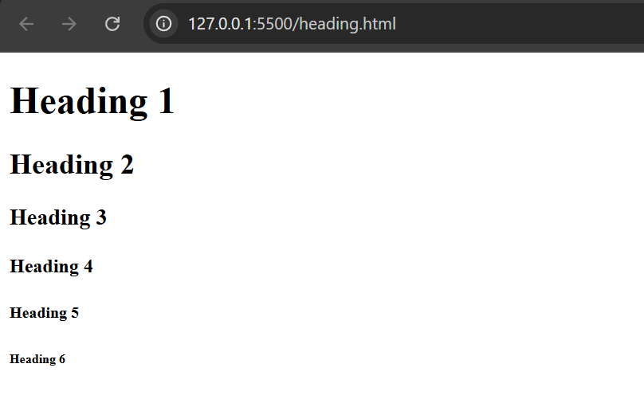
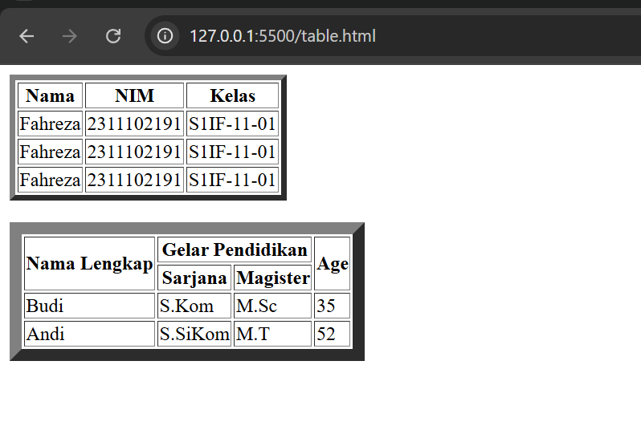
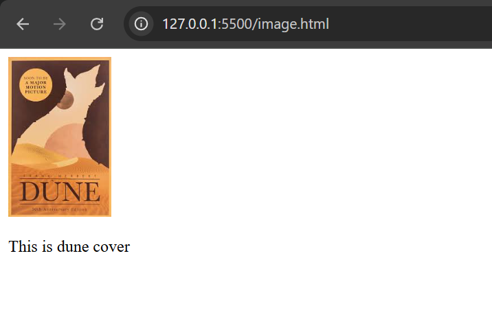
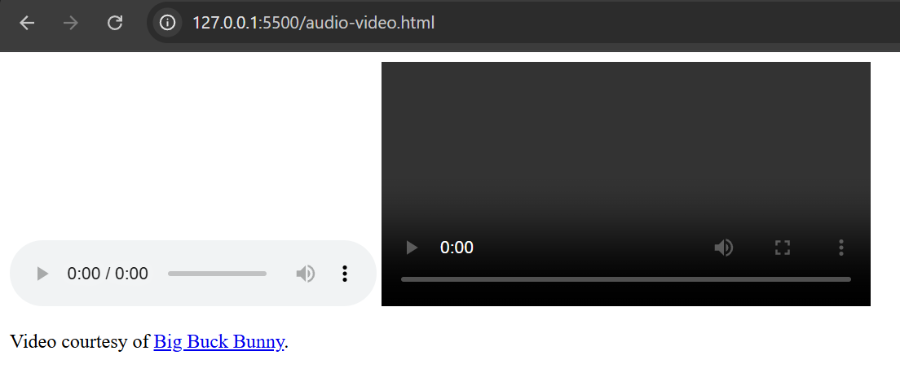
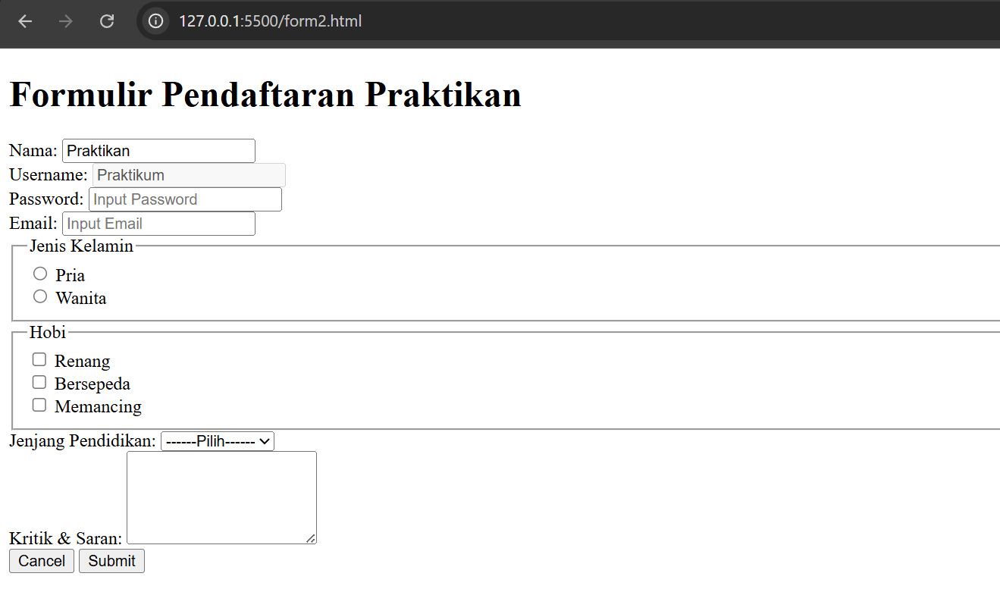
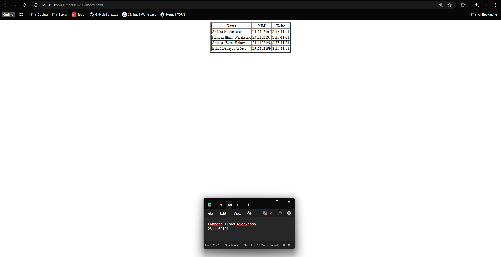

<div align="center">
  <br />

  <h1>LAPORAN PRAKTIKUM <br>
  APLIKASI BERBASIS PLATFORM
  </h1>

  <br />

  <h3>MODUL II <br>
  HTML
  </h3>

  <br />

  

  <br />
  <br />
  <br />

  <h3>Disusun Oleh :</h3>

  <p>
    <strong>Fahreza Ilham Wicaksono</strong><br>
    <strong>2311102191</strong><br>
    <strong>S1 IF-11-REG01</strong>
  </p>

  <br />

  <h3>Dosen Pengampu :</h3>

  <p>
    <strong>Dimas Fanny Hebrasianto Permadi, S.ST., M.Kom</strong>
  </p>
  
  <br />
  <br />
    <h4>Asisten Praktikum :</h4>
    <strong> Apri Pandu Wicaksono </strong> <br>
    <strong>Rangga Pradarrell Fathi</strong>
  <br />

  <h3>LABORATORIUM HIGH PERFORMANCE
 <br>FAKULTAS INFORMATIKA <br>UNIVERSITAS TELKOM PURWOKERTO <br>2026</h3>
</div>

<hr>

## Dasar Teori

### Pengenalan HTML

HTML atau HyperText Markup Language merupakan bahasa dasar yang digunakan untuk membangun sebuah web dimana HTML menangani elemen-elemen dasar pada pembangunan sebuah website.

#### Tag HTML

Tag dalam HTML secara normal memiliki sepasang tag di mana tag pertama merupakan tag pembuka dan yang kedua merupakan tag penutup. Konten yang ingin ditampilkan pada laman web diletakkan di antara kedua tag tersebut.

```html
<nama_tag> letakkan konten di sini … </nama_tag>
```

Tag dalam HTML tidak semuanya berbentuk pasangan, ada beberapa tag yang hanya berdiri sendiri seperti tag `<br/>` yang berguna untuk berpindah baris.

#### Elemen HTML

Elemen HTML merupakan tag HTML yang telah memiliki konten atau isi di antara kedua tag pembuka dan  penutupnya. Elemen HTML dapat berupa teks atau juga dapat menyisipkan tag HTML lain pada elemen tersebut.

#### Atribut HTML

Atribut HTML merupakan tambahan informasi dari sebuah tag HTML. Bentuk atribut untuk setiap tag HTML berbeda-beda sehingga kegunaan atribut juga berbeda seperti menambahkan informasi warna elemen, ukuran lebar, ukuran panjang dan lain-lain. Namun, mayoritas atribut yang sering muncul untuk setiap tag HTML adalah atribut `id` dan `class` karena kedua atribut ini berperan besar dalam pengembangan laman web dengan CSS dan JavaScript. Atribut HTML dideklarasikan di dalam tag pembuka pada setiap elemen HTML dengan format `nama_atribut=”value”`, setiap nilai atribut diapit oleh petik dua.

### Dasar Sintaks HTML

```html
<!DOCTYPE html>
<html lang="en">
<head>
    <meta charset="UTF-8">
    <meta name="viewport" content="width=device-width, initial-scale=1.0">
    <title>Document</title>
</head>
<body>
    
</body>
</html>
```

Seperti yang sudah dijelaskan sebelumnya struktur dasar HTML antara lain berupa:

- Deklarasi <! DOCTYPE html> mendefinisikan dokumen menjadi HTML5
- Elemen `<html>` adalah elemen dasar dari halaman HTML
- Elemen `<head>` berisi informasi meta tentang dokumen
- Elemen `<title>` menentukan judul untuk dokumen
- Elemen `<body>` berisi konten halaman yang terlihat

### Heading

Heading pada HTML merupakan tag yang berguna untuk menampilkan judul dari konten laman web yang dibangun. Dalam HTML terdapat enam tingkatan Heading di mana semakin kecil nilai heading nya maka semakin penting dan semakin besar ukurannya pada laman web.

```html
<h1>Heading 1</h1>
<h2>Heading 2</h2>
<h3>Heading 3</h3>
<h4>Heading 4</h4>
<h5>Heading 5</h5>
<h6>Heading 6</h6>
```



### Hyperlink

Hyperlink dalam HTML memungkinkan halaman web berpindah laman atau bernavigasi menuju laman web yang lain. Tag yang digunakan adalah tag `<a>…</a>` dengan atribut href sebagai urlnya.

```html
<a href="https://instagram.com">IG</a>
```

### Tabel

Tabel pada HTML merupakan salah satu elemen penting khususnya digunakan untuk menampilkan data yang membutuhkan bentuk tabel. Tabel pada HTML didefinisikan dengan tag `<table></table>` dengan setiap pendefinisian baris menggunakan tag `<tr></tr>`, pendefinisian heading tabel menggunakan tag `<th></th>` dan pendefinisian kolom menggunakan tag `<td></td>`.

Dalam tabel HTML kita dapat melakukan operasi Merge Cell yang biasanya dapat dilakukan pada aplikasi perkantoran seperti Microsoft Word atau Excel dengan cara menambahkan atribut colspan dan rowspanpada tag pembuka kolom yaitu `<td>` nilai dari atribut tersebut berupa jumlah kolom atau baris yang akan djgabungkan.

```html
 <table border="5">
        <tr>
            <th>Nama</th>
            <th>NIM</th>
            <th>Kelas</th>
        </tr>

        <tr>
            <td>Fahreza</td>
            <td>2311102191</td>
            <td>S1IF-11-01</td>
        </tr>

        <tr>
            <td>Fahreza</td>
            <td>2311102191</td>
            <td>S1IF-11-01</td>
        </tr>

        <tr>
            <td>Fahreza</td>
            <td>2311102191</td>
            <td>S1IF-11-01</td>
        </tr>
    </table>

    <br>

    <table width=”80%” height=”50%” border="10">
        <tr>
            <th rowspan="2">Nama Lengkap</th>
            <th colspan="2">Gelar Pendidikan</th>
            <th rowspan="2">Age</th>
        </tr>

        <tr>
            <th> Sarjana </th>
            <th> Magister </th>
        </tr>

        <tr>
            <td>Budi</td>
            <td>S.Kom</td>
            <td>M.Sc</td>
            <td>35</td>
        </tr>
        
        <tr>
            <td>Andi</td>
            <td>S.SiKom</td>
            <td>M.T</td>
            <td>52</td>
        </tr>
    </table>
```



### Image

Menampilkan gambar pada halaman web merupakan sebuah improvisasi dalam pembuatan desain sebuah web yang dapat memperindah tampilan website. Tag HTML yang digunakan adalah `` tag ini tidak memiliki pasangan penutup maka dari itu diakhir tag pembuka ditambahkan garis miring seperti di atas. Terdapat satu atribut wajib yang harus ditambahkan seperti atribut `href` pada tag Hyperlink yaitu atribut `src` yang bernilai alamat direktori gambar disimpan.

```html

<p>This is dune cover</p>
```



### Audio / Video Elemen

Sebelum berkembangnya teknologi HTML5, untuk menyisipkan audio atau video, diperlukan sebuah plugin seperti Flash Player namun sekarang dengan HTML5 memiliki tag yang dapat menyisipkan audio atau video ke dalam laman web. Untuk audio menggunakan tag `<audio>` untuk tag pembuka dan `<source>` untuk memanggil url atau alamat direktori file. Sedangkan untuk video menggunakan tag `<video>`.

```html
    <audio controls>
        <source src="horse.ogg" type="audio/ogg">
        <source src="horse.mp3" type="audio/mpeg"> Your browser does not support the
        audio element.
    </audio>

    <video width="400" controls>
        <source src="mov_bbb.mp4" type="video/mp4">
        <source src="mov_bbb.ogg" type="video/ogg"> Your browser does not support
        HTML5 video.
    </video>
    
    <p>
        Video courtesy of
        <a href="https://www.bigbuckbunny.org/" target="_blank">Big Buck Bunny</a>.
    </p>
```



### Form

Form pada HTML digunakan sebagai wadah untuk menampung dan mengumpulkan data-data dari pengguna jika diperlukan untuk disimpan dalam sebuah database. Tag dasar untuk pemanggilan form adalah `<form> … </form>` dan diantara tag form tersebut merupakan tempat mendefinisikan elemen-elemen yang dibutuhkan form yang akan dibuat nantinya. Atribut utama dari tag form yaitu action, atribut ini bernilai tujuan data akan diolah dengan bahasa pemrograman web saat tombol “Submit” ditekan, selain itu atribut method yang hanya bernilai `POST` atau `GET` ini juga sangat dibutuhkan untuk pengolahan data dengan bahasa pemrograman web. Pembahasan lebih lanjut ada pada modul PHP.

<br/>

Elemen html yang biasanya digunakan pada form adalah `<input />`, `<select><option> … </option></select>`, `<textarea> … </textarea>`, `<button> … </button>`.

```html
<h1>Formulir Pendaftaran Praktikan</h1>
    <form action="#" method="POST">
        <div class="form-group">
            <label for="nama_id">Nama:</label>
            <input type="text" name="nama_input" id="nama_id" placeholder="Input Nama" value="Praktikan" readonly>
        </div>
        <div class="form-group">
            <label for="uname_id">Username:</label>
            <input type="text" name="uname_input" id="uname_id" placeholder="Input Username" value="Praktikum" disabled>
        </div>
        <div class="form-group">
            <label for="password_id">Password:</label>
            <input type="password" name="password_input" id="password_id" placeholder="Input Password">
        </div>
        <div class="form-group">
            <label for="email_id">Email:</label>
            <input type="email" name="email_input" id="email_id" placeholder="Input Email">
        </div>
        <fieldset>
            <legend>Jenis Kelamin</legend>
            <div>
                <input type="radio" name="jk_input" id="pria" value="Pria">
                <label for="pria">Pria</label>
            </div>
            <div>
                <input type="radio" name="jk_input" id="wanita" value="Wanita">
                <label for="wanita">Wanita</label>
            </div>
        </fieldset>
        <fieldset>
            <legend>Hobi</legend>
            <div>
                <input type="checkbox" name="hobi_input" id="renang" value="Renang">
                <label for="renang">Renang</label>
            </div>
            <div>
                <input type="checkbox" name="hobi_input" id="bersepeda" value="Bersepeda">
                <label for="bersepeda">Bersepeda</label>
            </div>
            <div>
                <input type="checkbox" name="hobi_input" id="memancing" value="Memancing">
                <label for="memancing">Memancing</label>
            </div>
        </fieldset>
        <div class="form-group">
            <label for="jp_id">Jenjang Pendidikan:</label>
            <select name="jp_input" id="jp_id">
                <option value="" selected>------Pilih------</option>
                <option value="D3">Tamat D3</option>
                <option value="S1">Tamat S1</option>
                <option value="S2">Tamat S2</option>
                <option value="S3">Tamat S3</option>
            </select>
        </div>
        <div class="form-group">
            <label for="kritik_saran">Kritik & Saran:</label>
            <textarea id="kritik_saran" name="kritik_saran" rows="5"></textarea>
        </div>
        <div class="form-actions">
            <button type="button" class="btn-cancel">Cancel</button>
            <button type="submit" class="btn-submit">Submit</button>
        </div>
    </form>
```



## Tugas

### 1. Buat tampilan table dasar namun harus di tengah layar/center dan tidak boleh menggunakan css atau styling atau apapun itu

#### Source code

```html
<!DOCTYPE html>
<html lang="en">

<head>
    <meta charset="UTF-8">
    <meta name="viewport" content="width=device-width, initial-scale=1.0">
    <title>Tabel</title>
</head>

<body>
    <!-- Tabel -->
    <!-- Ditambah atribut align="center" untuk posisi tabel ditengah -->
    <table align="center" border="5">
        <tr>
            <th>Nama</th>
            <th>NIM</th>
            <th>Kelas</th>
        </tr>

        <tr>
            <td>Andika Neviantoro</td>
            <td>2311102167</td>
            <td>S1IF-11-01</td>
        </tr>

        <tr>
            <td>Fahreza Ilham Wicaksono</td>
            <td>2311102191</td>
            <td>S1IF-11-01</td>
        </tr>

        <tr>
            <td>Andreas Besar Wibowo</td>
            <td>2311102198</td>
            <td>S1IF-11-01</td>
        </tr>

        <tr>
            <td>Irshad Benaya Fardeca</td>
            <td>2311102199</td>
            <td>S1IF-11-01</td>
        </tr>
    </table>
</body>

</html>
```

#### Output


Gambar tersebut merupakan hasil dari kode html sebelumnya. Terdapat tag `<table>` untuk inisialisasi struktur tabel lalu diikuti `<tr>` untuk struktur row atau baris dengan didalamanya ada `<th>` untuk header atau `<td>` untuk data biasa. Agar posisi tabel ditengah tanpa menggunakan css tambahan bisa menggunakan atribut `align="center"`
