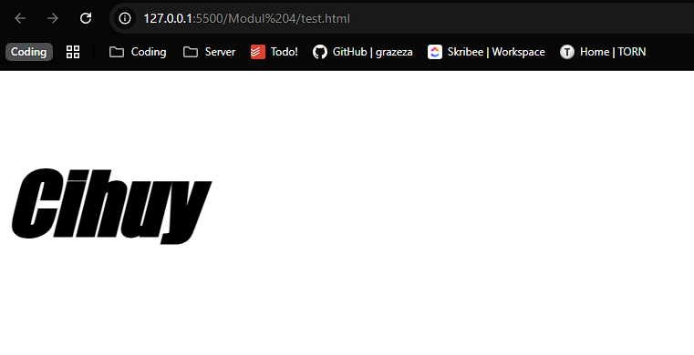
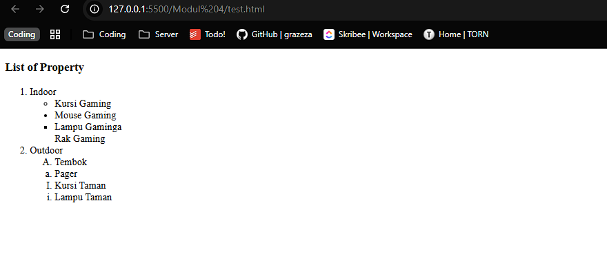
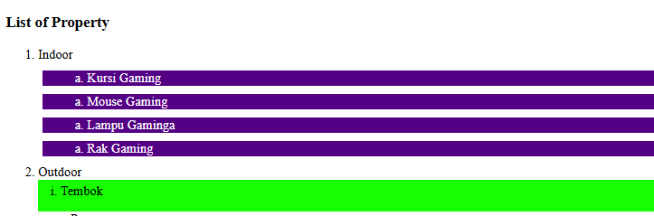
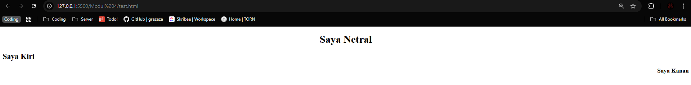
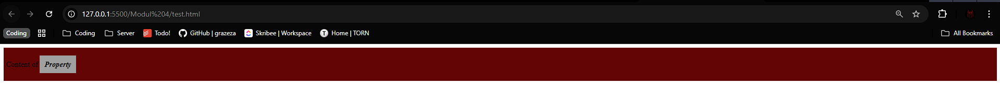
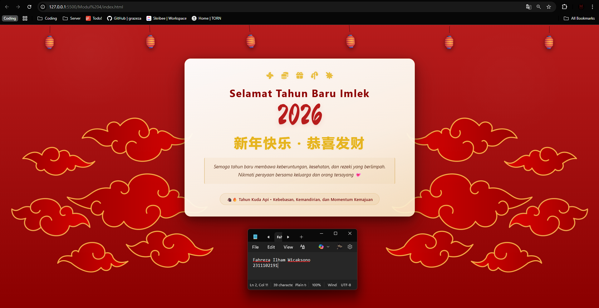

<div align="center">
  <br />

  <h1>LAPORAN PRAKTIKUM <br>
  APLIKASI BERBASIS PLATFORM
  </h1>

  <br />

  <h3>MODUL III <br>
  CSS - Cascading Style Sheet
  </h3>

  <br />

  

  <br />
  <br />
  <br />

  <h3>Disusun Oleh :</h3>

  <p>
    <strong>Fahreza Ilham Wicaksono</strong><br>
    <strong>2311102191</strong><br>
    <strong>S1 IF-11-REG01</strong>
  </p>

  <br />

  <h3>Dosen Pengampu :</h3>

  <p>
    <strong>Dimas Fanny Hebrasianto Permadi, S.ST., M.Kom</strong>
  </p>
  
  <br />
  <br />
    <h4>Asisten Praktikum :</h4>
    <strong> Apri Pandu Wicaksono </strong> <br>
    <strong>Rangga Pradarrell Fathi</strong>
  <br />

  <h3>LABORATORIUM HIGH PERFORMANCE
 <br>FAKULTAS INFORMATIKA <br>UNIVERSITAS TELKOM PURWOKERTO <br>2026</h3>
</div>

<hr>

## Dasar Teori

### Pengenalan CSS

Cascading Style Sheets (CSS) merupakan bahasa yang membantu memperindah tampilan dari laman webyang telah dibangun dengan HTML. CSS mendeskripsikan bagaimana bentuk tampilan elemen HTML seharusnya saat ditampilkan pada laman browser.

<br/>

Selector merupakan elemen HTML yang akan ditambahkan CSS kemudian diikuti dengan declaration blockyang terdiri dari property elemen yang akan dirubah beserta value dari property-nya. Setiap deklarasi selector dapat merubah banyak nilai property sekaligus dengan dipisahkan dengan titik koma dan untuk semua declaration block dari satu selector berada di antara kurung kurawal.

#### Cara Menyisipkan CSS

Terdapat tiga cara untuk menyisipkan atau mendefinisikan CSS ke dalam HTML, antara lain:

1. External Style Sheet
Eksternal Style Sheet merupakan cara menyisipkan atau mendefinisikan CSS ke dalam HTML dengan memanggil file dengan ekstensi .css ke dalam file HTML. Pemanggilannya diletakkan di antara elemen `<head></head>` dengan menggunakan tag `<link/>`.

```html
<head>
 <link rel="stylesheet" type="text/css" href="myStyleSheet.css">
</head>
```

2. Internal Style Sheet
Internal Style Sheet merupakan cara menyisipkan atau mendefinisikan CSS ke dalam HTML dengan menggunakan tag `<style> </style>` pada elemen `<head></head>`. Biasanya digunakan ketika satu laman membutuhkan style CSS yang berbeda dari yang telah dipanggil pada Eksternal Style Sheet

```html
<head>
 <style>
 body {
 background-color: blue;
 }
 h1 {
 color: maroon;
 margin-left: 40px;
 }
 </style>
</head>
```

3. Inline Style

Inline Style menyisipkan atau mendefinisikan CSS ke dalam HTML dengan menambahkan atribut stylepada elemen yang ingin ditambahkan CSS. Biasanya digunakan hanya untuk satu elemen yangmembutuhkan style CSS yang berbeda dari yang telah didefinisikan pada Internal Style atau EksternalStyle.

```html
<h1 style="color:lightblue; font-size:30px;">Praktikum Web Programming</h1>
```

#### Selector

Selector pada CSS digunakan untuk menemukan elemen HTML untuk diberi CSS berdasarkan selector yang didefinisikan. Bentuk selector ada beberapa antara lain nama elemen HTML, atribut `id` dan atribut `class`.

```css
/*Selector dengan Elemen 
HTML*/
p {
 text-align: center;
 color: red;
}
/*Selector dengan Id Elemen 
HTML*/
#para1 {
 text-align: center;
 color: red;
}
/*Selector dengan Class Elemen 
HTML*/
p.center {
 text-align: center;
 color: red;
}
```

### Font Properties

Sebuah laman web tentunya tidak lepas oleh penggunaan teks, oleh karena itu memiliki tampilan teks yang tepat sangat diperlukan agar sebuah web memiliki tampilan yang baik dan menarik. CSS dapat menangani kebutuhan tampilan teks dengan font properties.

```css
.example {
    font-family: Impact, Haettenschweiler, 'Arial Narrow Bold', sans-serif;
    font-size: 100px;
    color: ligh;
    font-style: italic;
    font-weight: bold;
}
```



### List Properties

Dalam HTML terdapat elemen yang berguna membuat sebuah list menggunakan simbol dan karakter. Tagyang digunakan adalah tag `<ul></ul>` atau `<ol></ol>`. Tag `<ul>` digunakan ketika akan menggunakan listdengan penanda berupa simbol atau bisa dikatakan unordered list, sedangkan tag `<ol>` digunakan ketika akan menggunakan list dengan penanda karakter yang memiliki urutan atau bisa dikatakan ordered list. Namun di dalam tag tersebut juga harus didefinisikan tag pendukung yaitu `<li></li>` untuk mendefinisikan elemen-elemen list yang akan ditampilkan. Untuk setiap tag ordered list atau unordered list memiliki satu atribut untuk mendefinisikan tipe simbol atau karakter yang akan digunakan yaitu atribut type.

```html
<h3>List of Property</h3>
    <ol type="1">
        <li>Indoor
            <ul type="circle">
                <li>Kursi Gaming</li>
            </ul>
            <ul type="disc">
                <li>Mouse Gaming</li>
            </ul>
            <ul type="square">
                <li>Lampu Gaminga</li>
            </ul>
            <ul type="none">
                <li>Rak Gaming</li>
            </ul>
        </li>
        <li>Outdoor
            <ol type="A">
                <li>Tembok</li>
            </ol>
            <ol type="a">
                <li>Pager</li>
            </ol>
            <ol type="I">
                <li>Kursi Taman</li>
            </ol>
            <ol type="i">
                <li>Lampu Taman</li>
            </ol>
        </li>
    </ol>
```



Dengan ditambahkan CSS pada elemen list, maka list yang ditampilkan dapat lebih menarik.

```css
ul.listsatu {
            background-color: rgb(84, 0, 133);
            margin: 10px 5px 10px 5px;
            list-style-type: lower-alpha;
            list-style-position: inside;
            color: white;
        }

        ol.listdua {
            background-color: rgb(21, 255, 0);
            list-style-type: lower-roman;
            padding: 5px 5px 15px 15px;
            list-style-position: inside;
        }
```



### Alignment of Text

```css
h1 {
            text-align: center;
        }

        h2 {
            text-align: left;
        }

        h3 {
            text-align: right;
        }
```



### Colors

Jika berbicara desain antar muka web, permasalahan tentang warna merupakan salah satu hal yang penting. Pada dasarnya Tag HTML dapat menangani pengaturan warna latar belakang atau teks menggunakan atribut dari HTML sendiri, namun CSS dapat menangani lebih baik dengan menawarkan pengaturan yang lebih lengkap.

```css
body{ 
    background-color: HSL(20%, 40%, 70%); 
    color: orange; 
} 

#teks{ 
    color: #2F3CDF; 
} 

/*dengan opacity sebesar 0.5*/ 
input.text-field{ 
    background-color: RGBA(32, 55, 122, 0.5); 
}
```

### Span & Div

Span merupakan elemen HTML yang dapat menangani perubahan konten elemen pada satu baris. Tagyang digunakan adalah `<span></span>`. Sedangkan Div merupakan elemen HTML yang digunakan untuk membuat section untuk beberapa elemen HTML di dalamnya. Tag yang digunakan yaitu `<div></div>`

```html
<div class="section1">
    <p> Content of <span class="mark"> Property </span> </p>
</div>
```

```css
.section1 {
            background-color: rgb(100, 5, 5);
            padding: 10px 5px 10px 5px;
        }

        .mark {
            background-color: rgb(160, 160, 160);
            font-style: italic;
            font-weight: bold;
            padding: 10px 10px 10px 10px;
        }
```



## Tugas

### 1. Buat halaman untuk merayakan imlek ("karena bubub gua cina") hanya menggunakan css tanpa library dan tanpa js

#### Source code

##### HTML

```html
<!DOCTYPE html>
<html lang="id">

<head>
    <meta charset="UTF-8" />
    <meta name="viewport" content="width=device-width, initial-scale=1.0" />
    <title>Selamat Tahun Baru Imlek</title>
    <link rel="shortcut icon" href="favicon.ico" type="image/x-icon">
    <link rel="icon"
        href="data:image/svg+xml,<svg xmlns='http://www.w3.org/2000/svg' viewBox='0 0 100 100'><text y='.9em' font-size='90'>🏮</text></svg>">

    <!-- Font Awesome -->
    <link rel="stylesheet" href="https://cdnjs.cloudflare.com/ajax/libs/font-awesome/7.0.1/css/all.min.css"
        integrity="sha512-2SwdPD6INVrV/lHTZbO2nodKhrnDdJK9/kg2XD1r9uGqPo1cUbujc+IYdlYdEErWNu69gVcYgdxlmVmzTWnetw=="
        crossorigin="anonymous" referrerpolicy="no-referrer" />

    <!-- Font Tambahan -->
    <link
        href="https://fonts.googleapis.com/css2?family=Noto+Serif+SC:wght@400;700;900&family=Ma+Shan+Zheng&family=Lora:ital,wght@0,400;0,600;1,400&display=swap"
        rel="stylesheet">

    <link rel="stylesheet" href="style.css" />
</head>

<body>
    <!-- Lentera menggantung -->
    <div class="lanterns" aria-hidden="true">
        <div class="lantern"><span class="lantern-icon">🏮</span></div>
        <div class="lantern"><span class="lantern-icon">🏮</span></div>
        <div class="lantern"><span class="lantern-icon">🏮</span></div>
        <div class="lantern"><span class="lantern-icon">🏮</span></div>
        <div class="lantern"><span class="lantern-icon">🏮</span></div>
        <div class="lantern"><span class="lantern-icon">🏮</span></div>
    </div>

    <!-- Kartu ucapan -->
    <main class="stage">
        <section class="card" role="region" aria-label="Ucapan Tahun Baru Imlek">
            <div class="decor-top">
                <i class="fa-solid fa-fan"></i>
                <i class="fa-solid fa-coins"></i>
                <i class="fa-solid fa-gift"></i>
                <i class="fa-solid fa-plant-wilt"></i>
                <i class="fa-solid fa-burst"></i>
            </div>

            <h1 class="title">Selamat Tahun Baru Imlek</h1>
            <h1 class="year">2026</h1>
            <p class="chinese">新年快乐 · 恭喜发财</p>

            <p class="message">
                Semoga tahun baru membawa keberuntungan, kesehatan, dan rezeki yang berlimpah.
                Nikmati perayaan bersama keluarga dan orang tersayang 💗
            </p>

            <div class="year-info">
                <span>🐴🔥 Tahun Kuda Api • Kebebasan, Kemandirian, dan Momentum Kemajuan</span>
            </div>
        </section>
    </main>

    <!-- Footer -->
    <footer class="cloud-footer" aria-hidden="true">
        <div class="cloud cloud-left">
            
        </div>

        <div class="cloud cloud-right">
            
        </div>
    </footer>
</body>

</html>
```

##### Penjelasan kode

Pada halaman ini digunakan dua library tambahan yang hanya berfungsi untuk menyediakan ikon dan font. Untuk pengaturan tampilan (styling), digunakan CSS eksternal yang terhubung melalui file style.css. Struktur pada kode HTML terdiri dari tiga bagian utama, yaitu header, main, dan footer. Pada bagian header, digunakan kombinasi elemen `<div>` dan `<span>` untuk membentuk dekorasi lentera yang menggantung. Bagian main menampilkan sebuah kartu ucapan Imlek yang berisi ikon dari library `Font Awesome`, teks ucapan Imlek, serta informasi mengenai tahun Imlek. Pada bagian footer, digunakan elemen `` untuk menampilkan dekorasi awan sebagai elemen visual tambahan pada bagian bawah halaman

##### CSS

```css
/* Variabel warna */
:root {
    --red-1: #b71c1c;
    --red-2: #8b0000;
    --gold: #e6b422;
    --card-bg: #fff6ea;
    --muted: #f5e9d8;
    --glass-shadow: 0 10px 30px rgba(0, 0, 0, 0.35);
}

* {
    box-sizing: border-box
}

html,
body {
    height: 100%
}

body {
    margin: 0;
    font-family: -apple-system, BlinkMacSystemFont, "Segoe UI", Roboto, "Helvetica Neue", Arial;
    background:
        radial-gradient(circle at 15% 10%, rgba(255, 255, 255, 0.03), transparent 10%),
        radial-gradient(circle at 85% 20%, rgba(255, 255, 255, 0.02), transparent 10%),
        linear-gradient(180deg, var(--red-1), var(--red-2));
    color: #2a1b10;
    -webkit-font-smoothing: antialiased;
    -moz-osx-font-smoothing: grayscale;
    min-height: 100vh;
    display: flex;
    flex-direction: column;
    align-items: center;
    justify-content: flex-start;
    padding: 2.5rem 1rem 6rem 1rem;
    overflow-x: hidden;
}

.lanterns {
    position: absolute;
    top: 0;
    left: 0;
    right: 0;
    height: 140px;
    display: flex;
    align-items: flex-start;
    justify-content: space-around;
    padding-top: 18px;
    pointer-events: none;
    z-index: 3;
}

.lantern {
    width: 64px;
    height: 64px;
    transform-origin: top center;
    animation: swing 4s ease-in-out infinite;
    display: flex;
    align-items: flex-start;
    justify-content: center;
    position: relative;
}

.lantern:nth-child(2) {
    animation-delay: .25s;
}

.lantern:nth-child(3) {
    animation-delay: .5s;
}

.lantern:nth-child(4) {
    animation-delay: .75s;
}

.lantern::before {
    content: "";
    position: absolute;
    top: -18px;
    width: 2px;
    height: 26px;
    background: rgba(0, 0, 0, 0.3);
    border-radius: 2px;
}

.lantern-icon {
    font-size: 48px;
    filter: drop-shadow(0 6px 8px rgba(0, 0, 0, 0.45));
    transform: translateY(6px);
}

.stage {
    display: flex;
    align-items: center;
    justify-content: center;
    width: 100%;
    margin-top: 80px;
    margin-bottom: 60px;
    z-index: 2;
}

.card {
    width: min(820px, 94%);
    background:
        linear-gradient(160deg, rgba(255, 255, 255, 0.97) 0%, rgba(253, 246, 233, 0.96) 60%, rgba(250, 235, 200, 0.93) 100%);
    border-radius: 22px;
    padding: 3rem 2.75rem 2.5rem;
    box-shadow:
        var(--glass-shadow),
        0 32px 80px rgba(30, 5, 5, 0.38),
        inset 0 1px 0 rgba(255, 255, 255, 0.9);
    border: 2px solid rgba(200, 146, 42, 0.22);
    position: relative;
    overflow: hidden;
    text-align: center;
}

.decor-top {
    display: flex;
    justify-content: center;
    gap: 22px;
    margin-bottom: 1.5rem;
}

.decor-top i {
    font-size: 1.55rem;
    color: var(--gold);
    opacity: 0.85;
    transition: transform 0.3s ease, opacity 0.3s ease;
    filter: drop-shadow(0 1px 3px rgba(200, 146, 42, 0.25));
}

.decor-top i:hover {
    transform: translateY(-3px) scale(1.15);
    opacity: 1;
}

.title {
    margin: 0 0 0.15rem;
    font-size: clamp(1.3rem, 3vw, 2.3rem);
    color: var(--red-2);
    letter-spacing: 2px;
    font-weight: 700;
    text-shadow: 0 1px 2px rgba(155, 17, 17, 0.10);
}

.year {
    font-family: 'Ma Shan Zheng', cursive;
    font-weight: 400;
    font-size: clamp(4rem, 10vw, 6.5rem);
    color: var(--red-1);
    line-height: 1.05;
    margin: 0;
    text-shadow:
        0 2px 0 rgba(155, 17, 17, 0.15),
        0 4px 18px rgba(155, 17, 17, 0.12);
}

.chinese {
    margin: 0.5rem 0 1.5rem;
    font-size: clamp(1.5rem, 3.8vw, 3rem);
    color: var(--gold);
    font-weight: 700;
    letter-spacing: 4px;
    text-shadow: 0 1px 6px rgba(200, 146, 42, 0.18);
}

.message {
    color: #5b3a28;
    max-width: 680px;
    margin: 0 auto 1.5rem;
    font-size: 1.025rem;
    line-height: 1.75;
    font-style: italic;
    padding: 1.1rem 1.5rem;
    background: rgba(200, 146, 42, 0.055);
    border-left: 3px solid rgba(200, 146, 42, 0.35);
    border-right: 3px solid rgba(200, 146, 42, 0.35);
    border-radius: 4px;
}

.year-info {
    margin-top: 10px;
    padding: 0.65rem 1.4rem;
    font-size: 0.875rem;
    font-weight: 600;
    color: #7a1a1a;
    letter-spacing: 0.5px;
    display: inline-flex;
    align-items: center;
    justify-content: center;
    gap: 8px;
    background: rgba(200, 146, 42, 0.07);
    border: 1px solid rgba(200, 146, 42, 0.22);
    border-radius: 999px;
}

.year-info i {
    color: var(--gold);
}

.cloud-footer {
    position: fixed;
    bottom: 0;
    left: 0;
    width: 100%;
    height: 120px;
    pointer-events: none;
}

.cloud {
    position: absolute;
    bottom: 0;
}

.cloud img {
    width: 800px;
    opacity: 0.9;
}

.cloud-left {
    left: 0;
}

.cloud-right {
    right: 0;
    transform: scaleX(-1);
}

/* Animasi */
@keyframes swing {
    0% {
        transform: rotate(-8deg) translateY(0);
    }

    25% {
        transform: rotate(6deg) translateY(6px);
    }

    50% {
        transform: rotate(-6deg) translateY(0);
    }

    75% {
        transform: rotate(6deg) translateY(6px);
    }

    100% {
        transform: rotate(-8deg) translateY(0);
    }
}
```

##### Penjelasan kode

Pada file CSS ini digunakan beberapa variabel warna yang didefinisikan pada :root, seperti warna merah `--red-1, --red-2`, emas `--gold`, dan warna latar kartu `--card-bg`. Variabel ini bertujuan agar pengaturan warna menjadi lebih konsisten dan mudah diubah. Struktur styling pada halaman mengikuti tiga bagian utama, yaitu header, main, dan footer. Pada bagian body ditambahkan efek gradient pada `background_color` agar tampilan warna menjadi gradasi.

Pada bagian header, elemen `.lanterns` digunakan sebagai container untuk dekorasi lentera yang berada di bagian atas halaman. Setiap lentera memiliki class `.lantern` yang mengatur ukuran, posisi, dan animasi. Untuk menambahkan elemen garis digunakan `.lantern::before` yang artinya akan menambahkan styling sebelum elemen selector terkait. Selain itu, terdapat animasi @keyframes swing yang membuat lentera bergerak seperti mengayun dan ditambahkan delay dengan menggunakan selector `.lantern:nth-child(x)` agar animasi tidak sama setiap lenteranya.

Pada bagian main, elemen `.stage` berfungsi sebagai container utama untuk menempatkan kartu ucapan di tengah halaman. Kartu ucapan tersebut menggunakan class `.card` yang memiliki background gradien, `border-radius` untuk membuat sudut elemen tumpul, dan efek bayangan `box-shadow` agar terdapat efek bayangan pada kartu. Di dalam kartu terdapat beberapa elemen tambahan seperti `.decor-top` untuk ikon dekorasi yang memiliki `drop-shadow`, `.title` untuk judul ucapan, `.year` untuk menampilkan tahun Imlek dengan ukuran besar, `.chinese` untuk tulisan Mandarin, `.message` untuk teks ucapan, serta `.year-info` untuk menampilkan informasi tambahan mengenai tahun Imlek yang memiliki tambahan `efek border` dan `box-shadow`.

Pada bagian footer, elemen `.cloud-footer` digunakan sebagai container untuk dekorasi awan yang berada di bagian bawah halaman. Di dalamnya terdapat elemen `.cloud` yang menampilkan gambar awan melalui tag ``. Kelas `.cloud-left` dan `.cloud-right` digunakan untuk mengatur posisi awan di sisi kiri dan kanan halaman.

#### Output


