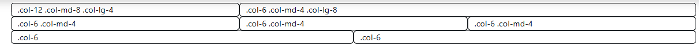
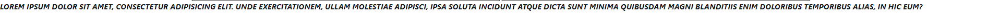
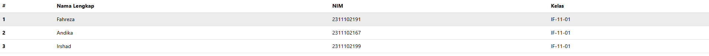
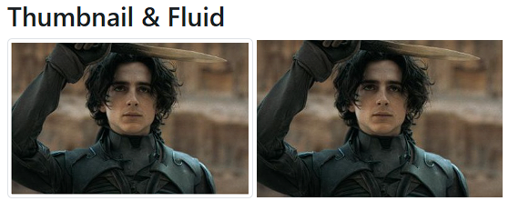
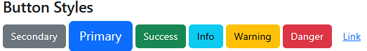
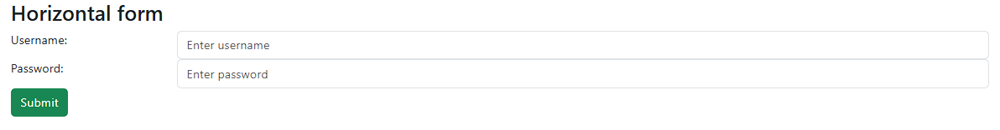
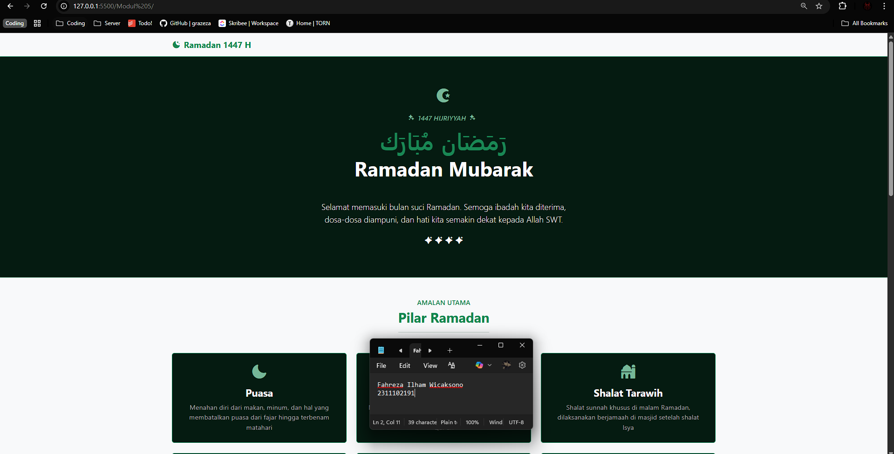

<div align="center">
  <br />

  <h1>LAPORAN PRAKTIKUM <br>
  APLIKASI BERBASIS PLATFORM
  </h1>

  <br />

  <h3>MODUL IV <br>
  BOOTSTRAP
  </h3>

  <br />

  

  <br />
  <br />
  <br />

  <h3>Disusun Oleh :</h3>

  <p>
    <strong>Fahreza Ilham Wicaksono</strong><br>
    <strong>2311102191</strong><br>
    <strong>S1 IF-11-REG01</strong>
  </p>

  <br />

  <h3>Dosen Pengampu :</h3>

  <p>
    <strong>Dimas Fanny Hebrasianto Permadi, S.ST., M.Kom</strong>
  </p>
  
  <br />
  <br />
    <h4>Asisten Praktikum :</h4>
    <strong> Apri Pandu Wicaksono </strong> <br>
    <strong>Rangga Pradarrell Fathi</strong>
  <br />

  <h3>LABORATORIUM HIGH PERFORMANCE
 <br>FAKULTAS INFORMATIKA <br>UNIVERSITAS TELKOM PURWOKERTO <br>2026</h3>
</div>

<hr>

## Dasar Teori

### Pengenalan Bootstrap

Bootstrap merupakan sebuah front-end framework gratis untuk pengembangan antar muka web yang lebih cepat dan lebih mudah. Dikembangkan oleh Mark Otto dan Jacom Thornton di Twitter dan dirilis sebagai produk open source pada Agustus 2011 di GitHub. Bootstrap mencakup template desain berbasis HTML dan CSS untuk tipografi, form, button, navigasi, modal, image carousells dan masih banyak lagi, serta terdapat opsional plugin JavaScript. Selain itu, Bootstrap memiliki kemampuan untuk membuat desain responsif yang secara otomatis menyesuaikan diri agar terlihat baik di segala perangkat, mulai dari perangkat ponsel hingga desktop pc.

#### Pemasangan Bootstrap

Bootstrap merupakan produk yang mengusung konsep open source sehingga untuk pemasangannya dapat
dilakukan dengan beberapa cara sebagai berikut:

- a. Unduh di [Website Bootstrap](http://getbootstrap.com), selanjutnya pasang pada project web kalian seperti memanggil External Style Sheet pada CSS.
- b. Memanggil Bootstrap CDN (Content Delivery Network), sehingga kita tidak perlu mengunduh dan memasangnya pada laman website, hanya memanggil source dari Bootstrap. Cara ini membutuhkan koneksi internet untuk menghasilkan perubahan tampilan CSS

```html
<!-- Pemanggilan Bootstrap dengan CDN -->
<!-- CSS -->
<link href="https://cdn.jsdelivr.net/npm/bootstrap@5.3.0/dist/css/bootstrap.min.css" 
rel="stylesheet" integrity="sha384-
9ndCyUaIbzAi2FUVXJi0CjmCapSmO7SnpJef0486qhLnuZ2cdeRhO02iuK6FUUVM" 
crossorigin="anonymous">
<!-- jQuery library -->
<script src="https://code.jquery.com/jquery-3.7.0.min.js" integrity="sha256-
2Pmvv0kuTBOenSvLm6bvfBSSHrUJ+3A7x6P5Ebd07/g=" crossorigin="anonymous"></script>
<!-- JavaScript -->
<script 
src="https://cdn.jsdelivr.net/npm/bootstrap@5.3.0/dist/js/bootstrap.bundle.min.js" 
integrity="sha384-geWF76RCwLtnZ8qwWowPQNguL3RmwHVBC9FhGdlKrxdiJJigb/j/68SIy3Te4Bkz" 
crossorigin="anonymous"></script>
```

### Bootstrap Container

Bootstrap container adalah elemen paling dasar yang dibutuhkan dalam layouting menggunakan Bootstrap Grid. Container berbentuk class CSS yang sisipkan pada elemen HTML `<div>`. Terdapat dua class container pada Bootstrap yang dapat dipilih yaitu:

- Class `.container` menyediakan container yang responsive dengan lebar yang tetap.
- Class `.container-fluid` menyediakan container dengan lebar yang penuh mencakup seluruh area pandang

### Bootstrap Grid

Sistem grid pada Bootstrap menggunakan rangkaian container, rows dan column untuk tata letak dan keselarasan elemen atau konten. Dibangun dengan flexbox dan sangat responsif terhadap perangkat yang digunakan untuk menampilkan laman web. Struktur dasar grid pada Bootstrap sebagai berikut.

```html
<div class="row"> 
 <div class="col-*-#"></div> 
 <div class="col-*-#"></div> 
</div> 
<div class="row"> 
 <div class="col-*-#"></div> 
 <div class="col-*-#"></div> 
 <div class="col-*-#"></div> 
</div>
```

Pertama diawali dengan `<div class=”container”>`. Kemudian buat sebuah baris sebelum mendeklarasikan sebuah kolom dengan menggunakan `<div class=”row”>`. Terakhir buat elemen div dengan mendefinisikan class `col-*-#`. Tanda* dan # mewakili jenis dan ukuran column yang akan digunakan.

```html
<div class="container">
        <div class="row">
            <div class="col-12 col-md-8 col-lg-4 border border-dark rounded">.col-12 .col-md-8 .col-lg-4</div>
            <div class="col-6 col-md-4 col-lg-8 border border-dark rounded">.col-6 .col-md-4 .col-lg-8</div>
        </div>

        <div class="row">
            <div class="col-6 col-md-4 border border-dark rounded">.col-6 .col-md-4</div>
            <div class="col-6 col-md-4 border border-dark rounded">.col-6 .col-md-4</div>
            <div class="col-6 col-md-4 border border-dark rounded">.col-6 .col-md-4</div>
        </div>

        <div class="row">
            <div class="col-6 border border-dark rounded">.col-6</div>
            <div class="col-6 border border-dark rounded">.col-6</div>
        </div>
    </div>
```



### Text Style

Ada beberapa text style yang disediakan oleh Bootstrap contohnya  `.text-left`, `.text-right`, `.text-center`, `.text-uppercase`, `.text-lowercase`, `fw-bold`, dan lain-lain.

```html
<p class="text-uppercase fw-bold fst-italic">Lorem ipsum dolor sit amet, consectetur adipisicing elit. Unde
        exercitationem, ullam
        molestiae adipisci, ipsa soluta incidunt atque dicta sunt minima quibusdam magni blanditiis enim doloribus
        temporibus alias, in hic eum?</p>
```



### Bootstrap Table, Image & Button

Bootstrap menyediakan class untuk pengaturan style elemen tabel, gambar dan tombol menjadi lebih
menarik.

1. Bootstrap Table
Tabel pada Bootstrap dipanggil dengan class `.table` secara default, namun ada beberapa class tambahan yang dapat didefinisikan pada elemen tabel yang lain

```html
<!--Tabel Hover Style -->
    <table class="table table-hover">
        <thead>
            <tr>
                <th scope="col">#</th>
                <th scope="col">Nama Lengkap</th>
                <th scope="col">NIM</th>
                <th scope="col">Kelas</th>
            </tr>
        </thead>
        <tbody>
            <tr>
                <th scope="row">1</th>
                <td>Fahreza</td>
                <td>2311102191</td>
                <td>IF-11-01</td>
            </tr>
            <tr>
                <th scope="row">2</th>
                <td>Andika</td>
                <td>2311102167</td>
                <td>IF-11-01</td>
            </tr>
            <tr>
                <th scope="row">3</th>
                <td>Irshad</td>
                <td>2311102199</td>
                <td>IF-11-01</td>
            </tr>
        </tbody>
    </table>
```



2. Bootstrap Image
Bootstrap dapat menangani desain gambar agar responsif pada setiap perangkat yang menampilkan laman web. Dengan menambahkan class `.img-fluid` pada elemen tag `` pada HTML maka gambar yang didefinisikan pada laman web akan memiliki ukuran yang responsif menyesuaikan ukuran layar perangkat. Class tersebut mengatur ukuran gambar dengan menyesuaikan ukuran dari parent elementsebagai wadah atau container elemen gambar. Terdapat class `.thumbnail` yang berguna menjadikan gambar menjadi berukuran kecil dan sedikit memiliki border disekitarnya

```html
<div class="container mt-3">
        <h2>Thumbnail & Fluid</h2>

        

        
    </div>
```



3. Bootstrap Button

Tampilan button pada elemen HTML dapat dirubah dengan menambahkan beberapa class untuk button oleh Bootstrap. Bootstrap membuat tampilan button menjadi lebih menarik dan memberikan user experience yang baik. Class yang digunakan secara default adalah `.btn` namun dengan disertai class lain  untuk memberikan perubahan warna dan ukuran button.

```html
<div class="container">
        <h4>Button Styles</h4>
        <button type="button" class="btn btn-secondary btn-md">Secondary</button>
        <button type="button" class="btn btn-primary btn-lg">Primary</button>
        <button type="button" class="btn btn-success btn-block">Success</button>
        <button type="button" class="btn btn-info btn-xs">Info</button>
        <button type="button" class="btn btn-warning">Warning</button>
        <button type="button" class="btn btn-danger">Danger</button>
        <button type="button" class="btn btn-link">Link</button>
    </div>
```



### Bootstrap Form

Bootstrap menyediakan perubahan elemen form pada HTML baik pada segi tata letak tampilan atau tampilan antarmuka elemen-elemen dalam form. Class `.form-control` digunakan untuk sebagian besar elemen input dalam tag `<form>` untuk memberikan styling yang konsisten. Ada beberapa cara untuk mengatur tata letak tampilan form di Bootstrap:

1. Vertical Form (Default): Ini merupakan tampilan default saat tag form tidak didefinisikan class khusus. Setiap elemen form akan ditampilkan secara vertikal.
2. Inline Form: Untuk membuat form inline di Bootstrap, Anda dapat menggunakan utility classes tertentu pada container form. Ini akan membuat elemen-elemen form berada dalam satu baris.
3. Horizontal Form: Untuk membuat form horizontal di Bootstrap, Anda dapat menggunakan sistem grid Bootstrap. Gunakan class .row pada container dan `.col-*` untuk mengatur lebar kolom label dan input.

```html
<div class="container">
        <h3>Horizontal form</h3>

        <form class="form-horizontal" action="/action_page.php">
            <div class="row form-group">
                <label class="control-label col-sm-2" for="email">Username:</label>
                <div class="col-sm-10">
                    <input type="text" class="form-control" id="uname" placeholder="Enter username" name="uname">
                </div>
            </div>

            <div class="row form-group">
                <label class="control-label col-sm-2" for="pwd">Password:</label>
                <div class="col-sm-10">
                    <input type="password" class="form-control" id="pwd" placeholder="Enter password" name="pwd">
                </div>
            </div>

            <div class="form-group">
                <div class="col-sm-offset-2 col-sm-10">
                    <button type="submit" class="btn btn-success">Submit</button>
                </div>
            </div>
        </form>
    </div>
```



## Tugas

### 1. Buat halaman ramadan dan gunakan bootstrap (sebisa mungkin tanpa meggunakan native css full bootstap)

#### Source code

```html
<!DOCTYPE html>
<html lang="id" data-bs-theme="dark">

<!-- 2311102191 -->
<!-- FAHREZA ILHAM WICAKSONO -->
<!-- 👍🏿 -->

<head>
    <meta charset="UTF-8" />
    <meta name="viewport" content="width=device-width, initial-scale=1.0" />
    <title>Ramadan Mubarak 1447 H</title>

    <link rel="icon"
        href="data:image/svg+xml,<svg xmlns='http://www.w3.org/2000/svg' viewBox='0 0 100 100'><text y='.9em' font-size='90'>🌙</text></svg>">

    <!-- library -->
    <link href="https://cdnjs.cloudflare.com/ajax/libs/bootstrap/5.3.2/css/bootstrap.min.css" rel="stylesheet" />
    <link href="https://cdn.boxicons.com/3.0.8/fonts/basic/boxicons.min.css" rel="stylesheet">
    <link href="https://cdn.boxicons.com/3.0.8/fonts/filled/boxicons-filled.min.css" rel="stylesheet">
    <link href="https://cdn.boxicons.com/3.0.8/fonts/brands/boxicons-brands.min.css" rel="stylesheet">
    <link rel="stylesheet" href="https://cdnjs.cloudflare.com/ajax/libs/font-awesome/7.0.1/css/all.min.css"
        integrity="sha512-2SwdPD6INVrV/lHTZbO2nodKhrnDdJK9/kg2XD1r9uGqPo1cUbujc+IYdlYdEErWNu69gVcYgdxlmVmzTWnetw=="
        crossorigin="anonymous" referrerpolicy="no-referrer" />
</head>

<body class="bg-light text-dark">

    <!-- navbar -->
    <nav class="navbar navbar-white bg-light border-bottom border-success sticky-top">
        <div class="container">
            <a class="navbar-brand fw-bold text-success d-flex align-items-center gap-2" href="#">
                <i class="bxf bx-moon-stars"></i>
                Ramadan 1447 H
            </a>
        </div>
    </nav>

    <!-- hero -->
    <div class="bg-success-subtle text-center p-5 border-bottom border-success-subtle">
        <div class="container p-4">
            <div class="mb-3">
                <i class="bxf bx-islam text-success-emphasis fs-1"></i>
            </div>

            <p class="text-success-emphasis text-uppercase fst-italic fw-semibold letter-spacing mb-2">
                <i class="bxf bx-sparkles-alt me-2"></i>1447 Hijriyyah<i class="bxf bx-sparkles-alt mx-2"></i>
            </p>

            <h1 class="display-4 fw-bold text-success mb-1">رَمَضَان مُبَارَك</h1>
            <h2 class="display-5 fw-bold text-white mb-5">Ramadan Mubarak</h2>
            <p class="lead text-white col-md-6 mx-auto mb-4">
                Selamat memasuki bulan suci Ramadan. Semoga ibadah kita diterima,
                dosa-dosa diampuni, dan hati kita semakin dekat kepada Allah SWT.
            </p>

            <div class="mt-3">
                <i class="bxf bx-sparkles text-light-emphasis fs-5"></i>
                <i class="bxf bx-sparkles text-light-emphasis fs-5"></i>
                <i class="bxf bx-sparkles text-light-emphasis fs-5"></i>
                <i class="bxf bx-sparkles text-light-emphasis fs-5"></i>
            </div>
        </div>
    </div>

    <!-- amalan -->
    <div id="amalan" class="bg-white-emphasis p-5 border-bottom border-success-subtle">
        <div class="container">
            <div class="text-center mb-5">
                <p class="text-success text-uppercase fw-semibold mb-1">
                    Amalan Utama
                </p>

                <h3 class="h2 fw-bold text-success mb-0">Pilar Ramadan</h3>
                <hr class="border-success-subtle opacity-25 col-2 mx-auto mt-3">
            </div>

            <div class="row g-4">
                <div class="col-md-6 col-lg-4">
                    <div class="card bg-success-subtle border border-success h-100 text-center p-2">
                        <div class="card-body">
                            <i class="bxf bx-moon text-success-emphasis fs-1 mb-3"></i>
                            <h4 class="card-title fw-bold text-light-emphasis">Puasa</h4>
                            <p class="card-text text-secondary-emphasis">Menahan diri dari makan, minum, dan hal yang
                                membatalkan puasa dari fajar hingga terbenam matahari</p>
                        </div>
                    </div>
                </div>

                <div class="col-md-6 col-lg-4">
                    <div class="card bg-success-subtle border border-success h-100 text-center p-2">
                        <div class="card-body">
                            <i class="fa-solid fa-book-quran text-success-emphasis fs-1 mb-3"></i>
                            <h4 class="card-title fw-bold text-light-emphasis">Tadarus Al-Qur'an</h5>
                                <p class="card-text text-secondary-emphasis">Memperbanyak membaca dan mengkaji
                                    Al-Qur'an. Bulan
                                    Ramadan adalah bulan diturunkannya Al-Qur'an</p>
                        </div>
                    </div>
                </div>

                <div class="col-md-6 col-lg-4">
                    <div class="card bg-success-subtle border border-success h-100 text-center p-2">
                        <div class="card-body">
                            <i class="bxf bx-mosque text-success-emphasis fs-1 mb-3"></i>
                            <h4 class="card-title fw-bold text-light-emphasis">Shalat Tarawih</h4>
                            <p class="card-text text-secondary-emphasis">Shalat sunnah khusus di malam Ramadan,
                                dilaksanakan berjamaah di masjid setelah shalat Isya</p>
                        </div>
                    </div>
                </div>

                <div class="col-md-6 col-lg-4">
                    <div class="card bg-success-subtle border border-success h-100 text-center p-2">
                        <div class="card-body">
                            <i class="fa-solid fa-hand-holding-heart text-success-emphasis fs-1 mb-3"></i>
                            <h4 class="card-title fw-bold text-light-emphasis">Sedekah & Zakat</h4>
                            <p class="card-text text-secondary-emphasis">Memperbanyak sedekah dan menunaikan zakat
                                fitrah
                                sebagai bentuk kepedulian kepada sesama</p>
                        </div>
                    </div>
                </div>

                <div class="col-md-6 col-lg-4">
                    <div class="card bg-success-subtle border border-success h-100 text-center p-2">
                        <div class="card-body">
                            <i class="fa-solid fa-hands text-success-emphasis fs-1 mb-3"></i>
                            <h4 class="card-title fw-bold text-light-emphasis">I'tikaf</h4>
                            <p class="card-text text-secondary-emphasis">Berdiam diri di masjid, terutama pada 10 malam
                                terakhir Ramadan untuk meraih Lailatul Qadar</p>
                        </div>
                    </div>
                </div>

                <div class="col-md-6 col-lg-4">
                    <div class="card bg-success-subtle border border-success h-100 text-center p-2">
                        <div class="card-body">
                            <i class="bxf bx-moon-star text-success-emphasis fs-1 mb-3"></i>
                            <h5 class="card-title fw-bold text-light-emphasis">Lailatul Qadar</h5>
                            <p class="card-text text-secondary-emphasis">Malam yang lebih baik dari seribu bulan. Dicari
                                pada malam ganjil di 10 hari terakhir Ramadan</p>
                        </div>
                    </div>
                </div>
            </div>
        </div>
    </div>

    <!-- ayat qur'an -->
    <div class="bg-success-subtle p-5 border-bottom border-success-subtle">
        <div class="container text-center">
            <div class="row justify-content-center">
                <div class="col-lg-8">
                    <i class="bxf bx-quote-left text-success-emphasis fs-1 opacity-50 mb-3"></i>
                    <p class="text-success-emphasis fw-bold mb-3 fs-1">
                        شَهْرُ رَمَضَانَ الَّذِيْٓ اُنْزِلَ فِيْهِ الْقُرْاٰنُ
                    </p>

                    <p class="lead text-light-emphasis fst-italic mb-5">
                        "Bulan Ramadan adalah (bulan) yang di dalamnya diturunkan Al-Qur'an,
                        sebagai petunjuk bagi manusia dan penjelasan-penjelasan mengenai
                        petunjuk itu dan pembeda (antara yang benar dan yang batil)."
                    </p>

                    <span class="badge bg-light text-success px-3 py-2 fs-6">
                        <i class="fa-solid fa-book-quran me-2"></i>QS. Al-Baqarah: 185
                    </span>
                </div>
            </div>
        </div>
    </div>

    <!-- niat dan doa puasa -->
    <div id="doa" class="bg-light py-5 border-bottom border-success-subtle">
        <div class="container">
            <div class="row justify-content-center">
                <div class="col-lg-6">
                    <div class="card bg-success-subtle border border-success text-center h-100 p-4">
                        <div class="card-body">
                            <i class="bxf bx-night-light text-success-emphasis fs-2 mb-3"></i>
                            <h4 class="card-title fw-bold text-light-emphasis mb-3">Niat Puasa</h4>
                            <p class="text-success-emphasis mb-3 fs-3">
                                نَوَيْتُ صَوْمَ غَدٍ عَنْ أَدَاءِ فَرْضِ شَهْرِ رَمَضَانَ لِلَّهِ تَعَالَى
                            </p>

                            <p class="card-text text-secondary-emphasis fst-italic">
                                "Saya niat berpuasa esok hari untuk menunaikan kewajiban
                                puasa di bulan Ramadhan karena Allah Ta'ala."
                            </p>
                        </div>
                    </div>
                </div>

                <div class="col-lg-6">
                    <div class="card bg-success-subtle border border-success text-center h-100 p-4">
                        <div class="card-body">
                            <i class="bxf bx-moon-crater text-success-emphasis fs-2 mb-3"></i>
                            <h4 class="card-title fw-bold text-light-emphasis mb-3">Do'a Berbuka Puasa</h4>
                            <p class="text-success-emphasis mb-3 fs-3">
                                اَللّهُمَّ لَكَ صُمْتُ وَبِكَ آمَنْتُ وَعَلَى رِزْقِكَ أَفْطَرْتُ
                            </p>

                            <p class="card-text text-secondary-emphasis fst-italic">
                                "Ya Allah, untuk-Mu aku berpuasa, kepada-Mu aku beriman,
                                dan dengan rezeki-Mu aku berbuka."
                            </p>
                        </div>
                    </div>
                </div>
            </div>
        </div>
    </div>


    <!-- tips -->
    <div class="bg-success-subtle py-5 border-bottom border-success-subtle">
        <div class="container">
            <div class="text-center mb-5">
                <p class="text-success-emphasis text-uppercase fw-semibold mb-1">
                    <i class="fa-solid fa-lightbulb me-2"></i>Panduan
                </p>

                <h3 class="h2 fw-bold text-light-emphasis mb-0">Tips Ramadan Produktif</h3>
                <hr class="border-success opacity-25 col-2 mx-auto mt-3">
            </div>

            <div class="row g-3">
                <div class="col-md-6">
                    <div class="d-flex align-items-start gap-3 bg-light border border-success rounded-3 p-3 h-100">
                        <i class="bxf bx-fork-knife text-success fs-4 mt-1 flex-shrink-0"></i>

                        <div>
                            <h6 class="fw-bold text-success mb-1">Jaga Asupan Sahur</h6>
                            <p class="text-secondary mb-0">Konsumsi makanan bergizi dan berserat tinggi agar
                                energi tahan sepanjang hari.</p>
                        </div>
                    </div>
                </div>

                <div class="col-md-6">
                    <div class="d-flex align-items-start gap-3 bg-light border border-success rounded-3 p-3 h-100">
                        <i class="fa-solid fa-droplet text-success fs-4 mt-1 flex-shrink-0"></i>
                        <div>
                            <h6 class="fw-bold text-success mb-1">Perbanyak Minum Air</h6>
                            <p class="text-secondary mb-0">Penuhi kebutuhan cairan antara Maghrib dan Sahur agar
                                tubuh tidak dehidrasi.</p>
                        </div>
                    </div>
                </div>

                <div class="col-md-6">
                    <div class="d-flex align-items-start gap-3 bg-light border border-success rounded-3 p-3 h-100">
                        <i class="bxf bx-biceps text-success fs-4 mt-1 flex-shrink-0"></i>
                        <div>
                            <h6 class="fw-bold text-success mb-1">Tetap Aktif Berolahraga</h6>
                            <p class="text-secondary mb-0">Olahraga ringan menjelang buka puasa membantu
                                metabolisme tetap baik.</p>
                        </div>
                    </div>
                </div>

                <div class="col-md-6">
                    <div class="d-flex align-items-start gap-3 bg-light border border-success rounded-3 p-3 h-100">
                        <i class="fa-solid fa-brain text-success fs-4 mt-1 flex-shrink-0"></i>
                        <div>
                            <h6 class="fw-bold text-success mb-1">Kelola Waktu dengan Bijak</h6>
                            <p class="text-secondary mb-0">Buat jadwal harian agar ibadah, pekerjaan, dan
                                istirahat bisa berjalan seimbang.</p>
                        </div>
                    </div>
                </div>
            </div>
        </div>
    </div>

    <!-- footer -->
    <footer class="bg-light py-4 border-top border-success-subtle">
        <div class="container text-center">
            <p class="text-success fw-bold mb-1">رَمَضَان كَرِيم
            </p>
            <p class="text-secondary small text-uppercase mb-3" style="letter-spacing:.25em;">Ramadan Kareem — 1447 H
            </p>

            <div class="d-flex justify-content-center gap-3 mb-3">
                <i class="bxf bx-sparkles-alt text-success opacity-50"></i>
                <i class="bxf bx-moon text-success"></i>
                <i class="bxf bx-moon-stars text-success fs-5"></i>
                <i class="bxf bx-moon text-success"></i>
                <i class="bxf bx-sparkles-alt  text-success opacity-50"></i>
            </div>

            <p class="text-secondary-emphasis small mb-0">
                Semoga Ramadan ini membawa berkah, ampunan, dan kebahagiaan untuk kita semua.
            </p>
        </div>
    </footer>

    <script src="https://cdnjs.cloudflare.com/ajax/libs/bootstrap/5.3.2/js/bootstrap.bundle.min.js"></script>
</body>

</html>
```

#### Penjelasan kode

Pada halaman ramadhan ini saya membuat total 7 section, dimulai dari header, hero, section amalan, section ayat qur'an, section doa, section tips, dan footer. Saya juga menggunakan library icon tambahan untuk dekorasi. Saya menggunakan `data-bs-theme="dark"` pada tag html untuk tema gelap dan menggunakan `bg-light` pada tag body untuk background putih.

Semua section pada dasarnya memiliki skema warna yang sama, maka dari itu kelas dari bootstrap yang digunakan juga sama. Untuk header saya menggunakan kelas `navbar` dari bootstrap dan ditambah `bg-light` `border-bottom` `border-success` untuk warna background putih dan border hijau. Untuk hero saya menggunakan `bg-success-subtle` untuk warna background dengan warna text `text-success-emphasis`. Untuk section amalan dan doa memiliki style yang sama dengan elemen card menggunakan template styling dari bootstrap docs dengan tambahan `bg-success-subtle` `border` `border-success` sebagai warna background dan border hijau dengan warna text menggunakan `text-success-emphasis` dan `text-secondary-emphasis`. Untuk section ayat qur'an memiliki styling warna yang sama dengan section hero dengan tambahan `badge` `bg-light` `text-success` untuk tampilan badge. Untuk section tips memiliki warna background yang sama dengan hero dengan styling card yang mirip seperti section amalan dengan perbedaan pada warna background menggunakan `bg-light`. Dan yang terakhir footer memiliki styling yang sama dengan `navbar`.

#### Output

