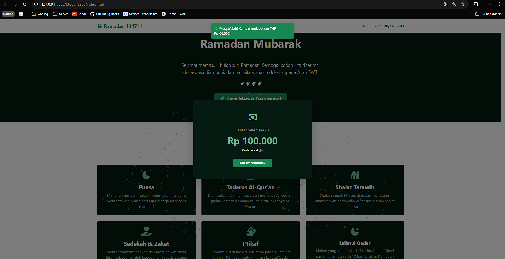

<div align="center">
  <br />

  <h1>LAPORAN PRAKTIKUM <br>
  APLIKASI BERBASIS PLATFORM
  </h1>

  <br />

  <h3>MODUL V <br>
  JAVASCRIPT & JQUERY
  </h3>

  <br />

  

  <br />
  <br />
  <br />

  <h3>Disusun Oleh :</h3>

  <p>
    <strong>Fahreza Ilham Wicaksono</strong><br>
    <strong>2311102191</strong><br>
    <strong>S1 IF-11-REG01</strong>
  </p>

  <br />

  <h3>Dosen Pengampu :</h3>

  <p>
    <strong>Dimas Fanny Hebrasianto Permadi, S.ST., M.Kom</strong>
  </p>
  
  <br />
  <br />
    <h4>Asisten Praktikum :</h4>
    <strong> Apri Pandu Wicaksono </strong> <br>
    <strong>Rangga Pradarrell Fathi</strong>
  <br />

  <h3>LABORATORIUM HIGH PERFORMANCE
 <br>FAKULTAS INFORMATIKA <br>UNIVERSITAS TELKOM PURWOKERTO <br>2026</h3>
</div>

<hr>

## Dasar Teori

### Pengenalan Javascript

Javascript, seperti namanya, merupakan bahasa pemrograman scripting. Dan seperti bahasa scriptinglainnya, Javascript umumnya digunakan hanya untuk program yang tidak terlalu besar, biasanya hanya beberapa ratus baris. Javascript pada umumnya mengontrol program yang berbasis Java. Meskipun dibuat dengan tujuan awal untuk mengendalikan program Java, komunitas Javascript menggunakan bahasa ini untuk tujuan lain, memanipulasi gambar dan isi dari dokumen HTML. Singkatnya, pada akhirnya Javascript digunakan untuk satu tujuan utama, “menghidupkan” dokumen HTML dengan mengubah konten statis menjadi dinamis dan interaktif.

#### Prinsip Dasar Javascript

1. Javascript mendukung paradigma pemrograman imparatif (Javascript dapat menjalankan perintah program baris demi baris, dengan masing-masing baris berisi satu atau lebih perintah), fungsional (struktur dan elemen-elemen dalam program sebagai fungsi matematis yang tidak memiliki keadaan (`state`) dan data yang dapat berubah (`mutable data`)), dan orientasi objek (segala sesuatu yang terlibat dalam program dapat disebut sebagai `objek`).
2. Javascript memiliki model pemrograman fungsional yang sangat ekspresif.
3. Pemrograman berorientasi objek (PBO) pada Javascript memiliki perbedaan dari PBO pada umumnya.
4. Program kompleks pada Javascript umumnya dipandang sebagai program-program kecil yang saling berinteraksi.

### Sintaks Umum pada Javascript

#### Tipe data dasar

Seperti kebanyakan bahasa pemrograman lainnya, Javascript memiliki beberapa tipe data untuk dimanipulasi. Seluruh nilai yang ada dalam Javascript selalu memiliki tipe data. Tipe data yang dimiliki oleh Javascript adalah sebagai berikut:

- `Number` (bilangan)
- `String` (serangkaian karakter)
- `Boolean` (benar / salah)
- `Object`
- `Functio`n (fungsi)
- `Array`
- `Date`
- `RegExp` (regular expression)
- `Null` (tidak berlaku / kosong)
- `Undefined` (tidak didefinisikan)

#### Variabel

Seperti pada bahasa pemrograman lainnya, variabel dalam Javascript merupakan sebuah tempat untuk menyimpan data sementara. Variabel dibuat dengan kata kunci `var` pada Javascript.

```js
var a; // a berisi undefined 
var nama = "Budi"; // nama berisi "Budi"
```

Nilai yang ada di dalam variabel dapat diganti dengan mengisikan nilai baru, dan bahkan dapat diganti tipe datanya juga.

```js
nama = "Anton"; // nama sekarang berisi string "Anton" 
nama = 1; // nama sekarang berisi integer 1
```

Walaupun kemampuan untuk menggantikan tipe data ini sangat memudahkan kita dalam mengembangkan aplikasi, fitur ini harus digunakan dengan sangat hati-hati. Perubahan tipe data yang tidak diperkirakan dengan baik dapat menyebabkan berbagai kesalahan (`error`) pada program.

#### Array

Array merupakan sebuah tipe data yang digunakan untuk menampung banyak tipe data lainnya. Berbeda dengan tipe data `object`, array pada Javascript merupakan sebuah tipe khusus. Walaupun memiliki method dan properti, array bukanlah objek, melainkan sebuah tipe yang “mirip objek”. Pembuatan array dalam Javascript dilakukan dengan menggunakan kurung siku (`[]`):

```js
var data = ["satu", 2, true];
```

Sebagai sebuah objek khusus, array juga memiliki method dan properti. Beberapa method dan properti yang populer misalnya `length`, `pop()`, dan `push()`.

```js
var data = ["a", "b", "c"]; 
// data.length mengembalikan 3 
data.push("d"); // mengembalikan 4 data menjadi ["a", "b", "c", "d"] 
data.pop(); // mengembalikan "d", data menjadi ["a", "b", "c"]
```

#### Pengendalian Struktur

Javascript memiliki perintah-perintah pengendalian struktur (`control stucture`) yang sama dengan bahasa dalam keluarga C. Perintah `if` dan `else` digunakan untuk percabangan, sementara perintah `for`, `for-in`, `while`, dan `do-while` digunakan untuk perulangan.

```js
var gelar;
var pendidikan = "S2";

if (pendidikan === "S1") {
 gelar = "Sarjana";
} else if (pendidikan === "S2") {
 gelar = "Master";
} else if (pendidikan === "S3") {
 gelar = "Doktor";
} else {
 gelar = "Tidak Diketahui";
}
gelar; // gelar berisi "Master"
```

### Object Orientation pada Javascript

Javascript memiliki dua jenis tipe data utama, yaitu tipe data dasar dan objek. Tipe data dasar pada Javascript adalah angka (`numbers`), rentetan karakter (`strings`), boolean (`true` dan `false`), `null`, dan `undefined`. Nilai-nilai selain tipe data dasar secara otomatis dianggap sebagai objek. Objek dalam Javascript didefinisikan sebagai `mutable properties collection`, yang artinya adalah sekumpulan properti (ciri khas) yang dapat berubah nilainya. Karena nilai-nilai selain tipe data dasar merupakan objek, maka pada Javascript sebuah Array adalah objek. Fungsi adalah objek dan Regular expression juga merupakan objek.

#### Pembuatan Object pada Javascript

Notasi pembuatan objek pada Javascript sangat sederhana, yaitu sepasang kurung kurawal yang membungkus properti. Notasi pembuatan objek ini dikenal dengan nama object literal. Object literal dapat digunakan kapanpun pada ekspresi Javascript yang valid. Sebuah objek dapat menyimpan banyak properti, dan setiap properti dipisahkan dengan tanda koma (`,`).

```js
var objek_kosong = {}; 
var mobil = { 
 "warna-badan": "merah", 
 "nomor-polisi": "BK1234AB" 
};
```

#### Akses Nilai Property

1. Penggunaan kurung siku (`[]`) setelah nama objek. Kurung siku kemudian diisikan dengan nama properti, yang harus berupa string. Cara ini biasanya digunakan untuk nama properti yang adalah nama ilegal atau kata kunci Javascript.
2. Penggunaan tanda titik (`.`) setelah nama objek diikuti dengan nama properti. Notasi ini merupakan notasi yang umum digunakan pada bahasa pemrograman lainnya. Notasi ini tidak dapat digunakan untuk nama ilegal atau kata kunci Javascript.

```js
mobil["warna-badan"] 
```

Sebagai bahasa dinamis, Javascript tidak akan melemparkan pesan kesalahan jika kita mengakses properti yang tidak ada dalam objek. Pengaksesan properti pada Javascript juga dapat digunakan secara dinamis untuk mengubah nilai dari properti tersebut.

#### Prototype pada Javascript

Pada Javascript yang mengimplementasikan PBO kita tidak lagi perlu menuliskan kelas, dan langsung melakukan penurunan terhadap objek. Misalkan kita memiliki objek mobil yang sederhana seperti berikut:

```js
var mobil = { nama: "Mobil", 
jumlahBan: 4 };
```

Kita dapat langsung menurunkan objek tersebut dengan menggunakan fungsi `Object.create` seperti berikut:

```js
var truk = Object.create(mobil); 
```

### Function pada Javascript

Sebuah fungsi membungkus satu atau banyak perintah. Setiap kali fungsi dipanggil, maka perintahperintah yang ada di dalam fungsi tersebut dijalankan. Secara umum fungsi digunakan untuk penggunaan kembali kode (`code reuse`) dan penyimpanan informasi (`information hiding`). Implementasi fungsi kelas pertama juga memungkinkan penggunaan fungsi sebagai unit-unit yang dapat dikombinasikan, seperti layaknya sebuah lego. Dukungan terhadap pemrograman berorientasi objek juga berarti fungsi dapat digunakan untuk memberikan perilaku tertentu dari sebuah objek.

#### Pembuatan Fungsi pada Javascript

```js
function tambah(a, b) {
 hasil = a + b;
 return hasil;
}
```

Penulisan deklarasi fungsi (`function declaration`) seperti di atas merupakan cara penulisan fungsi yang umumnya kita gunakan pada bahasa pemrograman imperatif dan berorientasi objek. Tetapi selain deklarasi fungsi Javascript juga mendukung cara penulisan fungsi lain, yaitu dengan memanfaatkan ekspresi fungsi (`function expression`). Ekspresi fungsi merupakan cara pembuatan fungsi yang memperbolehkan menuliskan fungsi tanpa nama. Fungsi yang dibuat tanpa nama dikenal dengan sebutan fungsi `anonim` atau fungsi `lambda`.

#### Pemanggilan Fungsi

Sebuah fungsi dapat dipanggil untuk menjalankan seluruh kode yang ada di dalam fungsi tersebut, sesuai dengan parameter yang kita berikan. Pemanggilan fungsi dilakukan dengan cara menuliskan nama fungsi tersebut, kemudian mengisikan argumen yang ada di dalam tanda kurung.

```js
function tambah(a, b) {
 hasil = a + b;
 return hasil;
}

tambah(3, 6)
```

Fungsi akan mengembalikan nilai ketika kata kunci `return` ditemukan. Pengembalian nilai fungsi dapat dilakukan kapanpun, dan fungsi akan segera berhenti ketika kata kunci return ditemukan. Sebuah ekspresi dapat juga diberikan langsung kepada keyword return, dan ekspresi tersebut akan dijalankan sebelum nilai dikembalikan. Hal ini berarti fungsi tambah maupun naikkan yang sebelumnya bisa disederhanakan dengan tidak lagi menyimpan nilai di variabel hasil terlebih dahulu.

### Pengenalan jQuery

jQuery adalah sebuah library Javascript yang dibuat oleh John Resig pada tahun 2006. jQuery memungkinkan manipulasi dokumen HTML dilakukan hanya dalam beberapa baris code. Beberapa fitur utama yang terdapat pada jQuery adalah:

- DOM manipulation – jQuery memungkinkan untuk memodifikasi DOM (`Document Object Model`) menggunakan source selector yang disebut dengan `Sizzle`.
- Event Handling – jQuery dapat menangani sebuah aksi pada dokumen HTML seperti saat pengguna melakukan click pada sebuah objek.
- Ajax Support – jQuery dapat memfasilitasi pembuatan website menggunakan teknologi `AJAX`.
- Animations – pada jQuery terdapat build-in animasi yang dapat digunakan pada halaman web.
- Lightweight – ukuran file jQuery sangat ringan yaitu sekitar 19KB.

jQuery dapat dengan mudah digunakan pada sebuah situs web dengan berbagai cara, beberapa caranya adalah:

1. Instalasi Lokal
2. Menggunakan CDN (Content Delivery Network)

### Kegunaan Lanjutan jQuery

- Efek hide/show
- Efek animasi

## Tugas

### 1. Buka kembali halaman ramadan dan tambahkan button atau semacam nya ketika di klik akan menampilkan modal "selamat anda mendapatkan THR" buat se interaktif itu dansebagus mungkin.

#### Source code

```html
<!DOCTYPE html>
<html lang="id" data-bs-theme="dark">

<!-- 2311102191 -->
<!-- FAHREZA ILHAM WICAKSONO -->
<!-- 👍🏿 -->

<head>
    <meta charset="UTF-8" />
    <meta name="viewport" content="width=device-width, initial-scale=1.0" />
    <title>Ramadan Mubarak 1447 H</title>

    <link rel="icon"
        href="data:image/svg+xml,<svg xmlns='http://www.w3.org/2000/svg' viewBox='0 0 100 100'><text y='.9em' font-size='90'>🌙</text></svg>">

    <!-- library -->
    <link href="https://cdnjs.cloudflare.com/ajax/libs/bootstrap/5.3.2/css/bootstrap.min.css" rel="stylesheet" />
    <link href="https://cdn.boxicons.com/3.0.8/fonts/basic/boxicons.min.css" rel="stylesheet">
    <link href="https://cdn.boxicons.com/3.0.8/fonts/filled/boxicons-filled.min.css" rel="stylesheet">
    <link href="https://cdn.boxicons.com/3.0.8/fonts/brands/boxicons-brands.min.css" rel="stylesheet">
    <link rel="stylesheet" href="https://cdnjs.cloudflare.com/ajax/libs/font-awesome/7.0.1/css/all.min.css"
        integrity="sha512-2SwdPD6INVrV/lHTZbO2nodKhrnDdJK9/kg2XD1r9uGqPo1cUbujc+IYdlYdEErWNu69gVcYgdxlmVmzTWnetw=="
        crossorigin="anonymous" referrerpolicy="no-referrer" />
</head>

<!-- notif untuk 100.000 -->
<div class="toast-container position-fixed top-0 start-50 translate-middle-x p-3">
    <div id="thrToast" class="toast text-bg-success border-0">
        <div class="toast-body fw-semibold">
            🎉 MasyaAllah! Kamu mendapatkan THR Rp100.000!
        </div>
    </div>
</div>

<body class="bg-light text-dark">

    <!-- navbar -->
    <nav class="navbar navbar-white bg-light border-bottom border-success sticky-top">
        <div class="container">
            <a class="navbar-brand fw-bold text-success d-flex align-items-center gap-2" href="#">
                <i class="bxf bx-moon-stars"></i>
                Ramadan 1447 H
            </a>

            <div class="ms-auto text-success fw-semibold">
                Idul Fitri: <span id="eidCountdown">Loading...</span>
            </div>
        </div>
    </nav>

    <!-- hero -->
    <div class="bg-success-subtle text-center p-5 border-bottom border-success-subtle">
        <div class="container p-4">
            <div class="mb-3">
                <i class="bxf bx-islam text-success-emphasis fs-1"></i>
            </div>

            <p class="text-success-emphasis text-uppercase fst-italic fw-semibold letter-spacing mb-2">
                <i class="bxf bx-sparkles-alt me-2"></i>1447 Hijriyyah<i class="bxf bx-sparkles-alt mx-2"></i>
            </p>

            <h1 class="display-4 fw-bold text-success mb-1">رَمَضَان مُبَارَك</h1>
            <h2 class="display-5 fw-bold text-white mb-5">Ramadan Mubarak</h2>
            <p class="lead text-white col-md-6 mx-auto mb-4">
                Selamat memasuki bulan suci Ramadan. Semoga ibadah kita diterima,
                dosa-dosa diampuni, dan hati kita semakin dekat kepada Allah SWT.
            </p>

            <div class="mt-3">
                <i class="bxf bx-sparkles text-light-emphasis fs-5"></i>
                <i class="bxf bx-sparkles text-light-emphasis fs-5"></i>
                <i class="bxf bx-sparkles text-light-emphasis fs-5"></i>
                <i class="bxf bx-sparkles text-light-emphasis fs-5"></i>
            </div>

            <div class="mt-4">
                <button type="button" class="btn btn-success btn-lg fw-bold px-4 py-2 shadow" id="thr-btn"
                    data-bs-toggle="modal" data-bs-target="#thrModal">
                    <i class="bxf bx-clover text-light-emphasis me-1 fs-5"></i> Saya Merasa Beruntung!
                </button>
            </div>
        </div>
    </div>

    <!-- amalan -->
    <div id="amalan" class="bg-white-emphasis p-5 border-bottom border-success-subtle">
        <div class="container">
            <div class="text-center mb-5">
                <p class="text-success text-uppercase fw-semibold mb-1">
                    Amalan Utama
                </p>

                <h3 class="h2 fw-bold text-success mb-0">Pilar Ramadan</h3>
                <hr class="border-success-subtle opacity-25 col-2 mx-auto mt-3">
            </div>

            <div class="row g-4">
                <div class="col-md-6 col-lg-4">
                    <div class="card bg-success-subtle border border-success h-100 text-center p-2">
                        <div class="card-body">
                            <i class="bxf bx-moon text-success-emphasis fs-1 mb-3"></i>
                            <h4 class="card-title fw-bold text-light-emphasis">Puasa</h4>
                            <p class="card-text text-secondary-emphasis">Menahan diri dari makan, minum, dan hal yang
                                membatalkan puasa dari fajar hingga terbenam matahari</p>
                        </div>
                    </div>
                </div>

                <div class="col-md-6 col-lg-4">
                    <div class="card bg-success-subtle border border-success h-100 text-center p-2">
                        <div class="card-body">
                            <i class="fa-solid fa-book-quran text-success-emphasis fs-1 mb-3"></i>
                            <h4 class="card-title fw-bold text-light-emphasis">Tadarus Al-Qur'an</h5>
                                <p class="card-text text-secondary-emphasis">Memperbanyak membaca dan mengkaji
                                    Al-Qur'an. Bulan
                                    Ramadan adalah bulan diturunkannya Al-Qur'an</p>
                        </div>
                    </div>
                </div>

                <div class="col-md-6 col-lg-4">
                    <div class="card bg-success-subtle border border-success h-100 text-center p-2">
                        <div class="card-body">
                            <i class="bxf bx-mosque text-success-emphasis fs-1 mb-3"></i>
                            <h4 class="card-title fw-bold text-light-emphasis">Shalat Tarawih</h4>
                            <p class="card-text text-secondary-emphasis">Shalat sunnah khusus di malam Ramadan,
                                dilaksanakan berjamaah di masjid setelah shalat Isya</p>
                        </div>
                    </div>
                </div>

                <div class="col-md-6 col-lg-4">
                    <div class="card bg-success-subtle border border-success h-100 text-center p-2">
                        <div class="card-body">
                            <i class="fa-solid fa-hand-holding-heart text-success-emphasis fs-1 mb-3"></i>
                            <h4 class="card-title fw-bold text-light-emphasis">Sedekah & Zakat</h4>
                            <p class="card-text text-secondary-emphasis">Memperbanyak sedekah dan menunaikan zakat
                                fitrah
                                sebagai bentuk kepedulian kepada sesama</p>
                        </div>
                    </div>
                </div>

                <div class="col-md-6 col-lg-4">
                    <div class="card bg-success-subtle border border-success h-100 text-center p-2">
                        <div class="card-body">
                            <i class="fa-solid fa-hands text-success-emphasis fs-1 mb-3"></i>
                            <h4 class="card-title fw-bold text-light-emphasis">I'tikaf</h4>
                            <p class="card-text text-secondary-emphasis">Berdiam diri di masjid, terutama pada 10 malam
                                terakhir Ramadan untuk meraih Lailatul Qadar</p>
                        </div>
                    </div>
                </div>

                <div class="col-md-6 col-lg-4">
                    <div class="card bg-success-subtle border border-success h-100 text-center p-2">
                        <div class="card-body">
                            <i class="bxf bx-moon-star text-success-emphasis fs-1 mb-3"></i>
                            <h5 class="card-title fw-bold text-light-emphasis">Lailatul Qadar</h5>
                            <p class="card-text text-secondary-emphasis">Malam yang lebih baik dari seribu bulan. Dicari
                                pada malam ganjil di 10 hari terakhir Ramadan</p>
                        </div>
                    </div>
                </div>
            </div>
        </div>
    </div>

    <!-- ayat qur'an -->
    <div class="bg-success-subtle p-5 border-bottom border-success-subtle">
        <div class="container text-center">
            <div class="row justify-content-center">
                <div class="col-lg-8">
                    <i class="bxf bx-quote-left text-success-emphasis fs-1 opacity-50 mb-3"></i>
                    <p class="text-success-emphasis fw-bold mb-3 fs-1">
                        شَهْرُ رَمَضَانَ الَّذِيْٓ اُنْزِلَ فِيْهِ الْقُرْاٰنُ
                    </p>

                    <p class="lead text-light-emphasis fst-italic mb-5">
                        "Bulan Ramadan adalah (bulan) yang di dalamnya diturunkan Al-Qur'an,
                        sebagai petunjuk bagi manusia dan penjelasan-penjelasan mengenai
                        petunjuk itu dan pembeda (antara yang benar dan yang batil)."
                    </p>

                    <span class="badge bg-light text-success px-3 py-2 fs-6">
                        <i class="fa-solid fa-book-quran me-2"></i>QS. Al-Baqarah: 185
                    </span>
                </div>
            </div>
        </div>
    </div>

    <!-- niat dan doa puasa -->
    <div id="doa" class="bg-light py-5 border-bottom border-success-subtle">
        <div class="container">
            <div class="row justify-content-center">
                <div class="col-lg-6">
                    <div class="card bg-success-subtle border border-success text-center h-100 p-4">
                        <div class="card-body">
                            <i class="bxf bx-night-light text-success-emphasis fs-2 mb-3"></i>
                            <h4 class="card-title fw-bold text-light-emphasis mb-3">Niat Puasa</h4>
                            <p class="text-success-emphasis mb-3 fs-3">
                                نَوَيْتُ صَوْمَ غَدٍ عَنْ أَدَاءِ فَرْضِ شَهْرِ رَمَضَانَ لِلَّهِ تَعَالَى
                            </p>

                            <p class="card-text text-secondary-emphasis fst-italic">
                                "Saya niat berpuasa esok hari untuk menunaikan kewajiban
                                puasa di bulan Ramadhan karena Allah Ta'ala."
                            </p>
                        </div>
                    </div>
                </div>

                <div class="col-lg-6">
                    <div class="card bg-success-subtle border border-success text-center h-100 p-4">
                        <div class="card-body">
                            <i class="bxf bx-moon-crater text-success-emphasis fs-2 mb-3"></i>
                            <h4 class="card-title fw-bold text-light-emphasis mb-3">Do'a Berbuka Puasa</h4>
                            <p class="text-success-emphasis mb-3 fs-3">
                                اَللّهُمَّ لَكَ صُمْتُ وَبِكَ آمَنْتُ وَعَلَى رِزْقِكَ أَفْطَرْتُ
                            </p>

                            <p class="card-text text-secondary-emphasis fst-italic">
                                "Ya Allah, untuk-Mu aku berpuasa, kepada-Mu aku beriman,
                                dan dengan rezeki-Mu aku berbuka."
                            </p>
                        </div>
                    </div>
                </div>
            </div>
        </div>
    </div>


    <!-- tips -->
    <div class="bg-success-subtle py-5 border-bottom border-success-subtle">
        <div class="container">
            <div class="text-center mb-5">
                <p class="text-success-emphasis text-uppercase fw-semibold mb-1">
                    <i class="fa-solid fa-lightbulb me-2"></i>Panduan
                </p>

                <h3 class="h2 fw-bold text-light-emphasis mb-0">Tips Ramadan Produktif</h3>
                <hr class="border-success opacity-25 col-2 mx-auto mt-3">
            </div>

            <div class="row g-3">
                <div class="col-md-6">
                    <div class="d-flex align-items-start gap-3 bg-light border border-success rounded-3 p-3 h-100">
                        <i class="bxf bx-fork-knife text-success fs-4 mt-1 flex-shrink-0"></i>

                        <div>
                            <h6 class="fw-bold text-success mb-1">Jaga Asupan Sahur</h6>
                            <p class="text-secondary mb-0">Konsumsi makanan bergizi dan berserat tinggi agar
                                energi tahan sepanjang hari.</p>
                        </div>
                    </div>
                </div>

                <div class="col-md-6">
                    <div class="d-flex align-items-start gap-3 bg-light border border-success rounded-3 p-3 h-100">
                        <i class="fa-solid fa-droplet text-success fs-4 mt-1 flex-shrink-0"></i>
                        <div>
                            <h6 class="fw-bold text-success mb-1">Perbanyak Minum Air</h6>
                            <p class="text-secondary mb-0">Penuhi kebutuhan cairan antara Maghrib dan Sahur agar
                                tubuh tidak dehidrasi.</p>
                        </div>
                    </div>
                </div>

                <div class="col-md-6">
                    <div class="d-flex align-items-start gap-3 bg-light border border-success rounded-3 p-3 h-100">
                        <i class="bxf bx-biceps text-success fs-4 mt-1 flex-shrink-0"></i>
                        <div>
                            <h6 class="fw-bold text-success mb-1">Tetap Aktif Berolahraga</h6>
                            <p class="text-secondary mb-0">Olahraga ringan menjelang buka puasa membantu
                                metabolisme tetap baik.</p>
                        </div>
                    </div>
                </div>

                <div class="col-md-6">
                    <div class="d-flex align-items-start gap-3 bg-light border border-success rounded-3 p-3 h-100">
                        <i class="fa-solid fa-brain text-success fs-4 mt-1 flex-shrink-0"></i>
                        <div>
                            <h6 class="fw-bold text-success mb-1">Kelola Waktu dengan Bijak</h6>
                            <p class="text-secondary mb-0">Buat jadwal harian agar ibadah, pekerjaan, dan
                                istirahat bisa berjalan seimbang.</p>
                        </div>
                    </div>
                </div>
            </div>
        </div>
    </div>

    <!-- footer -->
    <footer class="bg-light py-4 border-top border-success-subtle">
        <div class="container text-center">
            <p class="text-success fw-bold mb-1">رَمَضَان كَرِيم
            </p>
            <p class="text-secondary small text-uppercase mb-3" style="letter-spacing:.25em;">Ramadan Kareem — 1447 H
            </p>

            <div class="d-flex justify-content-center gap-3 mb-3">
                <i class="bxf bx-sparkles-alt text-success opacity-50"></i>
                <i class="bxf bx-moon text-success"></i>
                <i class="bxf bx-moon-stars text-success fs-5"></i>
                <i class="bxf bx-moon text-success"></i>
                <i class="bxf bx-sparkles-alt  text-success opacity-50"></i>
            </div>

            <p class="text-secondary-emphasis small mb-0">
                Semoga Ramadan ini membawa berkah, ampunan, dan kebahagiaan untuk kita semua.
            </p>
        </div>
    </footer>

    <!-- THR Modal -->
    <div class="modal fade" id="thrModal" tabindex="-1" aria-hidden="true">
        <div class="modal-dialog modal-dialog-centered">
            <div class="modal-content border-0 rounded-4 overflow-hidden shadow-lg">
                <div id="envelopeClosed" class="bg-success-subtle text-center p-5" style="cursor: pointer;"
                    onclick="openEnvelope()">
                    <div class="text-success-emphasis fs-1"><i class="bxf bx-envelope-open"></i></div>
                    <h4 class="text-white fw-semibold mt-3 mb-0">Ketuk untuk membuka!</h4>
                    <p class="text-lead fst-italic text-white-50">Gold! Gold! Gold!</p>
                </div>

                <div id="envelopeOpened" class="bg-success-subtle text-center p-5 d-none">
                    <div class="text-success-emphasis fs-1"><i class="bxf bx-currency-note"></i></div>

                    <p class="text-white-50 mt-2 mb-1">THR Lebaran 1447H</p>
                    <h1 id="thrAmount" class="text-success-emphasis fw-bold my-2">Rp 0</h1>
                    <p id="thrMessage" class="text-lead text-light-emphasis small mb-4"></p>

                    <button class="btn btn-success btn-md px-4 fw-semibold" data-bs-dismiss="modal">
                        Alhamdulillah~
                    </button>
                </div>
            </div>
        </div>
    </div>

    <script src="https://cdnjs.cloudflare.com/ajax/libs/bootstrap/5.3.2/js/bootstrap.bundle.min.js"></script>

    <!-- library untuk efek confetti -->
    <script src="https://cdn.jsdelivr.net/npm/canvas-confetti@1.6.0/dist/confetti.browser.min.js"></script>
</body>

</html>

<script>
    // tanggal lebaran
    const eidDate = new Date("March 20, 2026 00:00:00").getTime();

    // fungsi update countdown
    function updateCountdown() {
        const now = new Date().getTime();
        const distance = eidDate - now;

        if (distance < 0) {
            document.getElementById("eidCountdown").innerHTML = "Selamat Idul Fitri!";
            return;
        }

        const days = Math.floor(distance / (1000 * 60 * 60 * 24));
        const hours = Math.floor((distance % (1000 * 60 * 60 * 24)) / (1000 * 60 * 60));
        const minutes = Math.floor((distance % (1000 * 60 * 60)) / (1000 * 60));
        const seconds = Math.floor((distance % (1000 * 60)) / 1000);

        document.getElementById("eidCountdown").innerHTML =
            days + "h " + hours + "j " + minutes + "m " + seconds + "d";
    }

    setInterval(updateCountdown, 1000);
    updateCountdown();

    // jumlah thr
    const thrList = [
        { amount: 10000, message: "Kena nggo tuku es teh 😄" },
        { amount: 20000, message: "Alhamdulillah, cihuy! 😊" },
        { amount: 50000, message: "Mayan, nggo tuku bensin! 🛵" },
        { amount: 75000, message: "Semoga berkah ✨" },
        { amount: 100000, message: "Pesta Pora! 🎉" },
    ];

    // fungsi untuk membuat probabilitas thr
    function getRandom() {
        const weights = [40, 30, 18, 9, 3]; // probabilitas sesuai index thr list
        let random = Math.random() * 100, total = 0;

        for (let i = 0; i < weights.length; i++) {
            total += weights[i];
            if (random < total) return thrList[i];
        }

        return thrList[0];
    }

    // fungsi untuk membuka modal amplop
    function openEnvelope() {
        const pick = getRandom();
        const thr = 'Rp ' + pick.amount.toLocaleString('id-ID');

        document.getElementById('thrAmount').textContent = thr;
        document.getElementById('thrMessage').textContent = pick.message;

        document.getElementById('envelopeClosed').classList.add('d-none');
        document.getElementById('envelopeOpened').classList.remove('d-none');

        if (pick.amount === 100000) {
            // munculkan toast
            const toast = new bootstrap.Toast(document.getElementById('thrToast'));
            toast.show();

            // munculkan confetti
            confetti({
                particleCount: 300,
                spread: 150,
                origin: { y: 0.6 }
            });
        }
    }

    // untuk menutup modal
    document.getElementById('thrModal').addEventListener('hidden.bs.modal', () => {
        document.getElementById('envelopeClosed').classList.remove('d-none');
        document.getElementById('envelopeOpened').classList.add('d-none');
    });
</script>
```

#### Penjelasan kode

Untuk membuat fitur menampilkan thr saya menggunakan modal yang berperan seperti amplop dan nantinya akan muncul ketika suatu button di klik. Modal menggunakan format styling dari bootstrap dengan tambahan dua `div` khusus yang akan menentukan state, `div` pertama menggunakan class `envelopeClosed` ini adalah keadaan dimana amplop belum dibuka. Untuk berganti state saya menambahkan atribut `onClick` pada div agar ketika diklik menjalankan fungsi `openEnvelope()` pada javascript. Fungsi tersebut akan meng-generate jumlah thr dan menampilkanya pada html. Fungsi untuk generate thr dinamakan `getRandom()`, di dalam fungsi tersebut akan melakukan pemilihan acak berdasarkan probabilitas (pada variabel `const weights`) dari thr list (pada array `const thrList`). Untuk menampilkanya pada html digunakan metode `textContent`.

Untuk menampilkan div dengan class `envelopeOpened` digunakan metode `classList.add('nama-kelas')` dan `classList.remove('nama-kelas')` untuk menghilangkan div `envelopeClosed`. Dari thr list terdapat jumlah terbesar yang bisa muncul maka ditambahkan efek tambahan ketika mendapatkan jumlah tersebut dengan tambahan `toast` dari bootstrap dan efek confetti dari library tambahan `confetti.browser.min.js`.

Elemen-elemen yang telah disebutkan sebelumnya memiliki atribut tambahan berupa `id`. Atribut ini digunakan karena pada JavaScript, khususnya saat melakukan manipulasi DOM, kita dapat menggunakan selector `document.getElementById` untuk mengakses elemen HTML berdasarkan nilai id tersebut. Dengan adanya id, proses pemilihan elemen menjadi lebih mudah sehingga elemen tersebut dapat diubah atau dimanipulasi melalui JavaScript.

#### Output


