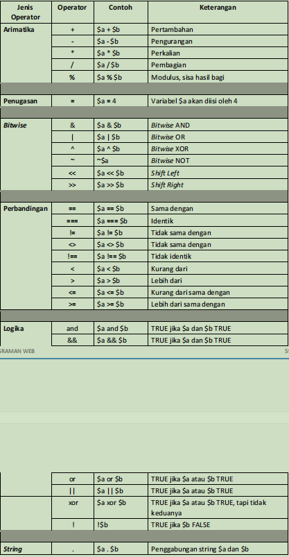
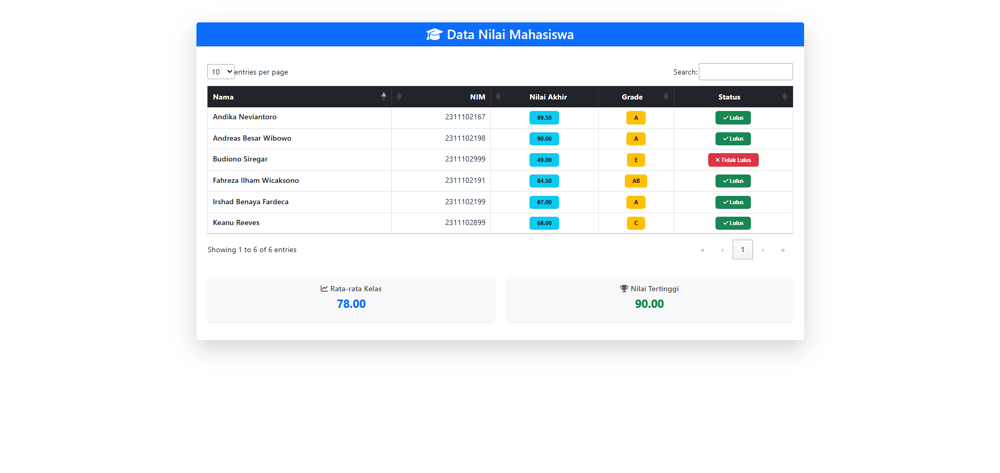

<div align="center">
  <br />

  <h1>LAPORAN PRAKTIKUM <br>
  APLIKASI BERBASIS PLATFORM
  </h1>

  <br />

  <h3>MODUL 9 <br>
  PHP
  </h3>

  <br />

  

  <br />
  <br />
  <br />

  <h3>Disusun Oleh :</h3>

  <p>
    <strong>Fahreza Ilham Wicaksono</strong><br>
    <strong>2311102191</strong><br>
    <strong>S1 IF-11-REG01</strong>
  </p>

  <br />

  <h3>Dosen Pengampu :</h3>

  <p>
    <strong>Dimas Fanny Hebrasianto Permadi, S.ST., M.Kom</strong>
  </p>
  
  <br />
  <br />
    <h4>Asisten Praktikum :</h4>
    <strong> Apri Pandu Wicaksono </strong> <br>
    <strong>Rangga Pradarrell Fathi</strong>
  <br />

  <h3>LABORATORIUM HIGH PERFORMANCE
 <br>FAKULTAS INFORMATIKA <br>UNIVERSITAS TELKOM PURWOKERTO <br>2026</h3>
</div>

<hr>

## Dasar Teori

### Web Server dan Server Side Scripting

Web Server merupakan sebuah perangkat lunak dalam server yang berfungsi menerima permintaan (request) berupa halaman web melalui HTTP atau HTTPS dari client yang dikenal dengan web browser dan mengirimkan kembali (response) hasilnya dalam bentuk halaman-halaman web yang umumnya berbentuk dokumen HTML

### XAMPP

XAMPP merupakan paket perangkat lunak web server berbasis open-source yang memudahkan pengembangan website secara lokal (offline) di komputer. XAMPP menggabungkan `Apache` (server), `MySQL/MariaDB` (database), `PHP`, dan `Perl` dalam satu instalasi, dan didukung oleh sistem operasi Windows, Linux, dan Mac OS

### PHP

Merupakan singkatan rekursif dari PHP : Hypertext Preprocessor. Pertama kali diciptakan oleh Rasmus Lerdorf pada tahun 1994. PHP sendiri harus ditulis diantara tag :

- `<? dan ?>`
- `<?php dan ?>`
- `<script language=”php”>` dan `</script>`
- `<% dan %>`

Setiap satu statement (perintah) biasanya diakhiri dengan titik-koma (`;`). PHP juga case sensitive untuk nama identifier yang dibuat oleh user sedangkan identifier bawaan dari PHP tidak case sensitive.

### Variabel

Variabel digunakan untuk menyimpan sebuah value (nilai), data atau informasi. Nama variabel pada PHP diawali dengan tanda `$`. Panjang dari suatu variabel tidak terbatas dan variabel tidak perlu dideklarasi terlebih dahulu sebelumnya. Setelah tanda `$`, dapat diawali dengan huruf atau under-score (`_`). Karakter berikutnya bisa terdiri dari huruf, angka dan atau karakter tertentu yang diperbolehkan (karakter `ASCII` dari 127 – 255). Variabel pada PHP bersifat `case sensitive` artinya besar kecilnya suatu karakter berpengaruh pada variabel tersebut. Suatu karakter pada PHP tidak boleh mengandung spasi.

```php
<?php 
$nim = “1301165454”; 
$nama = “Baharudin”; 
echo “NIM : “ . $nim; 
echo “Nama : “ . $nama; 
?>
```

Pada PHP, tipe data dari suatu variabel tidak didefinisikan langsung oleh programmer, akan tetapi secara otomatis akan ditentukan oleh interpreter PHP. Namun demikian, PHP mendukung 8 (delapan) buah tipe data primitif, yaitu:

- Boolean
- Integer
- Float
- String
- Array
- Object
- Resource
- NULL

### Konstanta

Konstanta merupakan variabel konstan yang nilainya tidak berubah-ubah. Untuk mendefinisikan konstanta pada PHP, dapat menggunakan fungsi `define()` yang telah tersedia pada PHP. Berikut adalah contohnya :

```php
<?php 
 define(“NAMA” , “Baharuddin”); 
 define(“NIM” , “1301165454”); 
 echo “Nama : “ . NAMA; 
 echo “NIM : “ . NIM; 
?>
```

### Operator dalam PHP

Ada beberapa jenis operator pada PHP, yaitu:



### Struktur Kondisi

Struktur kondisi pada PHP sama halnya dengan bahasa pemrograman lainnya seperti Java. Berikut adalah contoh penulisan struktur kondisi `if-then` pada PHP:

```php
if (kondisi) { 
 statement-jika-kondisi-TRUE; 
} else { 
 Statement-jika-kondisi-FALSE; }
```

Selain struktur kondisi if-then, terdapat pula struktur kondisi `switch-case` seperti berikut:

```php
switch ($var) { 
case ‘1’ : statement-1; break; case 
‘2’ : statement-2; break; 
 . . . . 
}   
```

### Perulangan (Looping)

Banyak jenis perulangan yang terdapat pada PHP. Adapun beberapa diantaranya adalah :

- Perulangan `for`
- Perulangan `while`
- Perulangan `do-while`
- Perulangan `foreach`

### Function

Dalam merancang kode program, kadang kita sering membuat kode yang melakukan tugas yang sama secara berulang-ulang, seperti membaca tabel dari database, menampilkan penjumlahan, dan lainlain. Tugas yang sama ini akan lebih efektif jika dipisahkan dari program utama, dan dirancang menjadi sebuah fungsi.
Fungsi dipanggil dengan menulis nama dari fungsi tersebut, dan diikuti dengan argumen (jika ada). Argumen ditulis di dalam tanda kurung, dan jika jumlah argumen lebih dari satu, maka diantaranya dipisahkan oleh karakter koma. Bentuk umum pendefinisian fungsi pada PHP adalah sebagai berikut:

```php
function nama_fungsi(parameter1, parameter2, 
…. , n) { 
statement; 
}
```

### Array

Array merupakan tipe data terstruktur yang berguna untuk menyimpan sejumlah data yang bertipe sama. Bagian yang menyusun array disebut elemen array, yang masing-masing elemen dapat diakses tersendiri melalui `index` array. Index array dapat berupa bilangan `integer` atau `string`.
Untuk mendeklarasikan atau mendefinisikan sebuah array di PHP bisa menggunakan keyword `array()`.Jumlah elemen array tidak perlu disebutkan saat deklarasi. Sedangkan untuk menampilkan isi array pada elemen tertentu, cukup dengan menyebutkan nama array beserta index array-nya.
Berikut adalah cara mendeklarasikan suatu array di PHP :

```php
<?php
$arrKendaraan = ["Mobil", "Pesawat", "Kereta Api", "Kapal Laut"];

echo $arrKendaraan[0] . "<br>"; //Mobil
echo $arrKendaraan[2] . "<br>"; //Kereta Api

$arrKota = [];
$arrKota[] = "Jakarta";
$arrKota[] = "Medan";
$arrKota[] = "Bandung";
$arrKota[] = "Malang";
$arrKota[] = "Sulawesi";

echo $arrKota[1] . "<br>"; //Medan 
echo $arrKota[2] . "<br>"; //Bandung 
echo $arrKota[4] . "<br>"; //Sulawesi
?>
```

Cara mendeklarasikan suatu array pada PHP bisa dengan index string atau yang dinamakan dengan array
`assosiatif`. Berikut adalah contoh pendeklarasian array `assosiatif` :

```php
<?php
$arrAlamat = [
 "Rona" => "Banjarmasin",
 "Dhiva" => "Bandung",
 "Ilham" => "Medan",
 "Oku" => "Hongkong",
];
echo $arrAlamat["Dhiva"] . "<br>"; //Bandung 
echo $arrAlamat['Oku'] . "<br>"; //Hongkong

$arrNim = [];
$arrNim["Rona"] = "11011112";
$arrNim["Dhiva"] = "11011101";
$arrNim["Ilham"] = "11011309";
$arrNim["Oku"] = "11014765";
$arrNim["Fadhlan"] = "11011113";

echo $arrNim["Ilham"] . "<br>"; //11011309 
echo $arrNim['Fadhlan'] . "<br>"; //11011113
?>
```

## Tugas

### Deskripsi

Buat program PHP sederhana untuk menampilkan data beberapa mahasiswa, menghitung nilai akhir, menentukan grade, dan status kelulusan.

Ketentuan

- Gunakan array Asosiasi untuk menyimpan minimal 3 data mahasiswa

Setiap mahasiswa punya:

- nama
- nim
- nilai tugas
- nilai uts
- nilai uas
- Gunakan function untuk menghitung nilai akhir
- Gunakan if/else atau switch untuk menentukan grade
- Gunakan operator aritmatika untuk perhitungan nilai akhir
- Gunakan operator perbandingan untuk menentukan lulus/tidak
- Gunakan loop untuk menampilkan seluruh data
- Tampilkan hasil dalam bentuk tabel HTML

Output minimal

- Nama
- NIM
- Nilai akhir
- Grade
- Status
- Tampilkan rata-rata kelas
- Tampilkan nilai tertinggi

### Source code

```php
<!-- 2311102191 -->
<!-- FAHREZA ILHAM WICAKSONO -->
<!-- 👍🏿 -->

<?php

$students = [
    [
        "nama" => "Fahreza Ilham Wicaksono",
        "nim" => "2311102191",
        "nilai_tugas" => 85,
        "nilai_uts" => 90,
        "nilai_uas" => 80,
    ],
    [
        "nama" => "Andika Neviantoro",
        "nim" => "2311102167",
        "nilai_tugas" => 90,
        "nilai_uts" => 95,
        "nilai_uas" => 85,
    ],
    [
        "nama" => "Irshad Benaya Fardeca",
        "nim" => "2311102199",
        "nilai_tugas" => 80,
        "nilai_uts" => 90,
        "nilai_uas" => 90,
    ],
    [
        "nama" => "Andreas Besar Wibowo",
        "nim" => "2311102198",
        "nilai_tugas" => 85,
        "nilai_uts" => 95,
        "nilai_uas" => 90,
    ],
    [
        "nama" => "Budiono Siregar",
        "nim" => "2311102999",
        "nilai_tugas" => 60,
        "nilai_uts" => 50,
        "nilai_uas" => 40,
    ],
    [
        "nama" => "Keanu Reeves",
        "nim" => "2311102899",
        "nilai_tugas" => 75,
        "nilai_uts" => 85,
        "nilai_uas" => 50,
    ],
];

function hitungNilaiAkhir($tugas, $uts, $uas): float
{
    return ($tugas * 0.3) + ($uts * 0.3) + ($uas * 0.4);
}

function tentukanGrade($nilai): string
{
    if ($nilai >= 85) {
        return "A";
    } elseif ($nilai >= 80 && $nilai < 85) {
        return "AB";
    } elseif ($nilai >= 75 && $nilai < 80) {
        return "B";
    } elseif ($nilai >= 70 && $nilai < 75) {
        return "BC";
    } elseif ($nilai >= 65 && $nilai < 70) {
        return "C";
    } elseif ($nilai >= 50 && $nilai < 65) {
        return "D";
    } else {
        return "E";
    }
}

function isLulus($nilaiAkhir): bool
{
    if ($nilaiAkhir >= 50) {
        return true;
    } else {
        return false;
    }
}
?>

<!DOCTYPE html>
<html lang="en">

<head>
    <meta charset="UTF-8">
    <meta name="viewport" content="width=device-width, initial-scale=1.0">
    <title>Data Mahasiswa</title>

    <link rel="icon" href="data:image/svg+xml,<svg xmlns='http://www.w3.org/2000/svg' viewBox='0 0 100 100'><text y='.9em' font-size='80'>🎓</text></svg>">

    <!-- Bootstrap -->
    <link href="https://cdn.jsdelivr.net/npm/bootstrap@5.3.0/dist/css/bootstrap.min.css" rel="stylesheet">

    <!-- Fontawesome -->
    <link href="https://cdnjs.cloudflare.com/ajax/libs/font-awesome/6.5.0/css/all.min.css" rel="stylesheet">

    <!-- jQuery -->
    <script src="https://code.jquery.com/jquery-3.7.1.min.js" integrity="sha256-/JqT3SQfawRcv/BIHPThkBvs0OEvtFFmqPF/lYI/Cxo=" crossorigin="anonymous"></script>

    <!-- Datatables -->
    <link rel="stylesheet" href="https://cdn.datatables.net/2.3.7/css/dataTables.dataTables.css" />
    <script src="https://cdn.datatables.net/2.3.7/js/dataTables.js"></script>
</head>

<body>
    <div class="container mt-5">
        <div class="card shadow-lg border-0">
            <div class="card-header bg-primary text-white text-center">
                <h3 class="mb-0">
                    <i class="fas fa-graduation-cap me-2"></i>Data Nilai Mahasiswa
                </h3>
            </div>

            <div class="card-body p-4">
                <div class="table-responsive">
                    <table id="tabelMahasiswa" class="table table-hover table-bordered">
                        <thead class="table-dark">
                            <tr>
                                <th>Nama</th>
                                <th>NIM</th>
                                <th class="align-middle text-center">Nilai Akhir</th>
                                <th class="align-middle text-center">Grade</th>
                                <th class="align-middle text-center">Status</th>
                            </tr>
                        </thead>
                        <tbody>
                            <?php
                            $totalNilai = 0;
                            $nilaiTertinggi = 0;

                            foreach ($students as $student) :
                                $nilaiAkhir = hitungNilaiAkhir(
                                    $student['nilai_tugas'],
                                    $student['nilai_uts'],
                                    $student['nilai_uas']
                                );

                                $grade = tentukanGrade($nilaiAkhir);
                                $status = isLulus($nilaiAkhir) ? "Lulus" : "Tidak Lulus";

                                $totalNilai += $nilaiAkhir;

                                if ($nilaiAkhir > $nilaiTertinggi) {
                                    $nilaiTertinggi = $nilaiAkhir;
                                }
                            ?>
                                <tr>
                                    <td class="fw-semibold"><?= $student['nama']; ?></td>
                                    <td><?= $student['nim']; ?></td>

                                    <td class="align-middle text-center">
                                        <span class="badge bg-info text-dark fw-bold px-3 py-2">
                                            <?= number_format($nilaiAkhir, 2); ?>
                                        </span>
                                    </td>

                                    <td class="align-middle text-center">
                                        <span class="badge bg-warning text-dark fw-bold px-3 py-2">
                                            <?= $grade; ?>
                                        </span>
                                    </td>

                                    <td class="align-middle text-center">
                                        <span class="badge <?= $status == 'Lulus' ? 'bg-success' : 'bg-danger'; ?> px-3 py-2">
                                            <i class="fas <?= $status == 'Lulus' ? 'fa-check' : 'fa-times'; ?>"></i>
                                            <?= $status; ?>
                                        </span>
                                    </td>
                                </tr>
                            <?php endforeach; ?>
                        </tbody>
                    </table>
                </div>

                <?php
                $rataRata = $totalNilai / count($students);
                ?>

                <div class="row text-center mt-4">
                    <div class="col-md-6 mb-3">
                        <div class="card border-0 shadow-sm bg-light">
                            <div class="card-body">
                                <h6 class="text-muted">
                                    <i class="fas fa-chart-line"></i> Rata-rata Kelas
                                </h6>

                                <h4 class="fw-bold text-primary">
                                    <?= number_format($rataRata, 2); ?>
                                </h4>
                            </div>
                        </div>
                    </div>

                    <div class="col-md-6 mb-3">
                        <div class="card border-0 shadow-sm bg-light">
                            <div class="card-body">
                                <h6 class="text-muted">
                                    <i class="fas fa-trophy"></i> Nilai Tertinggi
                                </h6>

                                <h4 class="fw-bold text-success">
                                    <?= number_format($nilaiTertinggi, 2); ?>
                                </h4>
                            </div>
                        </div>
                    </div>
                </div>

            </div>
        </div>
    </div>
</body>

<script>
    $(document).ready(function() {
        $("#tabelMahasiswa").DataTable({
            stateSave: true,
        });
    });
</script>

</html>
```

### Penjelasan kode

#### Penggunaan array asosiatif

```php
$students = [
    [
        "nama" => "Fahreza Ilham Wicaksono",
        "nim" => "2311102191",
        "nilai_tugas" => 85,
        "nilai_uts" => 90,
        "nilai_uas" => 80,
    ],
    [
        "nama" => "Andika Neviantoro",
        "nim" => "2311102167",
        "nilai_tugas" => 90,
        "nilai_uts" => 95,
        "nilai_uas" => 85,
    ],
    [
        "nama" => "Irshad Benaya Fardeca",
        "nim" => "2311102199",
        "nilai_tugas" => 80,
        "nilai_uts" => 90,
        "nilai_uas" => 90,
    ],
    [
        "nama" => "Andreas Besar Wibowo",
        "nim" => "2311102198",
        "nilai_tugas" => 85,
        "nilai_uts" => 95,
        "nilai_uas" => 90,
    ],
    [
        "nama" => "Budiono Siregar",
        "nim" => "2311102999",
        "nilai_tugas" => 60,
        "nilai_uts" => 50,
        "nilai_uas" => 40,
    ],
    [
        "nama" => "Keanu Reeves",
        "nim" => "2311102899",
        "nilai_tugas" => 75,
        "nilai_uts" => 85,
        "nilai_uas" => 50,
    ],
];
```

Kode tersebut merupakan digunakan untuk menyimpan informasi beberapa mahasiswa beserta nilainya. Variabel `$students` berisi array utama yang di dalamnya terdapat beberapa array asosiatif, di mana setiap elemen merepresentasikan satu mahasiswa. Setiap mahasiswa memiliki atribut seperti `nama`, `nim`, `nilai_tugas`, `nilai_uts`, dan `nilai_uas`.

#### Function yang digunakan

##### Menghitung nilai akhir

```php
function hitungNilaiAkhir($tugas, $uts, $uas): float
{
    return ($tugas * 0.3) + ($uts * 0.3) + ($uas * 0.4);
}
```

Fungsi tersebut digunakan untuk menghitung nilai akhir mahasiswa berdasarkan bobot tertentu. Nilai tugas dan UTS masing-masing memiliki bobot `30%`, sedangkan nilai UAS memiliki bobot terbesar yaitu `40%`. Fungsi ini mengembalikan nilai bertipe `float`, yang berarti hasil perhitungan bisa berupa bilangan desimal.

##### Menentukan grade nilai

```php
function tentukanGrade($nilai): string
{
    if ($nilai >= 85) {
        return "A";
    } elseif ($nilai >= 80 && $nilai < 85) {
        return "AB";
    } elseif ($nilai >= 75 && $nilai < 80) {
        return "B";
    } elseif ($nilai >= 70 && $nilai < 75) {
        return "BC";
    } elseif ($nilai >= 65 && $nilai < 70) {
        return "C";
    } elseif ($nilai >= 50 && $nilai < 65) {
        return "D";
    } else {
        return "E";
    }
}
```

Fungsi tersebut digunakan untuk mengonversi nilai numerik menjadi nilai huruf (grade). Logika yang digunakan adalah percabangan `if-elseif-else`, dengan rentang nilai tertentu untuk setiap grade, mulai dari `A` (nilai ≥ 85) hingga `E` (nilai < 50). Fungsi ini mengembalikan tipe data `string` karena outputnya berupa huruf.

##### Mengecek kelulusan

```php
function isLulus($nilaiAkhir): bool
{
    if ($nilaiAkhir >= 50) {
        return true;
    } else {
        return false;
    }
}
```

Fungsi tersebut digunakan untuk menentukan apakah seorang mahasiswa dinyatakan lulus atau tidak berdasarkan nilai akhir yang diperoleh. Kriteria kelulusan ditetapkan pada nilai minimal 50. Jika nilai akhir lebih besar atau sama dengan 50, maka fungsi mengembalikan `true` (lulus), sebaliknya akan mengembalikan `false` (tidak lulus). Fungsi ini mengembalikan tipe `bool`, yang sesuai dengan kebutuhan untuk evaluasi kondisi (`true/false`).

#### Output tabel

```php
<?php
$totalNilai = 0;
$nilaiTertinggi = 0;

foreach ($students as $student) :
    $nilaiAkhir = hitungNilaiAkhir(
        $student['nilai_tugas'],
        $student['nilai_uts'],
        $student['nilai_uas']
    );

    $grade = tentukanGrade($nilaiAkhir);
    $status = isLulus($nilaiAkhir) ? "Lulus" : "Tidak Lulus";

    $totalNilai += $nilaiAkhir;

    if ($nilaiAkhir > $nilaiTertinggi) {
        $nilaiTertinggi = $nilaiAkhir;
    }
?>
    <tr>
        <td class="fw-semibold"><?= $student['nama']; ?></td>
        <td><?= $student['nim']; ?></td>

        <td class="align-middle text-center">
            <span class="badge bg-info text-dark fw-bold px-3 py-2">
                <?= number_format($nilaiAkhir, 2); ?>
            </span>
        </td>

        <td class="align-middle text-center">
            <span class="badge bg-warning text-dark fw-bold px-3 py-2">
                <?= $grade; ?>
            </span>
        </td>

        <td class="align-middle text-center">
            <span class="badge <?= $status == 'Lulus' ? 'bg-success' : 'bg-danger'; ?> px-3 py-2">
                <i class="fas <?= $status == 'Lulus' ? 'fa-check' : 'fa-times'; ?>"></i>
                <?= $status; ?>
            </span>
        </td>
    </tr>
<?php endforeach; ?>
```

Pada kode tersebut dilakukan iterasi menggunakan `foreach` terhadap array `$students`. Di setiap perulangan, data tiap mahasiswa diolah dengan memanggil fungsi `hitungNilaiAkhir()` untuk mendapatkan nilai akhir berdasarkan bobot nilai tugas, UTS, dan UAS. Hasil tersebut kemudian digunakan untuk menentukan grade melalui fungsi `tentukanGrade()` dan status kelulusan melalui fungsi `isLulus()`, yang langsung dikonversi menjadi string "Lulus" atau "Tidak Lulus" menggunakan operator `ternary`.

Selain itu, terdapat dua variabel agregasi yaitu `$totalNilai` dan `$nilaiTertinggi`. Variabel `$totalNilai` digunakan untuk menjumlahkan seluruh nilai akhir mahasiswa, yang nantinya akan dipakai untuk menghitung rata-rata kelas. Sedangkan `$nilaiTertinggi` digunakan untuk melacak nilai maksimum dengan cara membandingkan nilai saat ini dengan nilai tertinggi sebelumnya di setiap iterasi.

#### Output rata rata dan nilai tertinggi kelas

```php
<?php
$rataRata = $totalNilai / count($students);
?>

<div class="row text-center mt-4">
    <div class="col-md-6 mb-3">
        <div class="card border-0 shadow-sm bg-light">
            <div class="card-body">
                <h6 class="text-muted">
                    <i class="fas fa-chart-line"></i> Rata-rata Kelas
                </h6>

                <h4 class="fw-bold text-primary">
                    <?= number_format($rataRata, 2); ?>
                </h4>
            </div>
        </div>
    </div>

    <div class="col-md-6 mb-3">
        <div class="card border-0 shadow-sm bg-light">
            <div class="card-body">
                <h6 class="text-muted">
                    <i class="fas fa-trophy"></i> Nilai Tertinggi
                </h6>

                <h4 class="fw-bold text-success">
                    <?= number_format($nilaiTertinggi, 2); ?>
                </h4>
            </div>
        </div>
    </div>
</div>
```

Pada kode tersebut dilakukan perhitungan rata-rata kelas dengan membagi `$totalNilai` yang sudah dihitung pada perulangan sebelumnya dengan jumlah mahasiswa menggunakan `count($students)`. Hasilnya disimpan dalam variabel `$rataRata`. Kemudian, baik nilai rata-rata maupun nilai tertinggi ditampilkan dalam bentuk card Bootstrap yang terpisah, sehingga lebih informatif dan estetis. Nilai ditampilkan kembali dengan `number_format()` untuk konsistensi format numerik.

### Output


