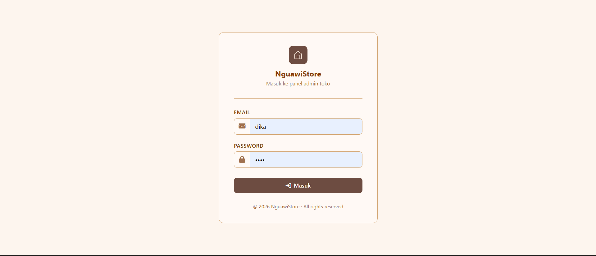
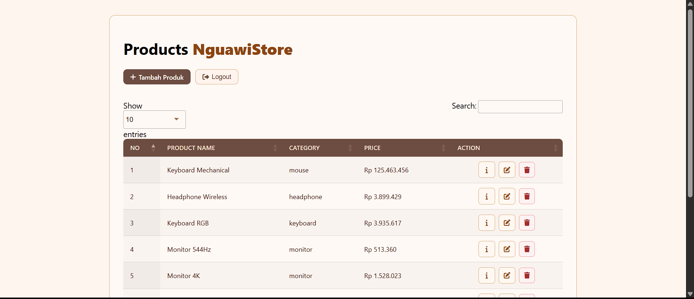
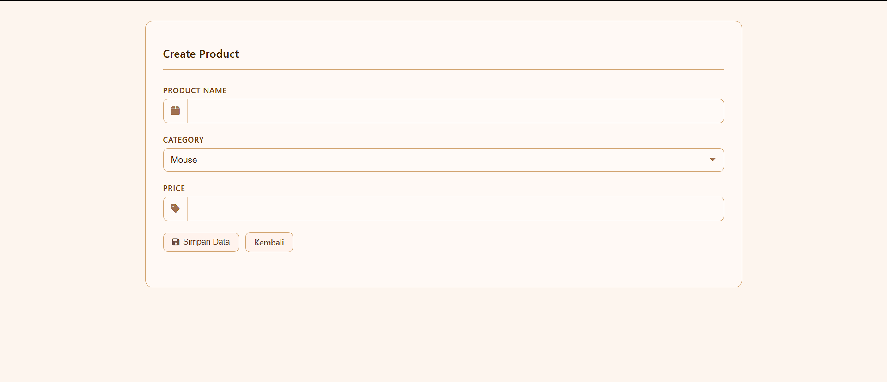
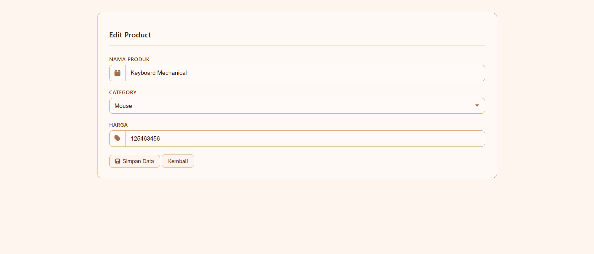
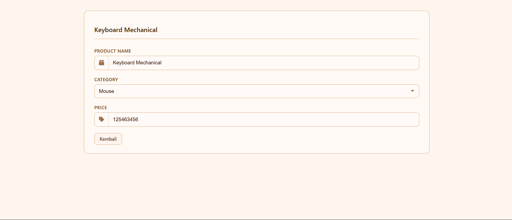
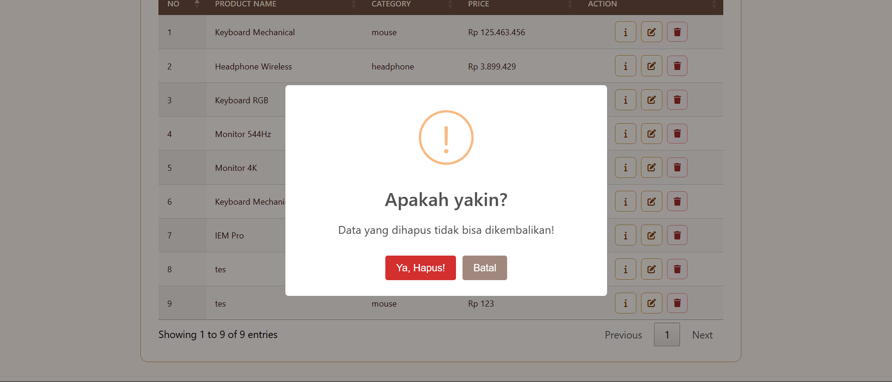

<div align="center">
  <br />

  <h1>LAPORAN PRAKTIKUM <br>
  APLIKASI BERBASIS PLATFORM
  </h1>

  <br />

  <h3>Modul 11 & 12 & 13 <br>
  Laravel
  </h3>

  <br />

  

  <br />
  <br />
  <br />

  <h3>Disusun Oleh :</h3>

  <p>
    <strong>Fahreza Ilham Wicaksono</strong><br>
    <strong>2311102191</strong><br>
    <strong>S1 IF-11-REG01</strong>
  </p>

  <br />

  <h3>Dosen Pengampu :</h3>

  <p>
    <strong>Dimas Fanny Hebrasianto Permadi, S.ST., M.Kom</strong>
  </p>
  
  <br />
  <br />
    <h4>Asisten Praktikum :</h4>
    <strong> Apri Pandu Wicaksono </strong> <br>
    <strong>Rangga Pradarrell Fathi</strong>
  <br />

  <h3>LABORATORIUM HIGH PERFORMANCE
 <br>FAKULTAS INFORMATIKA <br>UNIVERSITAS TELKOM PURWOKERTO <br>2026</h3>
</div>

<hr>

## Deskripsi Tugas

Buat project bisa menggunakan Laravel dimana kalian diminta membuat web inventari toko punya pak cik sama mas aimar (yang ga paham suki) dimana terdapat sebuah crud untuk mengelola produk, dengan tampilan seperti datatable, form create, form edit, dan konfirmasi modal untuk delete. Dan untuk data disimpan dalam database, gunakan database factory dan seeder (biar datanya ga kosong banget). dan buat nilai plus tambahkan dokumentasi project nya (bawaan ai juga udah ada pasti), please wok bantuin biar mas jakobi bisa belanja di toko nya mas aimar, jangan lupa terapin sistem login yaa (pake sistem session), #KingNasirPembantaiNgawiTimur

## Pengerjaan

### Route

Route dibagi dua grup middleware: `guest` untuk halaman login (hanya bisa diakses sebelum login), dan `auth` untuk halaman produk (hanya bisa diakses setelah login). Route produk menggunakan `resource` agar otomatis membuat 7 route CRUD sekaligus.

```php
Route::middleware('guest')->group(function () {
    Route::get('/', [AuthController::class, 'index'])->name('login.page');
    Route::post('/login', [AuthController::class, 'authenticate'])->name('login');
});

Route::middleware('auth')->group(function () {
    Route::post('/logout', [AuthController::class, 'logout'])->name('logout');

    Route::resource('/products', ProductController::class);
});
```

### Models

Model `Product` mendefinisikan field yang bisa diisi (*fillable*) dan menggunakan UUID sebagai primary key routing. UUID di-generate otomatis saat data dibuat melalui event `creating`.

#### Product

Model ini merepresentasikan tabel produk. Fungsi `getRouteKeyName()` memastikan Laravel menggunakan `uuid` alih-alih `id` saat melakukan route model binding.

```php
#[Fillable(['uuid', 'name', 'category', 'price'])]
class Product extends Model
{
    /** @use HasFactory<\Database\Factories\ProductFactory> */
    use HasFactory;

    protected static function booted()
    {
        static::creating(function ($model) {
            $model->uuid = (string) \Illuminate\Support\Str::uuid();
        });
    }

    public function getRouteKeyName()
    {
        return 'uuid';
    }
}
```

### Factory & Seeder

`ProductFactory` digunakan untuk menghasilkan data produk palsu secara otomatis. Kategori dipilih secara acak, lalu nama produk disesuaikan dengan kategori tersebut menggunakan `match`. Dijalankan via seeder agar tabel tidak kosong saat pertama kali di-*migrate*.

```php
class ProductFactory extends Factory
{
    /**
     * Define the model's default state.
     *
     * @return array<string, mixed>
     */
    public function definition(): array
    {
        $categories = ['mouse', 'keyboard', 'monitor', 'headphone', 'iem'];
        $category = $this->faker->randomElement($categories);

        return [
            'name' => match ($category) {
                'mouse' => 'Mouse ' . $this->faker->randomElement(['Gaming', 'Wireless', 'RGB']),
                'keyboard' => 'Keyboard ' . $this->faker->randomElement(['Mechanical', 'RGB']),
                'monitor' => 'Monitor ' . $this->faker->randomElement(['IPS', 'OLED', '144Hz', '544Hz', '4K']),
                'headphone' => 'Headphone ' . $this->faker->randomElement(['Studio', 'Wireless']),
                'iem' => 'IEM ' . $this->faker->randomElement(['Pro', 'Bass']),
            },
            'category' => $category,
            'price' => $this->faker->numberBetween(50000, 5000000),
        ];
    }
}
```

### Controller

Controller menangani logika bisnis aplikasi. Terbagi dua: `AuthController` untuk autentikasi, dan `ProductController` untuk operasi CRUD produk.

#### AuthController

Menangani tiga aksi: menampilkan halaman login, memverifikasi kredensial menggunakan `Auth::attempt()`, dan logout yang membersihkan session.

```php
class AuthController extends Controller
{
    public function index()
    {
        return view('auth.index', [
            'page' => 'Login'
        ]);
    }

    public function authenticate(Request $request)
    {
        $credentials = $request->validate([
            'email' => 'email|required',
            'password' => 'required'
        ]);

        if (Auth::attempt($credentials)) {
            $request->session()->regenerate();

            return redirect()->route('products.index');
        }

        return back()->with('loginError', 'Login failed! 🥲');
    }

    public function logout(Request $request)
    {
        Auth::logout();

        $request->session()->invalidate();
        $request->session()->regenerateToken();

        return redirect()->route('login.page');
    }
}
```

#### ProductController

Mengelola seluruh operasi CRUD produk. Setiap method memanfaatkan *route model binding* sehingga Laravel otomatis mencari produk berdasarkan UUID dari URL.

```php
class ProductController extends Controller
{
    /**
     * Display a listing of the resource.
     */
    public function index()
    {
        $products = Product::query()
            ->select(['uuid', 'name', 'category', 'price'])
            ->get();

        return view('product.index', [
            'page' => 'Product',
            'products' => $products
        ]);
    }

    /**
     * Show the form for creating a new resource.
     */
    public function create()
    {
        return view('product.create', [
            'page' => 'Create'
        ]);
    }

    /**
     * Store a newly created resource in storage.
     */
    public function store(Request $request)
    {
        $validatedData = $request->validate([
            'name' => 'required|string|max:255',
            'category' => 'required|string|max:100',
            'price' => 'required|numeric|min:0',
        ]);

        Product::create($validatedData);

        return redirect()->route('products.index')->with('success', 'Product created successfully');
    }

    /**
     * Display the specified resource.
     */
    public function show(Product $product)
    {
        return view('product.show', [
            'page' => 'Show',
            'product' => $product
        ]);
    }

    /**
     * Show the form for editing the specified resource.
     */
    public function edit(Product $product)
    {
        return view('product.edit', [
            'page' => 'Edit',
            'product' => $product
        ]);
    }

    /**
     * Update the specified resource in storage.
     */
    public function update(Request $request, Product $product)
    {
        $validatedData = $request->validate([
            'name' => 'required|string|max:255',
            'category' => 'required|string|max:100',
            'price' => 'required|numeric|min:0',
        ]);

        $product->update($validatedData);

        return redirect()->route('products.index')->with('success', 'Product edited successfully');
    }

    /**
     * Remove the specified resource from storage.
     */
    public function destroy(Product $product)
    {
        $product->delete();

        return redirect()->route('products.index')->with('success', 'Product deleted successfully');
    }
}
```

### Output

#### Login

```php
<!DOCTYPE html>
<html lang="id">

<head>
    <meta charset="UTF-8">
    <meta name="viewport" content="width=device-width, initial-scale=1.0">
    <title>Login | NguawiStore</title>

    <link rel="stylesheet" href="https://cdnjs.cloudflare.com/ajax/libs/font-awesome/6.4.2/css/all.min.css">

    <style>
        * {
            box-sizing: border-box;
            margin: 0;
            padding: 0;
        }

        body {
            background: #fdf5ee;
            font-family: 'Segoe UI', sans-serif;
            min-height: 100vh;
            display: flex;
            align-items: center;
            justify-content: center;
            padding: 2rem 1rem;
        }

        .nw-card {
            background: #fff9f5;
            border: 0.5px solid #d4a97a;
            border-radius: 12px;
            padding: 2rem 2.25rem;
            width: 100%;
            max-width: 380px;
        }

        .nw-brand {
            text-align: center;
            margin-bottom: 1.75rem;
        }

        .nw-logo {
            width: 44px;
            height: 44px;
            background: #6d4c41;
            border-radius: 10px;
            display: inline-flex;
            align-items: center;
            justify-content: center;
            margin-bottom: 10px;
        }

        .nw-brand h1 {
            font-size: 18px;
            font-weight: 500;
            color: #8B4513;
            margin: 0 0 4px;
        }

        .nw-brand p {
            font-size: 12.5px;
            color: #a07050;
            margin: 0;
        }

        .nw-divider {
            border: none;
            border-top: 0.5px solid #d4a97a;
            margin: 0 0 1.5rem;
        }

        .form-group {
            margin-bottom: 1.1rem;
        }

        .form-label {
            display: block;
            font-size: 12.5px;
            font-weight: 500;
            color: #7a4a20;
            text-transform: uppercase;
            letter-spacing: 0.04em;
            margin-bottom: 6px;
        }

        .input-group {
            display: flex;
            align-items: center;
            background: #fffaf7;
            border: 0.5px solid #d4a97a;
            border-radius: 8px;
            overflow: hidden;
            transition: border-color 0.15s, box-shadow 0.15s;
        }

        .input-group:focus-within {
            border-color: #8B4513;
            box-shadow: 0 0 0 3px rgba(139, 69, 19, 0.1);
        }

        .ig-icon {
            width: 38px;
            height: 38px;
            display: flex;
            align-items: center;
            justify-content: center;
            color: #a07050;
            border-right: 0.5px solid #e8cdb0;
            flex-shrink: 0;
        }

        .input-group input {
            flex: 1;
            border: none;
            background: transparent;
            padding: 0 12px;
            height: 38px;
            font-size: 14px;
            color: #3e2010;
            outline: none;
            font-family: 'Segoe UI', sans-serif;
        }

        .input-group input::placeholder {
            color: #c4a080;
        }

        .nw-forgot {
            text-align: right;
            margin-top: 6px;
        }

        .nw-forgot a {
            font-size: 12px;
            color: #8B4513;
            text-decoration: none;
        }

        .nw-forgot a:hover {
            text-decoration: underline;
        }

        .btn-add {
            display: flex;
            align-items: center;
            justify-content: center;
            gap: 6px;
            width: 100%;
            padding: 9px 14px;
            background: #6d4c41;
            color: #fff;
            border: none;
            border-radius: 8px;
            font-size: 13.5px;
            font-weight: 500;
            cursor: pointer;
            margin-top: 1.5rem;
            font-family: 'Segoe UI', sans-serif;
            transition: background 0.15s;
        }

        .btn-add:hover {
            background: #5a3d33;
        }

        .btn-secondary {
            display: flex;
            align-items: center;
            justify-content: center;
            gap: 6px;
            width: 100%;
            padding: 9px 14px;
            background: #fff3ed;
            color: #6d4c41;
            border: 0.5px solid #d4a97a;
            border-radius: 8px;
            font-size: 13.5px;
            font-weight: 500;
            cursor: pointer;
            margin-top: 10px;
            font-family: 'Segoe UI', sans-serif;
            transition: background 0.15s;
        }

        .btn-secondary:hover {
            background: #fde8d8;
        }

        .nw-footer {
            text-align: center;
            margin-top: 1.5rem;
            font-size: 12px;
            color: #a07050;
        }
    </style>
</head>

<body>
    <div class="nw-card">
        <div class="nw-brand">
            <div class="nw-logo">
                <svg width="22" height="22" viewBox="0 0 24 24" fill="none">
                    <path d="M3 9l9-7 9 7v11a2 2 0 01-2 2H5a2 2 0 01-2-2V9z" stroke="#f5e6da" stroke-width="1.5"
                        stroke-linejoin="round" />
                    <path d="M9 22V12h6v10" stroke="#f5e6da" stroke-width="1.5" stroke-linejoin="round" />
                </svg>
            </div>
            <h1><b>NguawiStore</b></h1>
            <p>Masuk ke panel admin toko</p>
        </div>
        <hr class="nw-divider">

        <form action="{{ route('login') }}" method="post">
            @csrf
            <div class="form-group">
                <label class="form-label">Email</label>
                <div class="input-group">
                    <span class="ig-icon">
                        <i class="fa-solid fa-envelope"></i>
                    </span>

                    <input type="email" name="email" class="form-control @error('email') is-invalid @enderror"
                        id="email" placeholder="name@example.com" value="{{ old('email') }}" autofocus required>
                </div>
            </div>

            <div class="form-group">
                <label class="form-label">Password</label>
                <div class="input-group">
                    <span class="ig-icon">
                        <i class="fa-solid fa-lock"></i>
                    </span>

                    <input type="password" name="password" class="form-control" id="password" placeholder="Password"
                        required>
                </div>
            </div>

            <button type="submit" class="btn-add">
                <i class="fa-solid fa-arrow-right-to-bracket"></i>
                Masuk
            </button>
        </form>

        <div class="nw-footer">© 2026 NguawiStore · All rights reserved</div>
    </div>
</body>

</html>

```



#### Layout

Blade template utama sebagai kerangka halaman. Setiap halaman lain meng-*extend* layout ini dan mengisi bagian `@yield('content')` dengan kontennya masing-masing.

```php
<!doctype html>
<html lang="en">

<head>
    <meta charset="utf-8">
    <meta name="viewport" content="width=device-width, initial-scale=1">
    <title>NguawiStore | {{ $page }}</title>
    {{-- font awesome --}}
    <link rel="stylesheet" href="https://cdnjs.cloudflare.com/ajax/libs/font-awesome/6.4.2/css/all.min.css">

    {{-- Css --}}
    <link rel="stylesheet" href="{{ asset('css/style.css') }}">

</head>

<body>

    @yield('content')

</body>

</html>

```

#### Index

```php
@extends('layout')

@section('content')
    <div class="container">
        <div class="card">
            <h1>Products <b>NguawiStore</b></h1>

            <div class="btn-container" style="">
                <a href="{{ route('products.create') }}" class="btn btn-add">
                    <i class="fa fa-plus"></i> Tambah Produk
                </a>

                <form action="{{ route('logout') }}" method="post" style="margin:0;">
                    @csrf

                    <button type="submit" class="btn btn-logout">
                        <i class="fa fa-right-from-bracket"></i> Logout
                    </button>
                </form>
            </div>

            <table id="productTable" class="display" style="width:100%">
                <thead>
                    <tr>
                        <th>No</th>
                        <th>Product Name</th>
                        <th>Category</th>
                        <th>Price</th>
                        <th>Action</th>
                    </tr>
                </thead>
                <tbody>
                    @foreach ($products as $product)
                        <tr>
                            <td>{{ $loop->iteration }}</td>
                            <td>{{ $product->name }}</td>
                            <td>{{ $product->category }}</td>
                            <td>Rp {{ number_format($product->price, 0, ',', '.') }}</td>

                            <td style="text-align:center; vertical-align:middle;">
                                <div style="display:flex; gap:8px; justify-content:center; align-items:center;">
                                    <a href="{{ route('products.show', $product->uuid) }}" class="btn btn-edit">
                                        <i class="fa fa-info"></i>
                                    </a>

                                    <a href="{{ route('products.edit', $product->uuid) }}" class="btn btn-edit">
                                        <i class="fa fa-edit"></i>
                                    </a>

                                    <form action="{{ route('products.destroy', $product->uuid) }}" method="POST"
                                        style="margin:0;">
                                        @csrf
                                        @method('delete')

                                        <button type="button" class="btn btn-delete confirm-delete">
                                            <i class="fa fa-trash"></i>
                                        </button>
                                    </form>
                                </div>
                            </td>
                        </tr>
                    @endforeach
                </tbody>
            </table>
        </div>
    </div>

    <script src="https://code.jquery.com/jquery-3.6.0.min.js"></script>
    <link rel="stylesheet" href="https://cdn.datatables.net/1.13.4/css/jquery.dataTables.min.css">
    <script src="https://cdn.datatables.net/1.13.4/js/jquery.dataTables.min.js"></script>
    <script src="https://cdn.jsdelivr.net/npm/sweetalert2@11"></script>

    <script>
        $(document).ready(function() {
            $('#productTable').DataTable();

            // SweetAlert Success
            @if (session('success'))
                Swal.fire({
                    icon: 'success',
                    title: 'Berhasil!',
                    text: "{{ session('success') }}",
                    confirmButtonColor: '#6d4c41'
                });
            @endif

            // SweetAlert Confirm Delete
            $('.confirm-delete').click(function(e) {
                let form = $(this).closest('form');
                Swal.fire({
                    title: 'Apakah yakin?',
                    text: "Data yang dihapus tidak bisa dikembalikan!",
                    icon: 'warning',
                    showCancelButton: true,
                    confirmButtonColor: '#d32f2f',
                    cancelButtonColor: '#a1887f',
                    confirmButtonText: 'Ya, Hapus!',
                    cancelButtonText: 'Batal'
                }).then((result) => {
                    if (result.isConfirmed) {
                        form.submit();
                    }
                });
            });
        });
    </script>
@endsection

```



#### Create

```php
@extends('layout')

@section('content')
    <div class="container">
        <div class="card">
            <h2>Create Product</h2>

            <form action="{{ route('products.store') }}" method="POST">
                @csrf

                <div class="form-group">
                    <label class="form-label">Product Name</label>
                    <div class="input-group">
                        <i class="fa fa-box"></i>
                        <input type="text" name="name" class="form-control" value="{{ old('name') }}" required>
                    </div>
                </div>

                <div class="form-group">
                    <label for="category" class="form-label text-white-50 text-uppercase fw-semibold small">Category</label>

                    <select name="category" id="category" aria-placeholder="Select Category">
                        <option value="mouse"> Mouse</option>
                        <option value="keyboard"> Keyboard</option>
                        <option value="monitor"> Monitor</option>
                        <option value="headphone"> Headphone</option>
                        <option value="iem"> IEM</option>
                    </select>
                </div>

                <div class="form-group">
                    <label class="form-label">Price</label>
                    <div class="input-group">
                        <i class="fa fa-tag"></i>
                        <input type="number" name="price" class="form-control" value="{{ old('price') }}" required>
                    </div>
                </div>

                <div class="btn-container">
                    <button type="submit" class="btn btn-primary">
                        <i class="fa fa-save"></i> Simpan Data
                    </button>

                    <a href="{{ route('products.index') }}" class="btn btn-secondary">Kembali</a>
                </div>

            </form>
        </div>
    </div>
@endsection
```



#### Edit

```php
@extends('layout')

@section('content')
    <div class="container">
        <div class="card">
            <h2>Edit Product</h2>

            <form action="{{ route('products.update', $product->uuid) }}" method="POST">
                @csrf
                @method('PUT')

                <div class="form-group">
                    <label class="form-label">Nama Produk</label>
                    <div class="input-group">
                        <i class="fa fa-box"></i>
                        <input type="text" name="name" class="form-control" value="{{ $product->name ?? old('name') }}"
                            required>
                    </div>
                </div>

                <div class="form-group">
                    <label for="category" class="form-label text-white-50 text-uppercase fw-semibold small">Category</label>

                    <select name="category" id="category" aria-placeholder="Select Category">
                        <option value="mouse"> Mouse</option>
                        <option value="keyboard"> Keyboard</option>
                        <option value="monitor"> Monitor</option>
                        <option value="headphone"> Headphone</option>
                        <option value="iem"> IEM</option>
                    </select>
                </div>

                <div class="form-group">
                    <label class="form-label">Harga</label>
                    <div class="input-group">
                        <i class="fa fa-tag"></i>
                        <input type="number" name="price" class="form-control"
                            value="{{ $product->price ?? old('price') }}" required>
                    </div>
                </div>

                <button type="submit" class="btn btn-login">
                    <i class="fa fa-save"></i> Simpan Data
                </button>
                <a href="{{ route('products.index') }}" class="btn btn-secondary">Kembali</a>
            </form>
        </div>
    </div>
@endsection
```



#### Show

```php
@extends('layout')

@section('content')
    <div class="container">
        <div class="card">
            <h2>{{ $product->name }}</h2>

            <div class="form-group">
                <label class="form-label">Product Name</label>
                <div class="input-group">
                    <i class="fa fa-box"></i>
                    <input type="text" name="name" class="form-control" value="{{ $product->name }}" required readonly>
                </div>
            </div>

            <div class="form-group">
                <label for="category" class="form-label text-white-50 text-uppercase fw-semibold small">Category</label>

                <select name="category" id="category" aria-placeholder="Select Category">
                    <option value="mouse"> Mouse</option>
                    <option value="keyboard"> Keyboard</option>
                    <option value="monitor"> Monitor</option>
                    <option value="headphone"> Headphone</option>
                    <option value="iem"> IEM</option>
                </select>
            </div>

            <div class="form-group">
                <label class="form-label">Price</label>
                <div class="input-group">
                    <i class="fa fa-tag"></i>
                    <input type="number" name="price" class="form-control" value="{{ $product->price }}" required
                        readonly>
                </div>
            </div>

            <a href="{{ route('products.index') }}" class="btn btn-secondary">Kembali</a>
        </div>
    </div>
@endsection

```



#### Delete


