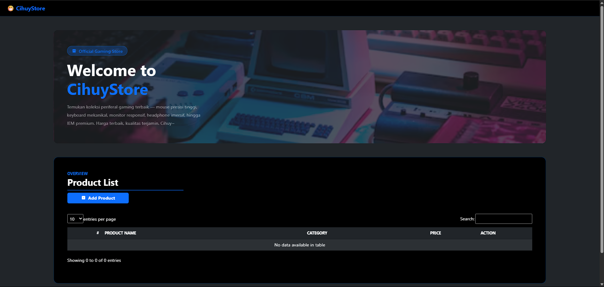
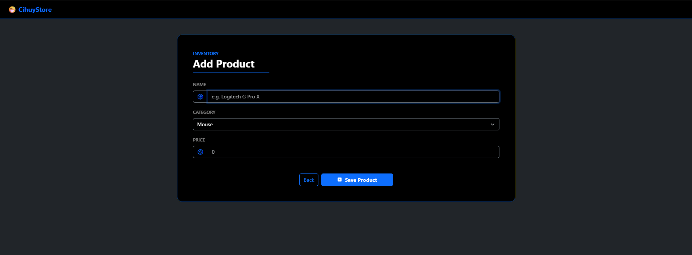
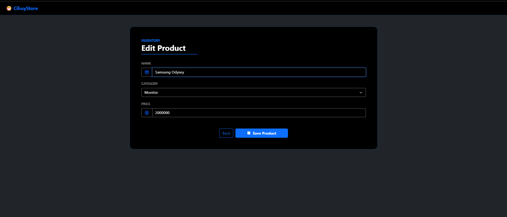
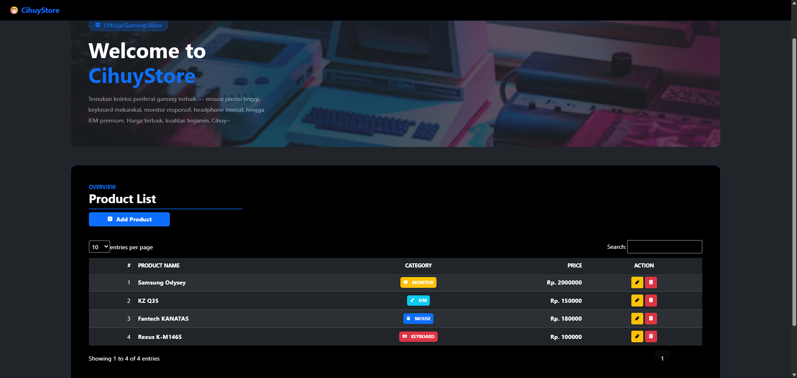

<div align="center">
  <br />

  <h1>LAPORAN PRAKTIKUM <br>
  APLIKASI BERBASIS PLATFORM
  </h1>

  <br />

  <h3>Tugas Praktikum <br>
  CihuyStore CI4
  </h3>

  <br />

  

  <br />
  <br />
  <br />

  <h3>Disusun Oleh :</h3>

  <p>
    <strong>Fahreza Ilham Wicaksono</strong><br>
    <strong>2311102191</strong><br>
    <strong>S1 IF-11-REG01</strong>
  </p>

  <br />

  <h3>Dosen Pengampu :</h3>

  <p>
    <strong>Dimas Fanny Hebrasianto Permadi, S.ST., M.Kom</strong>
  </p>
  
  <br />
  <br />
    <h4>Asisten Praktikum :</h4>
    <strong> Apri Pandu Wicaksono </strong> <br>
    <strong>Rangga Pradarrell Fathi</strong>
  <br />

  <h3>LABORATORIUM HIGH PERFORMANCE
 <br>FAKULTAS INFORMATIKA <br>UNIVERSITAS TELKOM PURWOKERTO <br>2026</h3>
</div>

<hr>

## Deskripsi Tugas

Buatlah sebuah aplikasi web sederhana yang memiliki minimal 3 (tiga) halaman fungsional yang mencakup Form, Halaman Data (Tabel), dan fungsionalitas CRUD (Create, Read, Update, Delete).

A. Spesifikasi Teknis Pengembangan (Wajib):

1. Aplikasi harus menggunakan Framework Bootstrap sebagai styling.

2. Aplikasi harus dibangun menggunakan Framework CodeIgniter (CI) atau NodeJS (express, fastify, atau berbasis library lain nya).

3. Struktur Halaman: Minimal terdiri dari 3 halaman utama:

    - Halaman Form (Input Data)
    - Halaman Tabel / Tampil Data
    - Fungsionalitas CRUD yang berjalan dengan baik.

4. Wajib menggunakan jQuery dan jQuery plugin.

5. Data yang ditampilkan pada tabel wajib menggunakan format data JSON, yang diimplementasikan menggunakan datatable Jquery.

B. Luaran

- source code + screenshot output
- video presentasi (menjelaskan kodenya dan output aplikasi) maksimal 10 menit dan ditambahkan pada laporan menggunakan tautan video

## Pengerjaan

### Penggunaan Bootstrap

Pada tugas ini Bootstrap diimpor menggunakan Content Delivery Network (`CDN`) sehingga proses pemuatan library menjadi lebih cepat tanpa perlu mengunduh dan menyimpan file Bootstrap secara lokal.

```html
<link href="https://cdn.jsdelivr.net/npm/bootstrap@5.3.8/dist/css/bootstrap.min.css" rel="stylesheet"
    integrity="sha384-sRIl4kxILFvY47J16cr9ZwB07vP4J8+LH7qKQnuqkuIAvNWLzeN8tE5YBujZqJLB" crossorigin="anonymous">

<script src="https://cdn.jsdelivr.net/npm/bootstrap@5.3.8/dist/js/bootstrap.bundle.min.js"
    integrity="sha384-FKyoEForCGlyvwx9Hj09JcYn3nv7wiPVlz7YYwJrWVcXK/BmnVDxM+D2scQbITxI"
    crossorigin="anonymous"></script>
```

Bootstrap grid dan column digunakan untuk mengatur tata letak halaman, khususnya melalui kelas seperti .row dan .col-md-*. Struktur layout pada website ini mengikuti pola yang sama seperti pada Tugas COTS, sehingga konsistensi desain tetap terjaga.

Untuk aspek styling, website ini juga menggunakan pendekatan yang serupa, yaitu menerapkan tema gelap (dark theme) dengan dominasi penggunaan kelas warna `primary` sebagai aksen, seperti pada teks, tombol, dan border. Kombinasi ini menghasilkan tampilan yang konsisten, modern, dan mudah dikenali.

```html
<div class="container-fluid">
    <div class="row justify-content-center my-5">
        <h1 class="display-4 fw-bold text-white mb-3">
            Welcome to<br>
            <span class="text-primary">CihuyStore</span>
        </h1>
    </div>

    <div class="row justify-content-center mb-5">
        <div class="col-md-6" data-aos="fade-up" data-aos-delay="100">\
            ...
       </div>
    </div>

    <div class="row justify-content-center mb-5">
        <div class="col-md-10" data-aos="fade-up" data-aos-delay="150">
            ...
       </div>
    </div>
```

### Penggunaan CodeIgniter 4

Pada tugas ini, framework yang digunakan adalah CodeIgniter, yang dipilih karena menyesuaikan dengan ketentuan yang telah ditetapkan. Versi yang digunakan adalah 4.7

CodeIgniter digunakan untuk membangun website dengan menerapkan arsitektur `MVC` (Model, View, Controller), sehingga proses pengembangan menjadi lebih terstruktur. Dengan pola ini, pengelolaan data (`Model`), tampilan (`View`), dan logika aplikasi (`Controller`) dapat dipisahkan dengan jelas, sehingga memudahkan dalam pengembangan, pemeliharaan, dan pengujian aplikasi.

#### Routes

```php
<?php

use CodeIgniter\Router\RouteCollection;

/**
 * @var RouteCollection $routes
 */

// Product
$routes->get('/', 'Products::index');

// create
$routes->get('/create', 'Products::create');
$routes->post('/store', 'Products::store');

// update
$routes->get('/edit/(:any)', 'Products::edit/$1');
$routes->post('/update/(:any)', 'Products::update/$1');

// delete
$routes->delete('/delete/(:any)', 'Products::destroy/$1');

// read
$routes->get('/products/get_json', 'Products::getProducts');
```

Konfigurasi routes tersebut digunakan untuk mengatur pemetaan URL ke method pada controller `Products`. Setiap route merepresentasikan operasi CRUD, dimulai dari index (`/`) untuk menampilkan halaman utama, `/create` dan `/store` untuk menambahkan data, `/edit` dan `/update` untuk memperbarui data, serta `/destroy` untuk menghapus data. Selain itu, terdapat route `getProducts` yang digunakan untuk mengambil data dalam format JSON. Parameter (`:any`) berfungsi untuk menangkap nilai dinamis seperti id dari URL yang kemudian diteruskan ke controller, sedangkan variabel `$1` berfungsi untuk menangkap parameter yang ada di URL.

#### Model Product

```php
<?php

namespace App\Models;

class ProductsModel
{
    private $file = WRITEPATH . 'data/products.json';

    public function getProducts()
    {
        if (!file_exists($this->file)) {
            return [];
        }

        $json = file_get_contents($this->file);
        $data = json_decode($json, true);

        return $data ? $data : [];
    }

    public function getProduct($id)
    {
        $products = $this->getProducts();

        foreach ($products as $product) {
            if ($product['id'] === $id) {
                return $product;
            }
        }

        return null;
    }

    public function insert($data)
    {
        $products = $this->getProducts();

        $data['id'] = uniqid();
        $products[] = $data;

        file_put_contents($this->file, json_encode($products, JSON_PRETTY_PRINT));
    }

    public function update($id, $newData)
    {
        $products = $this->getProducts();

        foreach ($products as $index => $product) {
            if ($product['id'] === $id) {
                $newData['id'] = $id;

                $products[$index] = array_merge($product, $newData);
                break;
            }
        }

        file_put_contents($this->file, json_encode($products, JSON_PRETTY_PRINT));
    }


    public function delete($id)
    {
        $products = $this->getProducts();

        $products = array_filter($products, function ($product) use ($id) {
            return $product['id'] !== $id;
        });

        $products = array_values($products);

        file_put_contents($this->file, json_encode($products, JSON_PRETTY_PRINT));
    }
}
```

Model `ProductsModel` digunakan untuk mengelola data produk dengan penyimpanan berbasis file JSON, bukan menggunakan database. Model ini tidak melakukan extend dari `BaseModel` milik CodeIgniter karena membutuhkan method kustom untuk menangani proses pembacaan dan penulisan data secara langsung ke file JSON. Model ini memiliki beberapa fungsi utama yang merepresentasikan operasi CRUD:

- `getProducts()`
Mengambil seluruh data produk dari file `products.json`. Jika file belum ada, maka akan mengembalikan array kosong.
- `getProduct($id)`
Mengambil satu data produk berdasarkan `id` dengan melakukan pencarian pada array produk.
- `insert($data)`
Menambahkan data produk baru dengan memberikan `id` unik menggunakan `uniqid()`, kemudian menyimpannya kembali ke file JSON.
- `update($id, $newData)`
Memperbarui data produk berdasarkan `id` dengan cara mengganti data lama menggunakan `array_merge`.
- `delete($id)`
Menghapus data produk berdasarkan `id` menggunakan `array_filter`, lalu merapikan kembali indeks array.

#### Controller Product

```php
<?php

namespace App\Controllers;

use App\Models\ProductsModel;
use Config\Services;

class Products extends BaseController
{
    protected $productsModel;

    public function __construct()
    {
        $this->productsModel = new ProductsModel();
    }

    public function index(): string
    {
        $data = [
            'title' => 'Inventory'
        ];

        return view('products/index', $data);
    }

    public function create(): string
    {
        $data = [
            'title' => 'Add Product',
            'validation' => session('validation') ?? Services::validation()
        ];

        return view('products/create', $data);
    }

    public function store()
    {
        $rules = [
            'product_name' => 'required|string',
            'category' => 'required|string',
            'price' => 'required|integer',
        ];

        if (!$this->validate($rules)) {
            $data = [
                'title' => 'Add Product',
                'validation' => $this->validator
            ];

            return view('products/create', $data);
        }

        $this->productsModel->insert([
            'product_name' => $this->request->getPost('product_name'),
            'category' => $this->request->getPost('category'),
            'price' => $this->request->getPost('price'),
        ]);

        session()->setFlashdata('message', 'Product successfully saved');

        return redirect()->to(base_url('/'));
    }

    public function edit($id)
    {
        $data = [
            'title' => 'Edit Product',
            'validation' => session('validation') ?? Services::validation(),
            'product' => $this->productsModel->getProduct($id)
        ];

        return view('products/edit', $data);
    }

    public function update($id)
    {
        $rules = [
            'product_name' => 'required|string',
            'category' => 'required|string',
            'price' => 'required|integer',
        ];

        if (!$this->validate($rules)) {
            return redirect()->to('/edit/' . $id)->withInput()->with('validation', $this->validator);
        }

        $this->productsModel->update($id, [
            'product_name' => $this->request->getPost('product_name'),
            'category' => $this->request->getPost('category'),
            'price' => $this->request->getPost('price'),
        ]);

        session()->setFlashdata('message', 'Data successfully updated');

        return redirect()->to(base_url('/'));
    }

    public function destroy($id)
    {
        $this->productsModel->delete($id);

        return $this->response->setJSON([
            'status' => 'success',
            'message' => 'Product successfully deleted'
        ]);
    }

    public function getProducts()
    {
        return $this->response->setJSON($this->productsModel->getProducts());
    }
}
```

Controller `Products` berfungsi sebagai penghubung antara Model dan View dalam mengelola data produk. Pada bagian `__construct()`, controller menginisialisasi `ProductsModel` agar dapat digunakan di seluruh method.

- Method `index()` digunakan untuk menampilkan halaman utama (daftar produk) ditambah mengirimkan data judul ke view `products/index`.
- Method `create()` menampilkan halaman form tambah produk pada view `products/create` serta mengirimkan data validasi untuk menangani error input.
- Method `store()` berfungsi untuk memproses penyimpanan data produk baru. Data input akan divalidasi terlebih dahulu, jika gagal maka form akan ditampilkan kembali dengan pesan error. Jika berhasil, data akan disimpan melalui model, kemudian menampilkan pesan sukses dan melakukan redirect ke halaman utama.
- Method `edit($id)` digunakan untuk menampilkan halaman edit produk berdasarkan `id`, sekaligus mengirimkan data produk yang akan diedit ke view `products/edit`.
- Method `update($id)` berfungsi untuk memproses pembaruan data produk, dimulai dari validasi input, lalu memperbarui data melalui model, dan akhirnya redirect kembali ke halaman utama dengan pesan sukses.
- Method `destroy($id)` digunakan untuk menghapus data produk berdasarkan `id`, kemudian mengembalikan response dalam format JSON sebagai indikator bahwa proses berhasil.  
- Method `getProducts()` digunakan untuk mengambil seluruh data produk dari model dan mengembalikannya dalam format JSON. Method ini digunakan untuk mengambil seluruh data dari file JSON yang nantinya diolah pada view menggunakan jQuery dan Datatables.

### Struktur Halaman

#### Home (Read)

```php
<?= $this->extend('layout/template'); ?>

<?= $this->section('content'); ?>
<!-- Hero -->
<div class="row justify-content-center my-5">
    <div class="col-md-10" data-aos="fade-down">
        <div class="rounded-4 overflow-hidden position-relative" style="min-height:400px; background-image:url('https://images.unsplash.com/photo-1550745165-9bc0b252726f?w=500&auto=format&fit=crop&q=60&ixlib=rb-4.1.0&ixid=M3wxMjA3fDB8MHxzZWFyY2h8MTB8fGdhbWluZ3xlbnwwfHwwfHx8MA%3D%3D'); background-size:cover; background-position:center;">

            <div class="position-absolute top-0 start-0 w-100 h-100 bg-dark bg-opacity-75"></div>

            <div class="position-relative p-5 d-flex flex-column justify-content-center" style="min-height:400px;">
                <span class="badge bg-primary bg-opacity-25 text-primary border border-primary border-opacity-50 rounded-pill px-3 py-2 mb-3 fs-6 fw-semibold align-self-start">
                    <i class="ph-fill ph-storefront me-1"></i> Official Gaming Store
                </span>

                <h1 class="display-4 fw-bold text-white mb-3">
                    Welcome to<br>
                    <span class="text-primary">CihuyStore</span>
                </h1>

                <p class="text-white-50 fs-6 mb-0" style="max-width:500px; line-height:1.8;">
                    Temukan koleksi periferal gaming terbaik — mouse presisi tinggi, keyboard mekanikal,
                    monitor responsif, headphone imersif, hingga IEM premium. Harga terbaik, kualitas terjamin.
                    Cihuy~
                </p>
            </div>
        </div>
    </div>
</div>

<!-- Product Table -->
<div class="row justify-content-center mb-5">
    <div class="col-md-10" data-aos="fade-up" data-aos-delay="150">
        <div class="bg-black border border-primary border-opacity-50 rounded-4 p-4 p-md-5">

            <p class="text-primary text-uppercase fw-bold small mb-0">Overview</p>
            <h2 class="fw-bold text-white mb-1">Product List</h2>
            <hr class="border border-primary border-2 opacity-75 mt-2 mb-2 w-25">

            <a href="/create" class="btn btn-primary fw-bold px-5 mb-4"><i class="ph-fill ph-plus-square me-1"></i> Add Product</a>

            <table id="productTable" class="table table-dark table-striped table-hover align-middle w-100">
                <thead class="border-bottom border-primary border-opacity-50">
                    <tr>
                        <th class="text-white text-uppercase small fw-bold">#</th>
                        <th class="text-white text-uppercase small fw-bold">Product Name</th>
                        <th class="text-white text-uppercase small fw-bold">Category</th>
                        <th class="text-white text-uppercase small fw-bold">Price</th>
                        <th class="text-white text-uppercase small fw-bold">Action</th>
                    </tr>
                </thead>
                <tbody></tbody>
            </table>
        </div>
    </div>
</div>
<?= $this->endSection('content'); ?>

<?= $this->section('script'); ?>
<?php if (session()->getFlashdata('message')) : ?>
    <script>
        Swal.fire({
            icon: 'success',
            title: '<?= session()->getFlashdata('message'); ?>',
            position: 'top',
            showConfirmButton: false,
            background: '#181818ff',
            color: '#fff',
            timer: 2000
        });
    </script>
<?php endif; ?>

<script>
    $(document).ready(function() {
        let table = $("#productTable").DataTable({
            paging: true,
            searching: true,
            stateSave: true,
            ordering: false,
            columnDefs: [{
                    targets: 0,
                    searchable: false,
                    orderable: false,
                    render: function(data, type, row, meta) {
                        return meta.row + 1;
                    }
                },
                {
                    targets: 1,
                    className: "fw-bold"
                },
                {
                    targets: 2,
                    className: "align-middle text-center"
                },
                {
                    targets: 3,
                    className: "fw-bold text-end"
                },
                {
                    targets: 4,
                    className: "align-middle text-center"
                }
            ]
        });

        (function($) {
            $.categoryBadge = function(category) {
                let badges = {
                    mouse: "primary",
                    keyboard: "danger",
                    monitor: "warning",
                    headphone: "success",
                    iem: "info"
                };

                let icons = {
                    mouse: "ph-mouse",
                    keyboard: "ph-keyboard",
                    monitor: "ph-monitor",
                    headphone: "ph-headphones",
                    iem: "ph-music-note"
                };

                return `
                    <span class="badge bg-${badges[category]} fw-bold p-2">
                        <i class="ph-fill ${icons[category]} me-2"></i>
                        ${category.toUpperCase()}
                    </span>`;
            };
        })(jQuery);

        $.ajax({
            url: '/products/get_json',
            method: 'GET',
            dataType: 'json',
            success: function(data) {
                if (data.length > 0) {
                    data.forEach(function(product) {
                        table.row.add([
                            null,
                            product.product_name,
                            $.categoryBadge(product.category),
                            "Rp. " + product.price,
                            `
                                <a href="/edit/${product.id}" class="btn btn-warning btn-sm"><i class="ph-fill ph-pencil-simple"></i></a>
                                <button class="btn btn-danger btn-sm deleteBtn" data-id="${product.id}"><i class="ph-fill ph-trash"></i></button>
                            `
                        ]);
                    });
                }

                table.draw(false);
            }
        });

        $("#productTable tbody").on('click', '.deleteBtn', function() {
            let button = $(this);
            let row = table.row(button.parents('tr'));
            let id = button.data('id');

            Swal.fire({
                title: "Are you sure?",
                text: "Delete this product?",
                icon: "warning",
                position: 'top',
                showCancelButton: true,
                background: '#181818ff',
                color: '#fff',
                confirmButtonColor: "#3085d6",
                cancelButtonColor: "#d33",
                confirmButtonText: "Yes, delete it",
                cancelButtonText: "Cancel"
            }).then((result) => {
                if (result.isConfirmed) {
                    $.ajax({
                        url: '/delete/' + id,
                        type: 'POST',
                        data: {
                            _method: 'DELETE'
                        },
                        success: function(response) {
                            Swal.fire({
                                icon: 'success',
                                title: response.message,
                                position: 'top',
                                showConfirmButton: false,
                                background: '#181818ff',
                                color: '#fff',
                                timer: 2000
                            });

                            row.remove().draw(false);
                        },
                        error: function() {
                            Swal.fire({
                                icon: 'success',
                                title: '<?= session()->getFlashdata('message'); ?>',
                                position: 'top',
                                background: '#181818ff',
                                color: '#fff',
                                timer: 2000
                            });
                        }
                    });
                }
            });
        });
    });
</script>
<?= $this->endSection(); ?>
```

Pada halaman ini terdapat tabel data produk yang menggunakan DataTables. Data pada tabel diambil menggunakan jQuery AJAX dengan mengakses endpoint `/products/get_json`, yang seperti dijelaskan sebelumnya berfungsi untuk mengambil seluruh data dari file JSON.

Setelah data diterima, data tersebut diolah menggunakan jQuery dan kemudian ditampilkan ke dalam tabel melalui DataTables agar lebih interaktif. Selain itu, pada setiap baris tabel juga ditambahkan tombol aksi seperti `edit` dan `hapus`, yang masing-masing terhubung dengan route yang telah didefinisikan untuk menangani proses update dan delete data.



#### Create

```php
<?= $this->extend('layout/template'); ?>

<?= $this->section('content'); ?>
<!-- Add Product Form -->
<div class="row justify-content-center mt-5">
    <div class="col-md-6" data-aos="fade-up" data-aos-delay="100">
        <div class="bg-black border border-primary border-opacity-50 rounded-4 p-4 p-md-5">

            <p class="text-primary text-uppercase fw-bold small mb-0">Inventory</p>
            <h2 class="fw-bold text-white mb-1">Add Product</h2>
            <hr class="border border-primary border-2 opacity-75 mt-2 mb-4 w-25">

            <form id="addProductForm" action="/store" method="post">
                <?= csrf_field(); ?>

                <div class="mb-3">
                    <label for="product_name" class="form-label text-white-50 text-uppercase fw-semibold small">Name</label>

                    <div class="input-group">
                        <span class="input-group-text bg-black border-secondary text-primary">
                            <i class="ph-duotone ph-package fs-5"></i>
                        </span>

                        <input type="text" class="form-control bg-black border-secondary text-white <?= ($validation->hasError('product_name')) ? 'is-invalid' : ''; ?>" id="product_name" name="product_name" placeholder="e.g. Logitech G Pro X" value="<?= old('product_name'); ?>" autofocus>
                    </div>

                    <div class="invalid-feedback">
                        <?= $validation->getError('product_name'); ?>
                    </div>
                </div>

                <div class="mb-3">
                    <label for="category" class="form-label text-white-50 text-uppercase fw-semibold small">Category</label>

                    <select class="form-select bg-black border-secondary text-white" id="category" name="category" aria-placeholder="Select Category">
                        <option value="mouse" <?= old('category') === 'mouse' ? 'selected' : ''; ?>> Mouse</option>
                        <option value="keyboard" <?= old('category') === 'keyboard' ? 'selected' : ''; ?>> Keyboard</option>
                        <option value="monitor" <?= old('category') === 'monitor' ? 'selected' : ''; ?>> Monitor</option>
                        <option value="headphone" <?= old('category') === 'headphone' ? 'selected' : ''; ?>> Headphone</option>
                        <option value="iem" <?= old('category') === 'iem' ? 'selected' : ''; ?>> IEM</option>
                    </select>
                </div>

                <div class="mb-3">
                    <label for="price" class="form-label text-white-50 text-uppercase fw-semibold small">Price</label>

                    <div class="input-group">
                        <span class="input-group-text bg-black border-secondary text-primary">
                            <i class="ph-duotone ph-currency-circle-dollar fs-5"></i>
                        </span>

                        <input type="number" class="form-control bg-black border-secondary text-white <?= ($validation->hasError('price')) ? 'is-invalid' : ''; ?>" id="price" name="price" placeholder="0" value="<?= old('price'); ?>" autofocus>
                    </div>

                    <div class="invalid-feedback">
                        <?= $validation->getError('price'); ?>
                    </div>
                </div>

                <div class="d-flex justify-content-center mt-5 gap-2">
                    <a href="/" class="btn btn-outline-primary">Back</a>

                    <button type="submit" class="btn btn-primary fw-bold px-5">
                        <i class="ph-fill ph-plus-square me-1"></i> Save Product
                    </button>
                </div>
            </form>
        </div>
    </div>
</div>
<?= $this->endSection('content'); ?>
```

Halaman create ini digunakan untuk menampilkan form penambahan produk pada website. Form memiliki action ke endpoint `/store` dengan method `POST`, yang akan diproses oleh controller untuk menyimpan data. Selain itu, digunakan fungsi `csrf_field()` sebagai proteksi keamanan terhadap serangan CSRF.

Field nama produk, kategori, dan harga, masing-masing sudah terintegrasi dengan validasi dari CodeIgniter. Jika terjadi error, input akan diberi class `is-invalid` dan pesan error ditampilkan menggunakan `$validation->getError()`. Nilai input sebelumnya juga tetap ditampilkan kembali menggunakan fungsi `old()`, sehingga memudahkan pengguna saat terjadi kesalahan input.



#### Update

```php
<?= $this->extend('layout/template'); ?>

<?= $this->section('content'); ?>
<!-- Add Product Form -->
<div class="row justify-content-center mt-5">
    <div class="col-md-6" data-aos="fade-up" data-aos-delay="100">
        <div class="bg-black border border-primary border-opacity-50 rounded-4 p-4 p-md-5">

            <p class="text-primary text-uppercase fw-bold small mb-0">Inventory</p>
            <h2 class="fw-bold text-white mb-1">Edit Product</h2>
            <hr class="border border-primary border-2 opacity-75 mt-2 mb-4 w-25">

            <form id="editProductForm" action="/update/<?= $product['id']; ?>" method="post">
                <?= csrf_field(); ?>

                <div class="mb-3">
                    <label for="product_name" class="form-label text-white-50 text-uppercase fw-semibold small">Name</label>

                    <div class="input-group">
                        <span class="input-group-text bg-black border-secondary text-primary">
                            <i class="ph-duotone ph-package fs-5"></i>
                        </span>

                        <input type="text" class="form-control bg-black border-secondary text-white <?= ($validation->hasError('product_name')) ? 'is-invalid' : ''; ?>" id="product_name" name="product_name" placeholder="e.g. Logitech G Pro X" value="<?= (old('product_name')) ? old('product_name') : $product['product_name']; ?>" autofocus>
                    </div>

                    <div class="invalid-feedback">
                        <?= $validation->getError('product_name'); ?>
                    </div>
                </div>

                <div class="mb-3">
                    <label for="category" class="form-label text-white-50 text-uppercase fw-semibold small">Category</label>

                    <select class="form-select bg-black border-secondary text-white" id="category" name="category">
                        <option value="mouse" <?= old('category', $product['category']) == 'mouse' ? 'selected' : '' ?>>Mouse</option>
                        <option value="keyboard" <?= old('category', $product['category']) == 'keyboard' ? 'selected' : '' ?>>Keyboard</option>
                        <option value="monitor" <?= old('category', $product['category']) == 'monitor' ? 'selected' : '' ?>>Monitor</option>
                        <option value="headphone" <?= old('category', $product['category']) == 'headphone' ? 'selected' : '' ?>>Headphone</option>
                        <option value="iem" <?= old('category', $product['category']) == 'iem' ? 'selected' : '' ?>>IEM</option>
                    </select>
                </div>

                <div class="mb-3">
                    <label for="price" class="form-label text-white-50 text-uppercase fw-semibold small">Price</label>

                    <div class="input-group">
                        <span class="input-group-text bg-black border-secondary text-primary">
                            <i class="ph-duotone ph-currency-circle-dollar fs-5"></i>
                        </span>

                        <input type="number" class="form-control bg-black border-secondary text-white <?= ($validation->hasError('price')) ? 'is-invalid' : ''; ?>" id="price" name="price" placeholder="0" value="<?= (old('price')) ? old('price') : $product['price']; ?>">
                    </div>

                    <div class="invalid-feedback">
                        <?= $validation->getError('price'); ?>
                    </div>
                </div>

                <div class="d-flex justify-content-center mt-5 gap-2">
                    <a href="/" class="btn btn-outline-primary">Back</a>

                    <button type="submit" class="btn btn-primary fw-bold px-5">
                        <i class="ph-fill ph-plus-square me-1"></i> Save Product
                    </button>
                </div>
            </form>
        </div>
    </div>
</div>
<?= $this->endSection('content'); ?>
```

Halaman edit ini digunakan untuk menampilkan form pengubahan data produk yang sudah ada. Struktur halaman sama seperti halaman create, namun perbedaannya terletak pada data yang sudah terisi otomatis berdasarkan produk yang dipilih.

Form memiliki action ke endpoint `/update/{id}` dengan method `POST`, di mana `{id}` merupakan identitas produk yang akan diperbarui. Data produk dikirim dari controller dan ditampilkan pada setiap field menggunakan variabel `$product`. Setiap input juga telah terintegrasi dengan validasi, sehingga jika terjadi error, field akan diberi class `is-invalid` dan pesan error ditampilkan. Selain itu, digunakan fungsi `old()` untuk mempertahankan input sebelumnya jika validasi gagal, dengan fallback ke data asli produk.



### Penggunaan jQuery dan jQuery Plugin

```js
$(document).ready(function() {
        let table = $("#productTable").DataTable({
            paging: true,
            searching: true,
            stateSave: true,
            ordering: false,
            columnDefs: [{
                    targets: 0,
                    searchable: false,
                    orderable: false,
                    render: function(data, type, row, meta) {
                        return meta.row + 1;
                    }
                },
                {
                    targets: 1,
                    className: "fw-bold"
                },
                {
                    targets: 2,
                    className: "align-middle text-center"
                },
                {
                    targets: 3,
                    className: "fw-bold text-end"
                },
                {
                    targets: 4,
                    className: "align-middle text-center"
                }
            ]
        });

        (function($) {
            $.categoryBadge = function(category) {
                let badges = {
                    mouse: "primary",
                    keyboard: "danger",
                    monitor: "warning",
                    headphone: "success",
                    iem: "info"
                };

                let icons = {
                    mouse: "ph-mouse",
                    keyboard: "ph-keyboard",
                    monitor: "ph-monitor",
                    headphone: "ph-headphones",
                    iem: "ph-music-note"
                };

                return `
                    <span class="badge bg-${badges[category]} fw-bold p-2">
                        <i class="ph-fill ${icons[category]} me-2"></i>
                        ${category.toUpperCase()}
                    </span>`;
            };
        })(jQuery);

        $.ajax({
            url: '/products/get_json',
            method: 'GET',
            dataType: 'json',
            success: function(data) {
                if (data.length > 0) {
                    data.forEach(function(product) {
                        table.row.add([
                            null,
                            product.product_name,
                            $.categoryBadge(product.category),
                            "Rp. " + product.price,
                            `
                                <a href="/edit/${product.id}" class="btn btn-warning btn-sm"><i class="ph-fill ph-pencil-simple"></i></a>
                                <button class="btn btn-danger btn-sm deleteBtn" data-id="${product.id}"><i class="ph-fill ph-trash"></i></button>
                            `
                        ]);
                    });
                }

                table.draw(false);
            }
        });

        $("#productTable tbody").on('click', '.deleteBtn', function() {
            let button = $(this);
            let row = table.row(button.parents('tr'));
            let id = button.data('id');

            Swal.fire({
                title: "Are you sure?",
                text: "Delete this product?",
                icon: "warning",
                position: 'top',
                showCancelButton: true,
                background: '#181818ff',
                color: '#fff',
                confirmButtonColor: "#3085d6",
                cancelButtonColor: "#d33",
                confirmButtonText: "Yes, delete it",
                cancelButtonText: "Cancel"
            }).then((result) => {
                if (result.isConfirmed) {
                    $.ajax({
                        url: '/delete/' + id,
                        type: 'POST',
                        data: {
                            _method: 'DELETE'
                        },
                        success: function(response) {
                            Swal.fire({
                                icon: 'success',
                                title: response.message,
                                position: 'top',
                                showConfirmButton: false,
                                background: '#181818ff',
                                color: '#fff',
                                timer: 2000
                            });

                            row.remove().draw(false);
                        },
                        error: function() {
                            Swal.fire({
                                icon: 'success',
                                title: '<?= session()->getFlashdata('message'); ?>',
                                position: 'top',
                                background: '#181818ff',
                                color: '#fff',
                                timer: 2000
                            });
                        }
                    });
                }
            });
        });
    });
```

Pada website ini, jQuery digunakan untuk mempermudah manipulasi elemen HTML dan pengelolaan interaksi pengguna. Fungsi `$(document).ready()` memastikan seluruh elemen halaman telah dimuat sebelum script dijalankan. Selain itu, jQuery digunakan untuk melakukan `AJAX` request ke endpoint `/products/get_json` guna mengambil data produk secara dinamis tanpa reload halaman, serta menangani event seperti klik tombol delete dengan `.on('click')`. jQuery juga membantu dalam mengambil atribut data (`data-id`), memanipulasi baris tabel, dan mengontrol alur logika interaksi pengguna secara lebih ringkas.

Selain itu, jQuery juga dimanfaatkan dalam bentuk plugin, seperti fungsi kustom `$.categoryBadge`. `$.categoryBadge` merupakan plugin sederhana yang dibuat untuk menghasilkan tampilan badge kategori secara dinamis berdasarkan jenis produk.

### Penggunaan JSON sebagai Database

```json
[
    {
        "product_name": "Samsung Odysey",
        "category": "monitor",
        "price": "2000000",
        "id": "69c472f651bfd"
    },
    {
        "product_name": "KZ Q35",
        "category": "iem",
        "price": "150000",
        "id": "69c4737b925df"
    },
    {
        "product_name": "Fantech KANATAS",
        "category": "mouse",
        "price": "180000",
        "id": "69c473a7bdc23"
    },
    {
        "product_name": "Rexus K-M1465",
        "category": "keyboard",
        "price": "100000",
        "id": "69c474f40bc90"
    }
]
```

Sesuai dengan ketentuan tugas, penyimpanan data tidak menggunakan database `MySQL`, melainkan menggunakan file JSON yang disimpan pada direktori `/writable/data/products.json`. Pengolahan data pada file JSON tersebut dilakukan melalui Model `ProductsModel` yang telah dijelaskan sebelumnya, yang bertugas menangani proses read, crete, store, edit, update, dan delet data secara terstruktur.

### Source code

#### Routes.php

```php
<?php

use CodeIgniter\Router\RouteCollection;

/**
 * @var RouteCollection $routes
 */

// Product
$routes->get('/', 'Products::index');

// create
$routes->get('/create', 'Products::create');
$routes->post('/store', 'Products::store');

// update
$routes->get('/edit/(:any)', 'Products::edit/$1');
$routes->post('/update/(:any)', 'Products::update/$1');

// delete
$routes->delete('/delete/(:any)', 'Products::destroy/$1');

// read
$routes->get('/products/get_json', 'Products::getProducts');

```

#### ProductsModel.php

```php
<?php

namespace App\Models;

class ProductsModel
{
    private $file = WRITEPATH . 'data/products.json';

    public function getProducts()
    {
        if (!file_exists($this->file)) {
            return [];
        }

        $json = file_get_contents($this->file);
        $data = json_decode($json, true);

        return $data ? $data : [];
    }

    public function getProduct($id)
    {
        $products = $this->getProducts();

        foreach ($products as $product) {
            if ($product['id'] === $id) {
                return $product;
            }
        }

        return null;
    }

    public function insert($data)
    {
        $products = $this->getProducts();

        $data['id'] = uniqid();
        $products[] = $data;

        file_put_contents($this->file, json_encode($products, JSON_PRETTY_PRINT));
    }

    public function update($id, $newData)
    {
        $products = $this->getProducts();

        foreach ($products as $index => $product) {
            if ($product['id'] === $id) {
                $newData['id'] = $id;

                $products[$index] = array_merge($product, $newData);
                break;
            }
        }

        file_put_contents($this->file, json_encode($products, JSON_PRETTY_PRINT));
    }


    public function delete($id)
    {
        $products = $this->getProducts();

        $products = array_filter($products, function ($product) use ($id) {
            return $product['id'] !== $id;
        });

        $products = array_values($products);

        file_put_contents($this->file, json_encode($products, JSON_PRETTY_PRINT));
    }
}

```

#### Products.php

```php
<?php

namespace App\Controllers;

use App\Models\ProductsModel;
use Config\Services;

class Products extends BaseController
{
    protected $productsModel;

    public function __construct()
    {
        $this->productsModel = new ProductsModel();
    }

    public function index(): string
    {
        $data = [
            'title' => 'Inventory'
        ];

        return view('products/index', $data);
    }

    public function create(): string
    {
        $data = [
            'title' => 'Add Product',
            'validation' => session('validation') ?? Services::validation()
        ];

        return view('products/create', $data);
    }

    public function store()
    {
        $rules = [
            'product_name' => 'required|string',
            'category' => 'required|string',
            'price' => 'required|integer',
        ];

        if (!$this->validate($rules)) {
            $data = [
                'title' => 'Add Product',
                'validation' => $this->validator
            ];

            return view('products/create', $data);
        }

        $this->productsModel->insert([
            'product_name' => $this->request->getPost('product_name'),
            'category' => $this->request->getPost('category'),
            'price' => $this->request->getPost('price'),
        ]);

        session()->setFlashdata('message', 'Product successfully saved');

        return redirect()->to(base_url('/'));
    }

    public function edit($id)
    {
        $data = [
            'title' => 'Edit Product',
            'validation' => session('validation') ?? Services::validation(),
            'product' => $this->productsModel->getProduct($id)
        ];

        return view('products/edit', $data);
    }

    public function update($id)
    {
        $rules = [
            'product_name' => 'required|string',
            'category' => 'required|string',
            'price' => 'required|integer',
        ];

        if (!$this->validate($rules)) {
            return redirect()->to('/edit/' . $id)->withInput()->with('validation', $this->validator);
        }

        $this->productsModel->update($id, [
            'product_name' => $this->request->getPost('product_name'),
            'category' => $this->request->getPost('category'),
            'price' => $this->request->getPost('price'),
        ]);

        session()->setFlashdata('message', 'Data successfully updated');

        return redirect()->to(base_url('/'));
    }

    public function destroy($id)
    {
        $this->productsModel->delete($id);

        return $this->response->setJSON([
            'status' => 'success',
            'message' => 'Product successfully deleted'
        ]);
    }

    public function getProducts()
    {
        return $this->response->setJSON($this->productsModel->getProducts());
    }
}

```

#### template.php

```php
<!DOCTYPE html>
<html lang="en" data-bs-theme="dark">

<!-- 2311102191 -->
<!-- FAHREZA ILHAM WICAKSONO -->
<!-- 👍🏿 -->

<head>
    <meta charset="UTF-8">
    <meta name="viewport" content="width=device-width, initial-scale=1.0">
    <title>CihuyStore | <?= $title; ?></title>

    <link rel="icon" href="data:image/svg+xml,<svg xmlns='http://www.w3.org/2000/svg' viewBox='0 0 100 100'><text y='.9em' font-size='80'>😁</text></svg>">

    <!-- Bootstrap -->
    <link href="https://cdn.jsdelivr.net/npm/bootstrap@5.3.8/dist/css/bootstrap.min.css" rel="stylesheet" integrity="sha384-sRIl4kxILFvY47J16cr9ZwB07vP4J8+LH7qKQnuqkuIAvNWLzeN8tE5YBujZqJLB" crossorigin="anonymous">

    <!-- Phospor icon -->
    <link rel="stylesheet" type="text/css" href="https://cdn.jsdelivr.net/npm/@phosphor-icons/web@2.1.2/src/duotone/style.css" />
    <link rel="stylesheet" type="text/css" href="https://cdn.jsdelivr.net/npm/@phosphor-icons/web@2.1.2/src/fill/style.css" />

    <!-- Datatables -->
    <link rel="stylesheet" href="https://cdn.datatables.net/2.3.7/css/dataTables.dataTables.css" />

    <!-- AOS -->
    <link rel="stylesheet" href="https://cdn.jsdelivr.net/npm/aos@2.3.4/dist/aos.css" />
</head>

<body class="bg-dark text-white d-flex flex-column min-vh-100">

    <!-- Navbar -->
    <?= $this->include('layout/navbar'); ?>

    <main class="flex-grow-1">
        <div class="container-fluid">
            <?= $this->renderSection('content'); ?>
        </div>
    </main>

    <!-- Footer -->
    <footer class="border-top border-secondary border-opacity-25 text-center py-4 mt-2">
        <p class="mb-0 text-white-50 small">© 2026 <span class="text-primary fw-semibold">CihuyStore</span> — All rights
            reserved.</p>
    </footer>

    <!-- Bootstrap -->
    <script src="https://cdn.jsdelivr.net/npm/bootstrap@5.3.8/dist/js/bootstrap.bundle.min.js" integrity="sha384-FKyoEForCGlyvwx9Hj09JcYn3nv7wiPVlz7YYwJrWVcXK/BmnVDxM+D2scQbITxI" crossorigin="anonymous"></script>

    <!-- Jquery -->
    <script src="https://code.jquery.com/jquery-3.7.1.min.js" integrity="sha256-/JqT3SQfawRcv/BIHPThkBvs0OEvtFFmqPF/lYI/Cxo=" crossorigin="anonymous"></script>

    <!-- Datatables -->
    <script src="https://cdn.datatables.net/2.3.7/js/dataTables.js"></script>

    <!-- sweet alert -->
    <script src="https://cdn.jsdelivr.net/npm/sweetalert2@11"></script>

    <!-- AOS -->
    <script src="https://cdn.jsdelivr.net/npm/aos@2.3.4/dist/aos.js"></script>
    <script>
        AOS.init({
            once: true,
            duration: 600,
            easing: 'ease-out-cubic'
        });
    </script>

    <!-- Custom JS -->
    <?= $this->renderSection('script'); ?>
</body>

</html>
```

#### index.php

```php
<?= $this->extend('layout/template'); ?>

<?= $this->section('content'); ?>
<!-- Hero -->
<div class="row justify-content-center my-5">
    <div class="col-md-10" data-aos="fade-down">
        <div class="rounded-4 overflow-hidden position-relative" style="min-height:400px; background-image:url('https://images.unsplash.com/photo-1550745165-9bc0b252726f?w=500&auto=format&fit=crop&q=60&ixlib=rb-4.1.0&ixid=M3wxMjA3fDB8MHxzZWFyY2h8MTB8fGdhbWluZ3xlbnwwfHwwfHx8MA%3D%3D'); background-size:cover; background-position:center;">

            <div class="position-absolute top-0 start-0 w-100 h-100 bg-dark bg-opacity-75"></div>

            <div class="position-relative p-5 d-flex flex-column justify-content-center" style="min-height:400px;">
                <span class="badge bg-primary bg-opacity-25 text-primary border border-primary border-opacity-50 rounded-pill px-3 py-2 mb-3 fs-6 fw-semibold align-self-start">
                    <i class="ph-fill ph-storefront me-1"></i> Official Gaming Store
                </span>

                <h1 class="display-4 fw-bold text-white mb-3">
                    Welcome to<br>
                    <span class="text-primary">CihuyStore</span>
                </h1>

                <p class="text-white-50 fs-6 mb-0" style="max-width:500px; line-height:1.8;">
                    Temukan koleksi periferal gaming terbaik — mouse presisi tinggi, keyboard mekanikal,
                    monitor responsif, headphone imersif, hingga IEM premium. Harga terbaik, kualitas terjamin.
                    Cihuy~
                </p>
            </div>
        </div>
    </div>
</div>

<!-- Product Table -->
<div class="row justify-content-center mb-5">
    <div class="col-md-10" data-aos="fade-up" data-aos-delay="150">
        <div class="bg-black border border-primary border-opacity-50 rounded-4 p-4 p-md-5">

            <p class="text-primary text-uppercase fw-bold small mb-0">Overview</p>
            <h2 class="fw-bold text-white mb-1">Product List</h2>
            <hr class="border border-primary border-2 opacity-75 mt-2 mb-2 w-25">

            <a href="/create" class="btn btn-primary fw-bold px-5 mb-4"><i class="ph-fill ph-plus-square me-1"></i> Add Product</a>

            <table id="productTable" class="table table-dark table-striped table-hover align-middle w-100">
                <thead class="border-bottom border-primary border-opacity-50">
                    <tr>
                        <th class="text-white text-uppercase small fw-bold">#</th>
                        <th class="text-white text-uppercase small fw-bold">Product Name</th>
                        <th class="text-white text-uppercase small fw-bold">Category</th>
                        <th class="text-white text-uppercase small fw-bold">Price</th>
                        <th class="text-white text-uppercase small fw-bold">Action</th>
                    </tr>
                </thead>
                <tbody></tbody>
            </table>
        </div>
    </div>
</div>
<?= $this->endSection('content'); ?>

<?= $this->section('script'); ?>
<?php if (session()->getFlashdata('message')) : ?>
    <script>
        Swal.fire({
            icon: 'success',
            title: '<?= session()->getFlashdata('message'); ?>',
            position: 'top',
            showConfirmButton: false,
            background: '#181818ff',
            color: '#fff',
            timer: 2000
        });
    </script>
<?php endif; ?>

<script>
    $(document).ready(function() {
        let table = $("#productTable").DataTable({
            paging: true,
            searching: true,
            stateSave: true,
            ordering: false,
            columnDefs: [{
                    targets: 0,
                    searchable: false,
                    orderable: false,
                    render: function(data, type, row, meta) {
                        return meta.row + 1;
                    }
                },
                {
                    targets: 1,
                    className: "fw-bold"
                },
                {
                    targets: 2,
                    className: "align-middle text-center"
                },
                {
                    targets: 3,
                    className: "fw-bold text-end"
                },
                {
                    targets: 4,
                    className: "align-middle text-center"
                }
            ]
        });

        (function($) {
            $.categoryBadge = function(category) {
                let badges = {
                    mouse: "primary",
                    keyboard: "danger",
                    monitor: "warning",
                    headphone: "success",
                    iem: "info"
                };

                let icons = {
                    mouse: "ph-mouse",
                    keyboard: "ph-keyboard",
                    monitor: "ph-monitor",
                    headphone: "ph-headphones",
                    iem: "ph-music-note"
                };

                return `
                    <span class="badge bg-${badges[category]} fw-bold p-2">
                        <i class="ph-fill ${icons[category]} me-2"></i>
                        ${category.toUpperCase()}
                    </span>`;
            };
        })(jQuery);

        $.ajax({
            url: '/products/get_json',
            method: 'GET',
            dataType: 'json',
            success: function(data) {
                if (data.length > 0) {
                    data.forEach(function(product) {
                        table.row.add([
                            null,
                            product.product_name,
                            $.categoryBadge(product.category),
                            "Rp. " + product.price,
                            `
                                <a href="/edit/${product.id}" class="btn btn-warning btn-sm"><i class="ph-fill ph-pencil-simple"></i></a>
                                <button class="btn btn-danger btn-sm deleteBtn" data-id="${product.id}"><i class="ph-fill ph-trash"></i></button>
                            `
                        ]);
                    });
                }

                table.draw(false);
            }
        });

        $("#productTable tbody").on('click', '.deleteBtn', function() {
            let button = $(this);
            let row = table.row(button.parents('tr'));
            let id = button.data('id');

            Swal.fire({
                title: "Are you sure?",
                text: "Delete this product?",
                icon: "warning",
                position: 'top',
                showCancelButton: true,
                background: '#181818ff',
                color: '#fff',
                confirmButtonColor: "#3085d6",
                cancelButtonColor: "#d33",
                confirmButtonText: "Yes, delete it",
                cancelButtonText: "Cancel"
            }).then((result) => {
                if (result.isConfirmed) {
                    $.ajax({
                        url: '/delete/' + id,
                        type: 'POST',
                        data: {
                            _method: 'DELETE'
                        },
                        success: function(response) {
                            Swal.fire({
                                icon: 'success',
                                title: response.message,
                                position: 'top',
                                showConfirmButton: false,
                                background: '#181818ff',
                                color: '#fff',
                                timer: 2000
                            });

                            row.remove().draw(false);
                        },
                        error: function() {
                            Swal.fire({
                                icon: 'success',
                                title: '<?= session()->getFlashdata('message'); ?>',
                                position: 'top',
                                background: '#181818ff',
                                color: '#fff',
                                timer: 2000
                            });
                        }
                    });
                }
            });
        });
    });
</script>
<?= $this->endSection(); ?>
```

#### create.php

```php
<?= $this->extend('layout/template'); ?>

<?= $this->section('content'); ?>
<!-- Add Product Form -->
<div class="row justify-content-center mt-5">
    <div class="col-md-6" data-aos="fade-up" data-aos-delay="100">
        <div class="bg-black border border-primary border-opacity-50 rounded-4 p-4 p-md-5">

            <p class="text-primary text-uppercase fw-bold small mb-0">Inventory</p>
            <h2 class="fw-bold text-white mb-1">Add Product</h2>
            <hr class="border border-primary border-2 opacity-75 mt-2 mb-4 w-25">

            <form id="addProductForm" action="/store" method="post">
                <?= csrf_field(); ?>

                <div class="mb-3">
                    <label for="product_name" class="form-label text-white-50 text-uppercase fw-semibold small">Name</label>

                    <div class="input-group">
                        <span class="input-group-text bg-black border-secondary text-primary">
                            <i class="ph-duotone ph-package fs-5"></i>
                        </span>

                        <input type="text" class="form-control bg-black border-secondary text-white <?= ($validation->hasError('product_name')) ? 'is-invalid' : ''; ?>" id="product_name" name="product_name" placeholder="e.g. Logitech G Pro X" value="<?= old('product_name'); ?>" autofocus>
                    </div>

                    <div class="invalid-feedback">
                        <?= $validation->getError('product_name'); ?>
                    </div>
                </div>

                <div class="mb-3">
                    <label for="category" class="form-label text-white-50 text-uppercase fw-semibold small">Category</label>

                    <select class="form-select bg-black border-secondary text-white" id="category" name="category" aria-placeholder="Select Category">
                        <option value="mouse" <?= old('category') === 'mouse' ? 'selected' : ''; ?>> Mouse</option>
                        <option value="keyboard" <?= old('category') === 'keyboard' ? 'selected' : ''; ?>> Keyboard</option>
                        <option value="monitor" <?= old('category') === 'monitor' ? 'selected' : ''; ?>> Monitor</option>
                        <option value="headphone" <?= old('category') === 'headphone' ? 'selected' : ''; ?>> Headphone</option>
                        <option value="iem" <?= old('category') === 'iem' ? 'selected' : ''; ?>> IEM</option>
                    </select>
                </div>

                <div class="mb-3">
                    <label for="price" class="form-label text-white-50 text-uppercase fw-semibold small">Price</label>

                    <div class="input-group">
                        <span class="input-group-text bg-black border-secondary text-primary">
                            <i class="ph-duotone ph-currency-circle-dollar fs-5"></i>
                        </span>

                        <input type="number" class="form-control bg-black border-secondary text-white <?= ($validation->hasError('price')) ? 'is-invalid' : ''; ?>" id="price" name="price" placeholder="0" value="<?= old('price'); ?>" autofocus>
                    </div>

                    <div class="invalid-feedback">
                        <?= $validation->getError('price'); ?>
                    </div>
                </div>

                <div class="d-flex justify-content-center mt-5 gap-2">
                    <a href="/" class="btn btn-outline-primary">Back</a>

                    <button type="submit" class="btn btn-primary fw-bold px-5">
                        <i class="ph-fill ph-plus-square me-1"></i> Save Product
                    </button>
                </div>
            </form>
        </div>
    </div>
</div>
<?= $this->endSection('content'); ?>
```

#### edit.php

```php
<?= $this->extend('layout/template'); ?>

<?= $this->section('content'); ?>
<!-- Add Product Form -->
<div class="row justify-content-center mt-5">
    <div class="col-md-6" data-aos="fade-up" data-aos-delay="100">
        <div class="bg-black border border-primary border-opacity-50 rounded-4 p-4 p-md-5">

            <p class="text-primary text-uppercase fw-bold small mb-0">Inventory</p>
            <h2 class="fw-bold text-white mb-1">Edit Product</h2>
            <hr class="border border-primary border-2 opacity-75 mt-2 mb-4 w-25">

            <form id="editProductForm" action="/update/<?= $product['id']; ?>" method="post">
                <?= csrf_field(); ?>

                <div class="mb-3">
                    <label for="product_name" class="form-label text-white-50 text-uppercase fw-semibold small">Name</label>

                    <div class="input-group">
                        <span class="input-group-text bg-black border-secondary text-primary">
                            <i class="ph-duotone ph-package fs-5"></i>
                        </span>

                        <input type="text" class="form-control bg-black border-secondary text-white <?= ($validation->hasError('product_name')) ? 'is-invalid' : ''; ?>" id="product_name" name="product_name" placeholder="e.g. Logitech G Pro X" value="<?= (old('product_name')) ? old('product_name') : $product['product_name']; ?>" autofocus>
                    </div>

                    <div class="invalid-feedback">
                        <?= $validation->getError('product_name'); ?>
                    </div>
                </div>

                <div class="mb-3">
                    <label for="category" class="form-label text-white-50 text-uppercase fw-semibold small">Category</label>

                    <select class="form-select bg-black border-secondary text-white" id="category" name="category">
                        <option value="mouse" <?= old('category', $product['category']) == 'mouse' ? 'selected' : '' ?>>Mouse</option>
                        <option value="keyboard" <?= old('category', $product['category']) == 'keyboard' ? 'selected' : '' ?>>Keyboard</option>
                        <option value="monitor" <?= old('category', $product['category']) == 'monitor' ? 'selected' : '' ?>>Monitor</option>
                        <option value="headphone" <?= old('category', $product['category']) == 'headphone' ? 'selected' : '' ?>>Headphone</option>
                        <option value="iem" <?= old('category', $product['category']) == 'iem' ? 'selected' : '' ?>>IEM</option>
                    </select>
                </div>

                <div class="mb-3">
                    <label for="price" class="form-label text-white-50 text-uppercase fw-semibold small">Price</label>

                    <div class="input-group">
                        <span class="input-group-text bg-black border-secondary text-primary">
                            <i class="ph-duotone ph-currency-circle-dollar fs-5"></i>
                        </span>

                        <input type="number" class="form-control bg-black border-secondary text-white <?= ($validation->hasError('price')) ? 'is-invalid' : ''; ?>" id="price" name="price" placeholder="0" value="<?= (old('price')) ? old('price') : $product['price']; ?>">
                    </div>

                    <div class="invalid-feedback">
                        <?= $validation->getError('price'); ?>
                    </div>
                </div>

                <div class="d-flex justify-content-center mt-5 gap-2">
                    <a href="/" class="btn btn-outline-primary">Back</a>

                    <button type="submit" class="btn btn-primary fw-bold px-5">
                        <i class="ph-fill ph-plus-square me-1"></i> Save Product
                    </button>
                </div>
            </form>
        </div>
    </div>
</div>
<?= $this->endSection('content'); ?>
```

### Output



<hr>

### Lampiran

[Link Video Presentasi](https://drive.google.com/file/d/1qkXoagqD0EPDoWbAQzYEreOTbv2ZvaAZ/view?usp=sharing)
